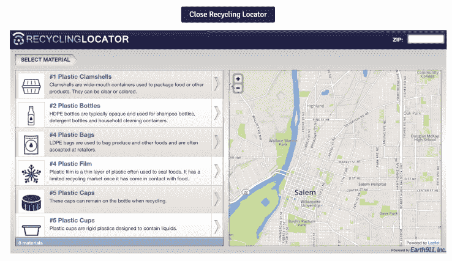

# 蓝围裙的“农场蛋”让我质疑一切 

> 原文：<https://web.archive.org/web/https://techcrunch.com/2016/09/01/blue-aprons-farm-egg-makes-me-question-everything/>

农家蛋。

看起来就这么简单。一个鸡蛋。阿特金斯饮食法和古饮食法使这种食物再次流行起来。这种食物是素食者和纯素食者的众多分界线之一。但是这个特殊的鸡蛋是硅谷创业王国的一个更有层次的，甚至是混乱的(如果你愿意的话)象征。

人们很容易将科技界的[尤斯](https://web.archive.org/web/20221007231759/https://beta.techcrunch.com/tag/yo/)视为异类，但当涉及到改善全球社会时，就很难审视我们的科技宠儿的整体影响了。

蓝围裙的“农场蛋”让我问了这些问题。优步创造了 100 万个工作岗位，最终却被自动驾驶汽车夺走了吗？Tinder 是让一代人在数字时代遇到某个人，还是创造了一代滥交、孤独的灵魂？

或者，更尖锐地说，蓝色围裙是不是在制造一大堆废物，以拯救完全工业化的农业和肥胖带来的便利？

输入，“农场蛋”

乍一看，“农场蛋”[似乎](https://web.archive.org/web/20221007231759/http://gizmodo.com/behold-farm-egg-1786000006)代表了蓝色围裙的[极度浪费](https://web.archive.org/web/20221007231759/https://www.buzzfeed.com/ellencushing/these-are-the-trashy-consequences-of-blue-apron-delivery?utm_term=.cjJ5WPmyAv#.ioVW75gpNa)。

与在杂货店买半打鸡蛋相比，用过多的纸板包装一个“农场鸡蛋”(其中大部分可能是为了防止运输过程中的碰撞和擦伤)似乎并不那么“环保”。

你可以更深入地研究这篇论文，并发现回收蓝色围裙的明显(如，它在盒子上)“生态友好”包装的[困难](https://web.archive.org/web/20221007231759/https://www.buzzfeed.com/ellencushing/these-are-the-trashy-consequences-of-blue-apron-delivery?utm_term=.cjJ5WPmyAv#.ioVW75gpNa)。

在收集了所有的纸板和纸制品后，这个过程包括融化和清空保持蓝色围裙食物新鲜的塑料冰袋，并找到回收 [LDPE](https://web.archive.org/web/20221007231759/https://en.wikipedia.org/wiki/Low-density_polyethylene) 塑料袋的地方(你可以在零售点回收 LDPE，比如*杂货店*)。

如果你愿意为地球做这一切(这是完全可能的，因为你也是那种没有时间去杂货店购物的人，因此，是一个蓝色围裙的使用者)，回收过程的最后一步是让你平静地扔掉塑料薄膜，因为“一旦它与食物接触，回收市场就有限了。”

也就是说，蓝色围裙认为，自四年前推出以来，其包装废物减少了至少 50%。

“农场鸡蛋有点讽刺，因为大多数杂货店出售的鸡蛋都装在不可回收的泡沫聚苯乙烯纸箱里，”蓝色围裙首席执行官马特·萨尔茨伯格说。“我们提供的食物(减少食物浪费)和每单位食物的包装比任何杂货店都少。”

此外，Blue 围裙还推出了一项退货计划，让用户寄回所有带有 UPS 退货标签的物品(盒子、冰袋、塑料和纸张)，在这一点上，该公司将为您回收包装。

"从字面上看，吨包装返回给我们每个月，让我们回收，"萨尔茨堡说。

为了慷慨起见，让我们假设蓝色围裙的 800 万份月餐中的每一份都被适当地完全回收。这仍然无法解释这样一个事实，其中一些食物从美国三个蓝色停机坪服务中心中的一个出发，经过数英里的运输，很可能是用冷藏车运送的。

该公司在新泽西州有一个履行中心，服务于整个东海岸，在加利福尼亚州有一个，服务于西海岸，在得克萨斯州有一个，负责飞越。对于纽约、加利福尼亚和得克萨斯的用户来说，就排放而言，这还不算太糟。但是不在人口密集区或佛罗里达州南部的用户收到的食物是从数百英里外运来的。

但说到食品运输排放，蓝色围裙真的是罪魁祸首吗？加州的鳄梨、佛罗里达州的橙子和威斯康星州的奶酪甚至没有触及这个行业的表面，在这个行业中，绝大多数的碳排放来自食品生产，而不是运输。

蓝色围裙专门选择位于其履行中心一般区域内的供应商，尽可能在当地采购食品以减少排放。

此外，对于来自食品运输的一小部分排放物——开车去商店零售，加上顾客开车去商店购买——蓝色围裙排除了杂货店的中间商，甚至可能比*更有效率。*

在到达履行中心之前，在那里它准备被运送——我可以想象小“农场蛋”和它的朋友分开，滑入个性化的，粘贴的纸板皮套，然后被放入绝缘盒中——蓝色围裙食品来自数百个精选的，家庭经营的农场和供应商。

考虑到工业化农业对地球的危险程度，这也不算太坏。

该公司有一个超过 50 人的团队，他们不仅选择供应商，还帮助他们改进做法，确保使用最少的农药，并确保农民很好地保护他们的土壤。

然后，你必须考虑蓝围裙的完美分配餐包，配有[熏猪肉](https://web.archive.org/web/20221007231759/https://twitter.com/heymermaid/status/754016179321208832)和亲爱的“农场鸡蛋”，必须减少食物浪费。根据美国农业部的这项研究，在杂货店大量购买食物的人浪费了 31%的食物。有了蓝色围裙的部分，这个数字缩小到几乎为零。

“大多数行业专家会告诉你，考虑到所有用于种植食物的资源，食物浪费对环境的危害是包装浪费的十倍，”Salzberg 说。

更不用说，蓝围裙帮人做饭。否则不会的人。约翰霍普金斯大学的研究人员发现烹饪实际上会带来更健康的饮食。

这就引出了一个问题:蓝色围裙和小小的“农场鸡蛋”是问题的一部分还是解决方案的一部分？

很难权衡蓝色围裙包装的极端(但大部分是可回收的)浪费与它对国家食物浪费及其使用者健康的总体好处。

但我们可以肯定的是，估值超过 20 亿美元、可能寻求首次公开募股(IPO)的 Blue 围裙，既是一家食品初创公司，也是一家航运公司，一个小型员工团队完全专注于盒子、塑料袋、冰袋，以及……精致的“农场鸡蛋”纸板摇篮。

“农场鸡蛋”可能只是硅谷与世界上最紧迫的困境脱节的又一个可笑、滑稽的象征。也许吧。“农场鸡蛋”也可能是一个真正合适的象征，象征着科技界以整体视角处理全球问题的方式。

乍一看，“农场鸡蛋”似乎是一个笑话，是我们全球进步的一个倒退，解决了一个我们实际上没有的问题——只要去该死的商店买半打鸡蛋，懒骨头！

但是“农场鸡蛋”也代表了食品工业各个方面的进步。在从一个没有笼子的养鸡场到一个蓝色围裙的履行中心(在那里它被包装成可回收的材料)走了一小段距离后，农场鸡蛋最终被送到了一个用户的家里，这个用户在没有浪费任何东西的情况下将它烹饪成晚餐，并且…希望之后回收了包装。