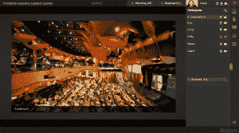

# Blue Jeans Network 筹集 7650 万美元，将视频会议带到办公室之外

> 原文：<https://web.archive.org/web/https://techcrunch.com/2015/09/23/blue-jeans-network-raises-76-5m-to-bring-video-conferencing-beyond-the-office/>

Blue Jeans Network 是一家提供基于云的视频会议服务的公司，在其第五轮融资中筹集了 7650 万美元。

NEA 领投了 E 轮融资，其他投资方包括 Accel Partners、Battery Ventures、Glynn Capital、Norwest Venture Partners 和 Quadrille Capital。MLB 全明星德瑞克·基特发起的新基金 Jeter Ventures 也参与其中。

根据联合创始人兼首席执行官 Krish Ramakrishnan 的说法，当蓝色牛仔裤在 2011 年推出时，整个视频会议市场的规模为每年 2 亿分钟，因为公司主要依赖纯音频电话会议。

如今，仅 Blue Jeans 一家公司每年就为 5，000 家公司的 2，500 多万用户提供超过 10 亿分钟的视频会议。

对于与工作相关的电话会议，Blue Jeans 为音频、视频和文档共享提供了一个单一的平台，它与几乎所有主要的硬件和软件平台兼容。因此，无论您是在旅途中使用 iPhone，还是在家中使用笔记本电脑，或者使用会议室中现有的硬件系统，您都可以选择从任何地方拨入全体会议。

如果你对视频会议不感兴趣，花一分钟考虑一下这项技术在办公室环境之外的用途。Blue Jeans 今年早些时候推出的 Primetime 服务代表着该公司首次尝试将实时视频会议功能扩展到企业以外。

有了黄金时段，任何直播事件或广播都可以变得互动。通过使从单向流媒体模式快速切换到双向互动模式成为可能，主持人可以与远程观众互动，就像他们在现场一样，无论是大学讲座，名人脱口秀还是技术会议。

这就是德瑞克·基特适合的地方。今年早些时候，队长推出了[球员的论坛报](https://web.archive.org/web/20230227002611/http://www.theplayerstribune.com/)，这是一个让运动员讲述自己故事的媒体渠道。利用黄金时段，该网站将能够为观众提供与名人或运动员面对面互动的机会，此前这些采访是向被动观众播放的。

其他早期黄金时段的合作伙伴包括圣丹斯电影节、TED 和沃顿商学院。

“想想像优步这样的公司，它们一开始是出租车替代服务，今天它们更像是交通工具的替代品，”Ramakrishnan 说。“当我们开始时，我们正在解决视频会议市场的一个非常大的问题，现在我们正在改变人们对视频和通信的看法。”