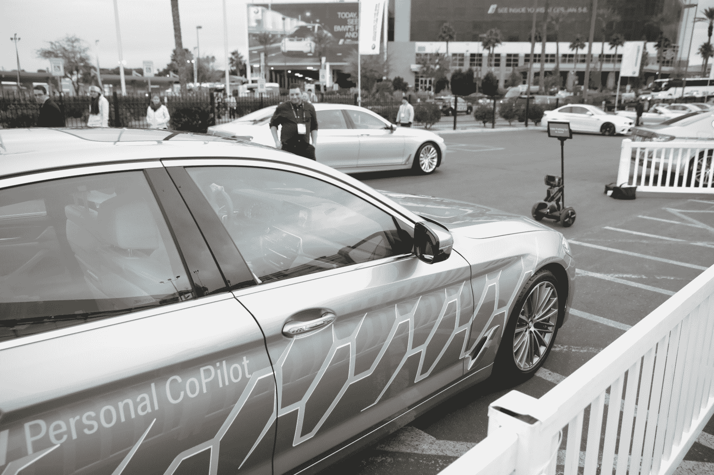

# 宝马对 Android Auto TechCrunch 说“不”

> 原文：<https://web.archive.org/web/https://techcrunch.com/2017/02/28/bmw-says-nein-to-android-auto/>

和 CES 一样，巴塞罗那的世界移动通信大会现在也吸引了相当一部分汽车制造商。几年前福特是早期采用者，现在其他公司也加入了竞争。我采访了宝马负责数字服务和商业模式的高级副总裁迪特·梅(当然是坐在一辆 [i3](https://web.archive.org/web/20221007063351/https://beta.techcrunch.com/2014/07/08/a-weekend-with-the-all-electric-bmw-i3/) 车里)。

在我们的谈话中，我们谈到了很多话题，从无人驾驶汽车，到汽车所有权的未来和车载技术带来的新商业模式。“我们提供(苹果的)CarPlay 作为选项，但不提供 Android Auto，”他说。“我们相信汽车内部和用户体验的变化，就像自动驾驶汽车一样，你必须控制客户界面。这是品牌体验的一部分，为此，我不想要安卓屏幕，我特别希望能够深度整合这些系统。”

他预计未来的汽车(尤其是当我们谈论自动驾驶汽车时)将提供更多的个性化选择，这反过来也将实现新的商业模式。

“如果你在车上有六个屏幕，你还可以通过个人助理进行手势控制、语音控制等。，”张婷说道。“你需要控制这种用户体验——如果你是一个‘大规模生产者’，也许你可以做到，但在高端市场就不行了。”

为了做到这一点，宝马建立了自己的云平台，可以在线保存用户偏好和其他汽车数据，然后允许司机在不同的汽车之间携带他们的个人资料和偏好。

代替 Android Auto(在某种程度上，CarPlay)，宝马正专注于 [A2A(汽车应用)](https://web.archive.org/web/20221007063351/http://www.bmw.com/com/en/insights/technology/connecteddrive/2013/services_apps/bmw_connecteddrive_services.html)，这是该公司 ConnectedDrive 平台的一部分。May 表示，这允许应用程序与汽车深度(和安全地)集成，因为它提供了稳定的开发者界面，所以它允许公司更快地创新。这主要是因为这让他的团队能够在车内技术栈中从事自己的工作，而不必坚持主导汽车业务实际硬件部分的较慢的创新周期。

不过，宝马对与第三方合作更感兴趣的一个领域是个人助理。该公司已经展示了与亚马逊的 Alexa 和 Cortana 的原型集成，但是 May 认为它们目前都不是万能的，所以他想构建一个可以与所有人交流的系统。

“我们是第一个与亚马逊大规模推出这款产品的汽车制造商，因为我们能够很容易地将其与我们的云平台集成，”当我问他宝马与 Alexa 在车上的合作时，他解释道。不过，他也承认，宝马——就像任何其他汽车制造商一样——还有许多工作要做。“我认为这是一个独特的机会，可以让我们与现有的应用生态系统进行对比。这给了我们一个新的机会，因为你不再那么依赖它们，但是新的生态系统也在增加。[……]但是如果你坐在 7 系宝马里，你不希望你的顾客说‘嘿，阿列克谢，把车窗摇起来’。当然，这一切都与品牌有关。"

在他看来，所有的助手都有不同的长处。Bixby 可能非常适合物联网和控制你的三星设备，而谷歌将非常适合搜索，亚马逊将非常适合电子商务，Cortana 将汽车连接到 Skype 和 LinkedIn 生态系统。“在现实生活中，你也会和不同的人谈论不同的话题，”他说，并补充说他不相信一家公司能够同样好地满足所有的需求。对于像宝马这样的汽车制造商来说，这意味着它必须想出如何将所有这些整合到汽车内外。

我们要多久才能在车里看到这个？"梅开玩笑说，我们的产品周期差不多就是 CES-to-CES . "一年前，我们展示了 Alexa，8 月份，它出现在我们的平台上，并扩大了规模。Cortana 也是如此。我们已经展示了它，到下一届 CES，我们应该有一个生产就绪的版本。”事实上，他为自己的团队制定了年度预算，然后团队预计将在年底前交付预算。这可能看起来不像快速创新，但与汽车行业传统的产品周期相比，这是非常快的。他的团队从一个季度到另一个季度进行规划，而一辆汽车从概念到生产通常需要几年时间。

正因为如此，拥有一个具有稳定开发者接口的平台是关键，因为它允许开发者从底层汽车平台获得一定程度的独立性。

像其他制造商一样，宝马希望其平台能够让它将与这些客户的关系扩展到展厅之外。

梅对新的商业模式也有一些有趣的想法，尤其是现在宝马——像其他汽车制造商一样——正专注于扩展其与客户的关系，而不仅仅是展厅。毕竟，如果一辆车的所有功能都由软件控制，那么你最终也会有很多新功能可以出售。不过，宝马对通过车载平台分享酒店预订收入不感兴趣。它们必须与驾驶体验有关。May 正在考虑的是销售已经具备所有硬件选项的汽车，然后让你选择购买额外的功能，如加热的汽车座椅或穿越阿尔卑斯山的额外 50 马力(你的汽车甚至可以建议这一点，因为它知道是否有大量交通或你正在走山路或可能想在德国高速公路上减速)。

在梅的《完美世界》中，汽车的每个功能都有一个 IP 地址。你只需要生产汽车的一个 SKU，然后你可以根据需要启用和禁用功能——可能是永久的，也可能是订阅模式。

梅表示，对于一家像宝马这样规模的公司来说，这比通过猫途鹰预订机票花 2 欧元更有意义。

自动驾驶汽车将改变人们对汽车和汽车所有权的看法。梅承认了这一点，并指出未来的宝马可能不会以它卖出多少辆车来衡量它的成功，而是以人们每月驾驶它的汽车行驶多少英里来衡量。“现在这是一个非常令人兴奋的行业。汽车和互联网技术的融合，人工智能，自动驾驶——它们都在一起，”梅说。“这是欧洲和德国的核心产业。这带来了大量机会，但也带来了风险。”为了竞争，宝马雇佣了数百人——但不是在硅谷，因为梅不认为它能在那里与谷歌和其他互联网公司争夺人才。“这些 24 岁的年轻人希望在某个地方短期工作两年，然后继续前进。这不是我们需要的人，我也不能向他们保证我们会进行大规模的 IPO，让他们成为百万富翁。”

他似乎不认为优步和其他人是传统汽车制造商的当务之急，但他显然也在关注这一点。“但我确信，如果你不够快，你肯定会输。这是事实。”

宝马往往速度很快，但像所有的竞争对手一样，该公司敏锐地意识到，它现在是在一个快速变化的市场中运营——这给了竞争对手一个夺走市场份额的机会。