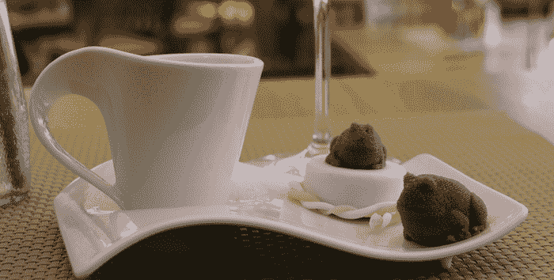

# Bocusini 将像一个优秀的机器人糕点厨师一样 3D 打印你的食物 

> 原文：<https://web.archive.org/web/https://techcrunch.com/2015/05/18/bocusini-will-3d-print-your-food-like-a-fine-robotic-pastry-chef/>

# Bocusini 将像一个优秀的机器人糕点厨师一样 3D 打印你的食物

很快我们都会走进一家名为 Casa Automa 的怪异、无人值守的餐厅，在那里，机器人会烧烤汉堡，为你提供形状完美的杏仁软糖，并在精致到你不想吃的霜蛋糕上写下你的名字。毕竟，我们正在快速进入一个入门级 3D 食品打印机的世界，比如 [Bocusini](https://web.archive.org/web/20221208041256/https://www.kickstarter.com/projects/2028227986/bocusini-worlds-first-plug-and-play-3d-food-printi) 。

博古西尼不会给你印汉堡的。相反，可以把打印机想象成一种 3D 绘图仪，让你用糖和杏仁糖制作物体，并以绝对的精度在食物上绘图。该系统基本上是一个简单的 3D 打印机，带有一个加热的挤压头，可以容纳小盒的杏仁软糖、巧克力和软糖。你可以用一个墨盒打印几十个小物体——建筑物或糖蛙。

再说一次，这不是什么令人惊讶的事情，你已经能够用 3D 打印机做这件事有一段时间了。然而，对于早期采用者来说，这款产品的价格约为 900 美元，它提供了一个在这个领域进行实验的绝佳机会，而无需预先花费太多。

该团队位于德国的 Freising，已经建造了工作原型。他们计划在 2016 年 1 月发运打印机，他们还提供“黑客”套件，允许您将其他 3D 打印机改造成食品制造机。简而言之，这是一个有趣的小产品，可以让你的糕点师高兴，因为她快乐地为你好奇的乔治主题早午餐打印连锁糖猴。

或者你可以训练你的打印机做出一个[完美的冰淇淋](https://web.archive.org/web/20221208041256/http://3dprint.com/66147/soft-serve-printer-ice-cream/)筒，然后就完事了。

[YouTube = https://YouTube . be/uuhznhcn 5 Yu]