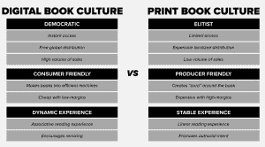
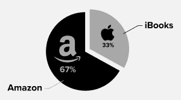

# 数字时代的图书出版

> 原文：<https://web.archive.org/web/https://techcrunch.com/2017/04/10/book-publishing-in-the-digital-age/>

克里斯·拉弗涅撰稿人

2012 年，我们推出了思想目录书籍。有了思想目录网站，我们掌握了为网络制作短文的技巧，我们想要一个新的挑战。我们希望建立一个更具思想性的图书出版商衍生品牌，以抗衡思想目录的时尚数字品牌。

有两个问题驱动着我们的图书创业公司的身份:在算法和社交媒体的时代，我们能否创造一个创造性和智力复杂性仍然重要的飞地？我们能否建立一个以读者而不是广告商为主要利益相关者的出版模式？

理解网站背景下的思想目录书很重要，因为当 ThoughtCatalog.com 在 2010 年上线时，它还不是一个病毒式的出版商。毫无价值的“思想目录”的名字揭示了对病毒性出版趋势完全缺乏远见。思想目录应该是一本“实验文化杂志”

问题是，新闻写作的实验有一个决定性的可怕的结果。像[音乐人简介](https://web.archive.org/web/20230405210737/http://thoughtcatalog.com/killian-fox/2010/02/chilly-gonzales/)、[书评](https://web.archive.org/web/20230405210737/http://thoughtcatalog.com/mollyyoung/2009/12/book-reviewdominic-dunne-too-much-money/)和[文化分析](https://web.archive.org/web/20230405210737/http://thoughtcatalog.com/mark-dery/2010/12/hate-is-all-around-on-the-politics-of-enthusiasm-and-its-discontents/)这样的长篇写作会让我们破产，于是我们转向了。来自脸书数据公司的受众洞察成为我们的出版商，谷歌数据成为我们的主编，Twitter signals 成为我们的执行主编。《思想目录》是第一批由社交媒体数据构建的杂志之一，这让我们和 BuzzFeed 以及其他一些人成为数字出版第一次淘金热的一部分。

不过，钱不是唯一的目标。对任何公司来说，钱都是命脉，但我们仍有更高的理想。我们想要读者，而不仅仅是访客；艺术欣赏，不只是社会喜欢。这种提升对话的愿望是内容公司和媒体公司的区别，我们认为自己是后者。资金充足的媒体公司通过委托被认为是“重要的东西”作为亏损领导者来处理这个问题。作为一家白手起家的创业公司，我们从来没有能力拥有亏损领袖。所以书籍印记看起来是个不错的选择，原因有二:

*   图书商业模式更适合长时间阅读。一篇 5000 字的文章以 1.00 美元一个字的价格出售，出版商需要大约 100 万次阅读才能在优化的广告设置下实现收支平衡。通常，即使是病毒式的列表也不会有 100 万访客，更不用说长篇调查性新闻或深度创造性作品了。对于图书出版，你只需要约 2000 人以 4.99 美元的价格购买电子书就能收回投资。

*   书籍让我们可以委托昂贵的视觉艺术项目。网络出版不仅降低了作者的成本，还极大地减少了对复杂视觉艺术的需求。在视觉世界中，手机上生成的一个模因通常会比顶级艺术家的精彩插图产生更多的读者和利润。网络经济使这一点变得不可能，但是当涉及到书籍封面和包装时，我们可以证明惊人的视觉佣金的预算是合理的，因为，尽管这是老生常谈，人们确实通过封面来判断书籍。

    书籍是完美的平台:简单的经济学、影响视觉和书面创作的机会以及市场契合度。我们学到了什么？已经五年了，这些都是宏观的教训。

    ## 媒介就是信息

    我们惊讶地发现，纸质书和数字书几乎是两种截然不同的业务，有着完全不同的运营模式。虽然纸质书和电子书共享相同的内容，但它们反映了截然相反的媒体格式。纸质书是奢侈品，电子书是实用品，这对于两者的营销和生产背后的战略和工作流程有着真正的影响。

    下面是我们如何看待这两种格式之间的区别。

    
    这种技术上的区别也存在于消费者行为中。对我们来说，电子书——凭借其即时访问和低廉的价格——销量通常是纸质书的 6 倍。也就是说，纸质书的收入通常是电子书的 7 倍。电子书很难产生收入，因为这个平台的整个前提是:我想尽快以尽可能低的价格得到它。数字时代纸质书的前提是由奢侈品驱动的:我在纸上阅读更好……或者……我喜欢翻页的感觉。

你不能在实用性上创造太多的利润，但是你可以在奢侈品上创造大量的利润。这也许是推动思想 目录书籍增长的最重要的见解之一。印刷图书部门需要像奢侈品公司一样运营，而电子书部门需要像科技公司一样运营。内容是一样的，但是媒介决定了完全不同的商业模式。

## 图书出版有令人惊讶的经济效益

原来，有思想的广告人喜爱书籍，而思想 目录书籍已经成为了思想 目录销售团队的重要工具。在线原生内容对于短篇故事是有效的，但如果一个品牌想要切入更深层次，建立一个有深度的故事，印刷书籍是完美的媒介。原生内容和赞助内容是简短的内容，读者只能接触几分钟。有了赞助书籍，广告商利用最久经考验的讲故事技术——印刷书籍，利用深度品牌推广机会，读者经常花几个小时甚至几天时间阅读他们的内容，并可能永远留在他们的书架上。

除了向我们的客户出售赞助书籍，我们很高兴看到有声读物带来的巨大收入机会，这是一个目前正在蓬勃发展的行业。我们也看到了由我们的书改编的老式电影的大量机会。

## 即使在图书出版业，昂贵的佣金仍然是亏损的主要原因

商业可行性和艺术完整性之间的争论充满了荆棘。从荷马到莎士比亚，到弗吉尼亚·伍尔夫，再到乔纳森·弗兰岑，最好的词马上就会“畅销”。经典往往立刻成为经典，尤其是在小说领域。

尽管如此，在哲学、新闻、传记和其他可能永远不会成为畅销书，但对社会同样重要的领域，仍有重要的工作要做。这样的故事就像优雅的数学问题，虽然不适用于广泛的受众，但对那些知道如何解决它们的人仍然有用。

支持这种写作——比如伊丽莎白·伍尔泽的媒体理论之旅《创造力》,西蒙·克里切利令人心碎的对自杀的批判性调查，以及萨宾·海因莱茵的《孤儿动物园》,邀请读者进入皇后区臭名昭著的 Creedmoor 精神病中心——是无价的，即使它存在于流行文化和市场规范之外。通过图书出版，我们找到了一种更好地支持这种工作的方式，让作者获得报酬，尽管可能不会盈利，但可以确保作品到达正确的人手中，并以图书的形式保存下来。

## 不要害怕亚马逊

亚马逊如此强有力地触及业务的各个方面，以至于感觉像是垄断。然而，它的力量在三个重要方面受到限制。

iBooks 代表了与亚马逊在电子书市场的真正竞争。出版技术 2014 年的一项研究报告称，iBooks 控制了 T2 31%的电子书市场。这与我们 2016 年的数据相关，iBooks 推动了我们 33%的电子书销售。此外，随着人们放弃传统的电子阅读器，转而使用手机或台式机(苹果在这方面比亚马逊有先天优势)来阅读书籍，iBooks 很可能会增长。

四大出版社不可或缺。亚马逊一直梦想着[去掉“看门人”](https://web.archive.org/web/20230405210737/http://quotecatalog.com/quote/brad-stone-book-publishers-wa9Y5aP)，在作者和读者之间建立直接关系。然而，问任何人他们最喜欢的书是什么，他们自己出版的可能性就像他们最喜欢的电视节目是 YouTube 网络系列一样。现实是，主要图书出版商扮演的创意和金融中介角色对图书行业至关重要，就像这些角色在电影或电视行业一样。出版商的角色将会一直存在。

随着电子书越来越受欢迎，在亚马逊上销售实体书可能没什么意义了。在认为 编目书籍的时候，亚马逊是[数字发行](https://web.archive.org/web/20230405210737/http://www.amazon.com/s/ref=dp_byline_sr_ebooks_2?ie=UTF8&text=Thought++Catalog&search-alias=digital-text&field-author=Thought++Catalog&sort=relevancerank)和某些种类印刷发行的理想合作伙伴。然而，亚马逊销售我们的[高级印刷书籍](https://web.archive.org/web/20230405210737/http://shopcatalog.com/)没有意义。对我们来说，通过更定制的电子商务体验或通过独立的实体零售商订购书籍更具个性。如果书籍是真正的奢侈品，那么就像一个高端服装品牌不想在亚马逊上销售一样，我们作为专业书籍出版商，也不希望我们的产品在那里。其他更大的出版商可能最终也会这样，至少会开始限制他们在亚马逊上的印刷发行。

## 图书的未来是光明的

理查德·纳什在《文学的使命是什么？，[“是文学的特色，不是 bug。](https://web.archive.org/web/20230405210737/http://quotecatalog.com/quote/richard-nash-the-lack-of-vid-Y7AW02a)“这正是我们在思考目录时看待图书业务的方式。书籍不是过时的技术。书籍是尖端科技。事实上，书籍是市场上最伟大的虚拟现实机器。当像 Oculus 这样的虚拟现实设备吞噬大脑以呈现不同的现实时，书籍通过媒介和自我之间更具创造性的交流来吸引大脑并呈现不同的现实。

这应该让出版商放心，尽管图书出版公司永远不会以脸书或传统科技公司的指数速度增长，但这正是它们的魅力所在。这是一个深度参与的行业，而不是快速增长的行业。