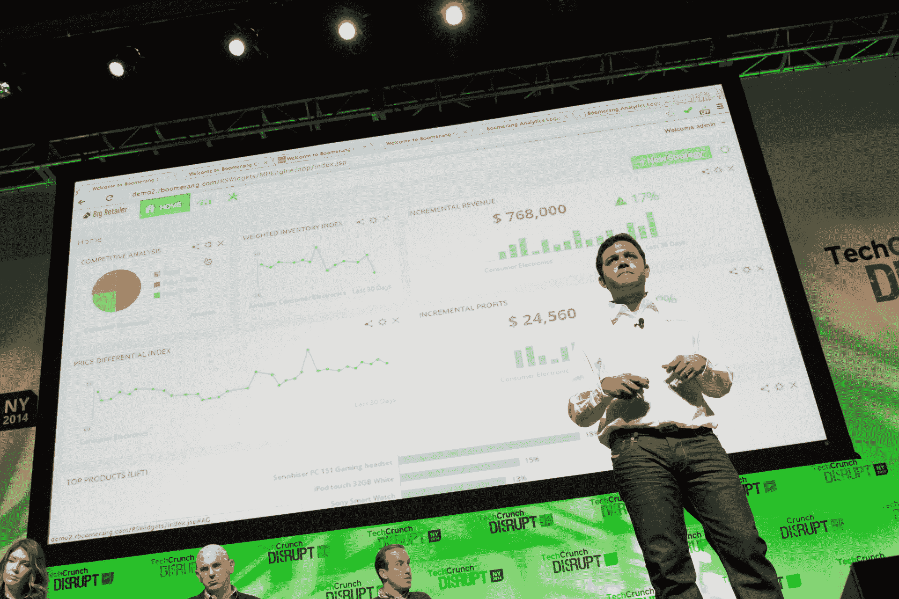
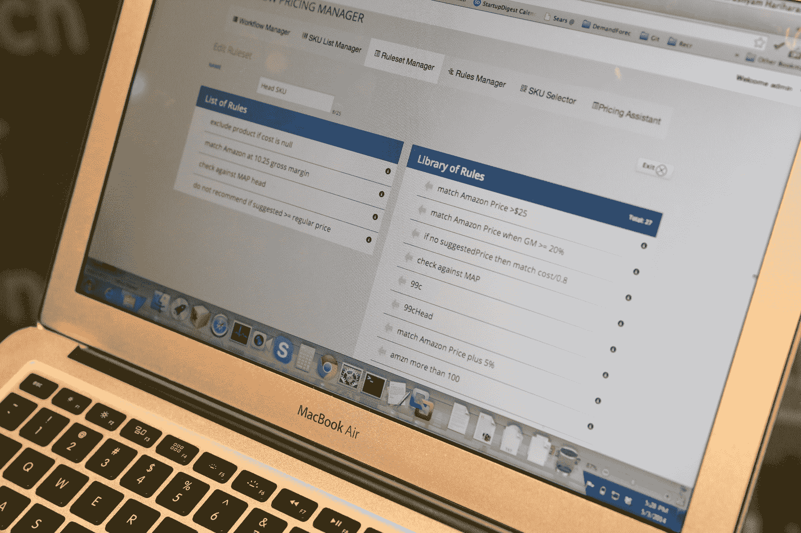

# Boomerang Commerce 为其价格优化平台 TechCrunch 筹集 1200 万美元的 B 轮融资

> 原文：<https://web.archive.org/web/https://techcrunch.com/2016/01/14/boomerang-commerce-raises-12m-series-b-round-for-its-price-optimization-platform/>

# Boomerang Commerce 为其价格优化平台筹集了 1200 万美元的 B 轮融资

扰乱战场明矾(也是决赛选手)[回旋镖商业](https://web.archive.org/web/20221210064007/http://www.boomerangcommerce.com/)今天宣布，它已经筹集了 1200 万美元的 B 轮融资，由[沙斯塔风险投资](https://web.archive.org/web/20221210064007/http://www.shastaventures.com/)领投。之前的投资者 Madrona Venture Group 和 Trinity Ventures 也参与了此轮投资。

Boomerang 帮助在线零售商获得正确的价格。它允许零售商测试和优化他们的定价策略，并允许他们监控和分析竞争对手的价格。例如，根据他们选择的策略，Boomerang 然后使用其机器学习技术来帮助零售商为自己的商品定价，以优化原始销量或提高利润率。

该公司本质上是让零售商获得像亚马逊这样的主要在线零售商用来提高销售额的那种定价数据和分析。

该公司表示，2015 年其客户群翻了两番，排名前 50 的零售商中有 9 家现在使用其服务。其客户目前包括史泰博(Boomerang 最早的合作伙伴之一)以及 Groupon、Office Depot 和 US Auto Parts。

鉴于 Boomerang 的快速增长和令人印象深刻的合作伙伴名单，投资者对其感兴趣也就不足为奇了，尽管整体融资市场似乎有点降温。

“我们有大部分的系列——现金仍然留在银行里。然而，我们仍然筹集了资金，以利用我们在市场上建立的势头，”Boomerang 首席执行官 Guru Hariharan 告诉我。“我们在实现构建零售神经中枢的愿景方面取得了重大进展，这一愿景通过数据科学提升了零售艺术。”

2014 年，Boomerang 获得了由 Madrona Venture Group 和 Trinity Ventures 领投的 850 万美元 A 轮融资。该公司目前总共筹集了 2050 万美元。

“我们将投资资本，通过加倍投资现代零售用例，巩固我们现有和未来客户的成功，”他说。“我们将加快建设我们的团队，该团队拥有独特的 DNA，结合了数据科学和电子商务的最佳优势。”

【T2