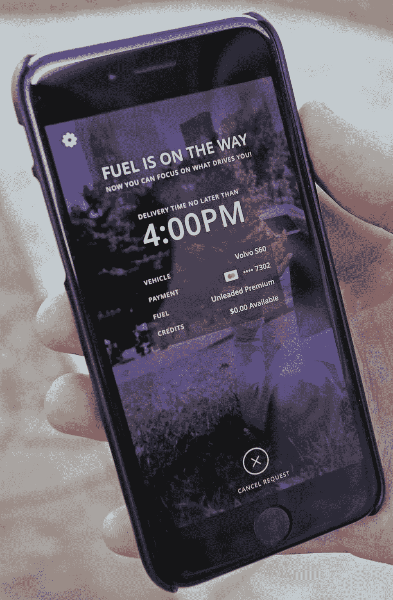
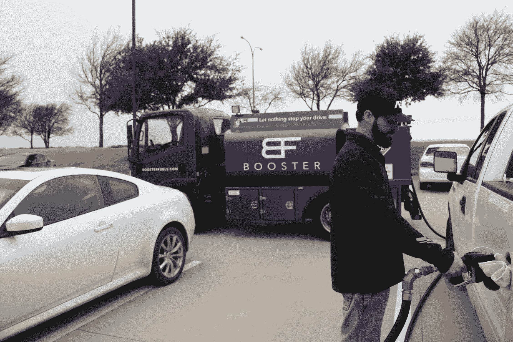

# 在你工作的时候给你的汽车加油的 booster Fuels A 轮融资 900 万美元 

> 原文：<https://web.archive.org/web/https://techcrunch.com/2016/01/28/booster-fuels-fills-up-your-car-while-youre-working-raises-9m-series-a-round/>

# 在你工作的时候给你的汽车加油的 Booster Fuels 首轮融资 900 万美元

即使你生活在少数几个自己加油是非法的州之一，开车去加油站加油可能也不是你喜欢做的事情。Booster Fuels 希望解决加油的麻烦。该公司[与大型企业](https://web.archive.org/web/20230124202420/https://boosterfuels.com/corporate-programs)合作，然后在他们的企业园区提供按需燃料服务。尽管我讨厌写这些文字，但基本上是“优步加油”

工人们只需停好车，在 Booster Fuels 应用程序上请求加油，离开时打开油箱盖，当他们下班回来时，他们的车就可以上路了。

到目前为止，Booster Fuels 主要在其家乡德克萨斯州提供这项服务。正如该公司今天宣布的那样，它现在已经从 Maveron、Madrona Venture Group、Version One Ventures 和 RRE 风险投资公司等公司筹集了 900 万美元的首轮融资。计划是用这笔钱来资助 Booster 在北德克萨斯和硅谷的扩张。

在加利福尼亚，Booster 几个月前开始与教科书服务公司 Chegg 合作。Booster 告诉我，65%的齐格网员工已经定期使用助燃剂。在最繁忙的一天，Booster 在齐格加满了 100 辆汽车。

虽然 Booster 目前的重点是与拥有大型企业园区和其他企业办公园区的企业合作，但 Booster 的首席执行官兼联合创始人弗兰克·迈克罗夫特(Frank Mycroft)告诉我，该公司希望“90%或更多的人”不再需要去加油站

Booster 表示，它的价格与当地加油站的价格相比具有竞争力，而且往往更低，因为它是批发购买燃料的。该公司提供普通无铅汽油和优质无铅汽油，并表示其司机都是接受背景调查的商务司机，“热爱汽车，并为每次都能提供正确的服务而自豪。”

就公司福利而言，在你工作的时候有人给你加油听起来并没有那么糟糕。在竞争激烈的硅谷招聘领域，有相当多的公司可能会向员工提供这种服务，因为其他人也有每日美食午餐、现场按摩服务和酒吧。

迈克罗夫特告诉我:“与那些有更多替代交通方式的学校相比，员工不得不开车上下班的学校在招聘和留住员工方面往往处于劣势。”。“我们帮助将停车场转化为有价值的资产，用于提高员工的生活质量。对于许多关心员工生产率和保留率的雇主来说，这是一个巨大的胜利。”

