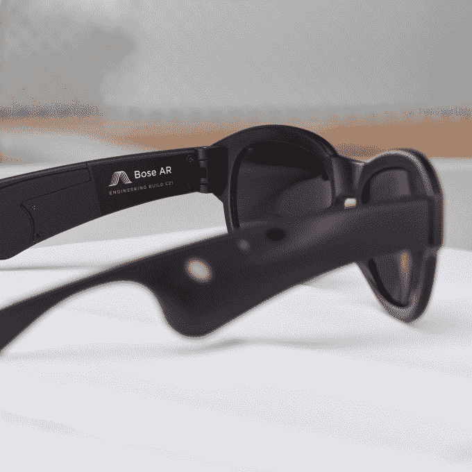
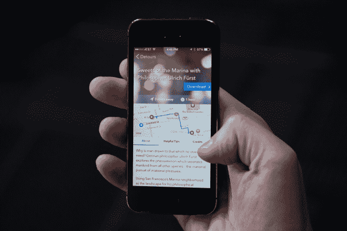

# Bose 收购 Andrew Mason 的徒步旅行初创公司，Detour 

> 原文：<https://web.archive.org/web/https://techcrunch.com/2018/04/24/bose-acquires-andrew-masons-walking-tour-startup-detour/>

Groupon 创始人安德鲁·梅森(Andrew Mason)的音频旅游初创公司 [Detour](https://web.archive.org/web/20230313182510/https://www.detour.com/) 已被出售给 Bose。这项收购只涉及软件和旅游内容，不涉及团队，几天前在[的博客](https://web.archive.org/web/20230313182510/https://medium.com/detour-dot-com/detour-the-next-chapter-6f1aa2d97a14)上悄悄宣布，随后是一封给客户的电子邮件。 [Bose](https://web.archive.org/web/20230313182510/https://www.bose.com/) 最初似乎不太可能收购一款旨在帮助人们通过叙述式徒步旅行发现城市的应用。但它对该产品的兴趣与其即将推出的 AR 平台有关，该平台涉及通过一副布满传感器的眼镜提供的音频体验。

Bose 现在正在“积极寻找合作伙伴来托管绕道内容”，并将其提供给其客户，包括 Bose AR 上的客户。绕道 app 本身很快就会关闭。

梅森说，他可能会在寻找第三方的过程中帮助博斯一点，但他的重点是他的新公司， [Descript](https://web.archive.org/web/20230313182510/https://www.descript.com/) 。

几年前,[推出了“绕道”](https://web.archive.org/web/20230313182510/https://techcrunch.com/2014/07/30/detour/),完全由梅森自筹资金。它的目标是为游客和当地人提供一种发现一个城市隐藏的宝石的方式，比如它与众不同的商店和小巷——其他旅行团会忽略的东西。这项服务[于 2015 年开始在三藩市向公众开放](https://web.archive.org/web/20230313182510/https://techcrunch.com/2015/02/03/detour-is-live/)，随后[将](https://web.archive.org/web/20230313182510/https://techcrunch.com/2015/06/11/detour-andrew-masons-audio-tour-app-goes-global-and-expands-to-6-more-cities/)扩展到其他市场，包括国际目的地，所有这些都可以通过应用内购买获得。

这款应用在发售时有大约 120 个可用的旅游项目。

由一位德国哲学家讲述的绕道码头糖果店之旅

作为旅游创作的一部分，Detour 已经[开发了](https://web.archive.org/web/20230313182510/https://techcrunch.com/2015/06/11/detour-andrew-masons-audio-tour-app-goes-global-and-expands-to-6-more-cities/)一些有趣的技术——比如一个转录音频的工具，让你通过编辑书面转录来编辑音频文件，以及一种通过将音乐和声音添加到转录中来为叙事添加音乐和声音的方法。

这项技术现在已经作为一个新的创业公司被剥离出来。包括 Mason 在内的 Detour 团队已经在 Descript 上工作了大约六个月。Descript 的目标是让编辑声音文件像编辑 Word 文档一样简单，[于 12 月推出，Andreessen Horowitz 提供了 500 万美元的资金](https://web.archive.org/web/20230313182510/https://techcrunch.com/2017/12/12/descript-gets-5m-to-make-sound-editing-like-a-word-document/)。

鉴于梅森目前的关注点,“绕道”被关闭并不奇怪。但有点令人惊讶的是，它找到了一个收购者。

这款应用从来没有像其他旅游指南那样拥有大量的追随者。(截至目前，它在 App Store 的“旅行”类别中的排名一直在 400 到 700 名之间——也就是说，几乎看不见。)然而，它的旅行是独特而有趣的，并且设计了当时其他人缺乏的功能——比如位置感知或与一群人中的多人同步的能力。

绕道应用程序将在 2018 年 5 月 31 日之前保持可用，届时所有旅行都将免费。之后，该应用将从 App Store 中移除。

“感谢制片人、工程师、设计师和故事讲述者，他们在过去的四年里走过了弯路。我很高兴看到 Bose 会把它带到哪里，”Mason 在 Detour 的博客上写道。

PitchBook [声称](https://web.archive.org/web/20230313182510/https://pitchbook.com/profiles/company/113075-38) Detour 已经筹集了资金，但梅森说这是不正确的。

“绕道是自筹资金的(由我)，我们从来没有透露多少，”他说。但他确实证实，他的一个朋友 Mihir Shah 已经投资了“最初象征性的几千美元”，这就是为什么这笔投资被列在 Shah 的 [LinkedIn](https://web.archive.org/web/20230313182510/https://www.linkedin.com/in/mhrshah) 上。

交易条款还不清楚，但这可能是一个小小的退出。

目前还不清楚 Detour 何时会出现在 Bose ar 上，因为 Bose 仍在寻找第三方继续进行 Detour，并且尚未向开发者提供 AR 眼镜的测试版本。