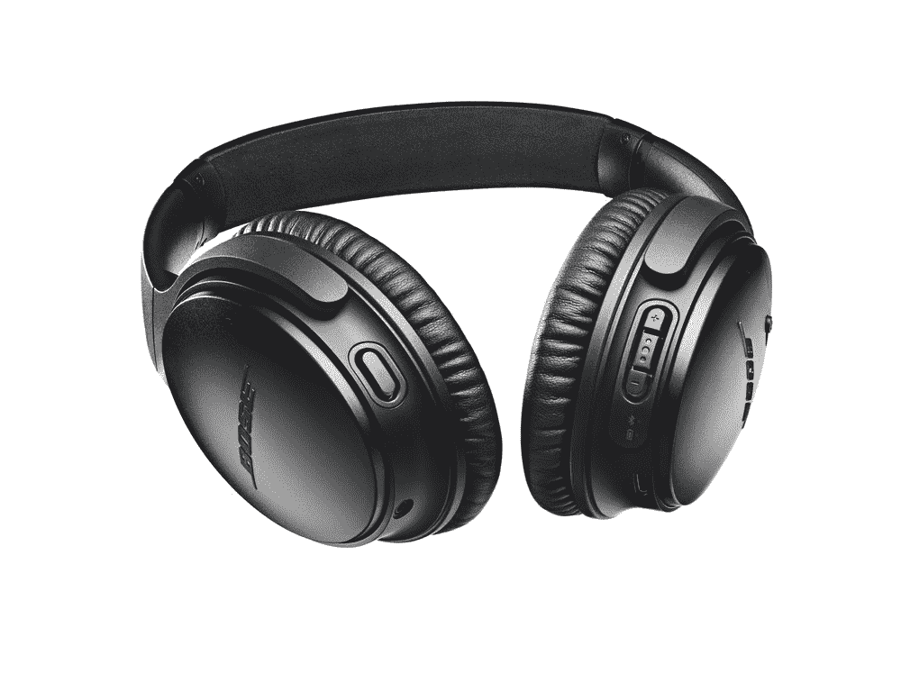

# Bose 推出新的谷歌助手优化降噪耳机 

> 原文：<https://web.archive.org/web/https://techcrunch.com/2017/09/21/bose-debuts-new-google-assistant-optimized-noise-cancelling-headphones/>

# Bose 推出新的谷歌助手优化降噪耳机

Bose 的传言 QC 35 II 降噪耳机不再是传言:Bose 今天正式发布了它们，披露了该公司广受欢迎的 QC 35 优质降噪罐的更新。

谷歌在一篇新的博客文章中解释说，谷歌与 Bose 合作开发了这款新耳机，帮助“优化”了谷歌用于 iPhone 和 Android 的虚拟助手软件 Assistant 的音频附件。耳机有一个专用的助手按钮，用户可以在任何时候按下它来调用基于语音的伴侣。

它们本身并没有将助手作为一项专门的服务，而是集成了对基于助手的服务的支持，包括来电通知、新闻简报等音频功能以及通话和音乐播放的语音命令。

【T2

助理支持将在美国、澳大利亚、加拿大、德国、法国和英国的 QC 35 II 上提供，耳机在美国的零售价为 349 美元，与之前的 QC 35 价格相同。

谷歌在其关于新的合作伙伴关系和集成的博客帖子中提到，它一直在与 Bose 合作，从 QC 35 II 开始为耳机进行辅助集成，这意味着我们可以看到这一功能扩展到 Bose 系列的更多产品。