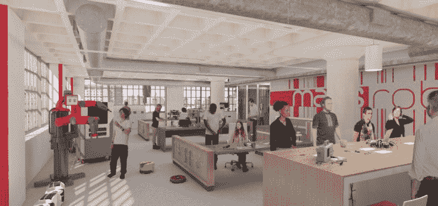

# 波士顿的新中枢 MassRobotics 就像是机器人初创公司 TechCrunch 的 WeWork

> 原文：<https://web.archive.org/web/https://techcrunch.com/2017/02/16/bostons-new-hub-massrobotics-is-like-a-wework-for-robotics-startups/>

# 波士顿的新中枢，MassRobotics，就像一个为机器人初创公司工作的 WeWork

如果您正在制造无人驾驶飞机、个人运载工具或可以执行手术的机器人，那么像 WeWork 或 RocketSpace 这样的协同工作社区中的一张桌子可能对您来说是不够的。现在，波士顿市为机器人初创公司新开了一家工厂。非营利中心，MassRobotics ，位于波士顿海港创新区 Channel Street 12 号。

根据一份新闻声明，MassRobotics 的设施包括实验室和初创公司测试和原型制作所需的昂贵设备，如工业级示波器、3D 打印机、航空电子设备和室内无人机测试外壳。MassRobotics 租赁了 1.5 万平方英尺，并将在该建筑中再建造 2.5 万平方英尺。明天，2 月 17 日，波士顿市长马蒂·沃尔什将主持一个正式的剪彩仪式。

根据 MassRobotics hub 的联合创始人 Joyce Sidopoulos 的说法，MassRobotics 不仅仅是为机器人公司提供一个创新的 T2 空间，同样重要的是。该倡议与 MassRobotics 的合作伙伴[Mass Technology Leadership Council](https://web.archive.org/web/20221207182004/http://www.masstlc.org/)在当地做出的其他努力相一致，旨在留住城里的科技人才，在当地的主要雇主那里创造就业或接受工作。Mass TLC 赢得了一系列经济发展和相关赠款，以帮助确保新英格兰在蓬勃发展的机器人行业中保持地区领先地位。

*艺术家渲染:MassRobotics，一个专门为波士顿的机器人初创公司设计的合作空间。*

机器人领域的雇主在大波士顿地区有很大的存在，从像[通用动力](https://web.archive.org/web/20221207182004/http://www.generaldynamics.com/)、[德雷珀](https://web.archive.org/web/20221207182004/http://www.draper.com/)和[亚马逊机器人](https://web.archive.org/web/20221207182004/https://www.amazonrobotics.com/)这样的大公司，到像[轨迹机器人](https://web.archive.org/web/20221207182004/http://www.locusrobotics.com/get-started/#page)、[软机器人](https://web.archive.org/web/20221207182004/http://www.softroboticsinc.com/)和[崛起机器人这样的大量初创公司。](https://web.archive.org/web/20221207182004/http://www.riserobotics.com/)mass Robotics“阿尔法”空间的最初居民包括专注于农业的[美国机器人](https://web.archive.org/web/20221207182004/http://www.american-robotics.com/)，城市移动初创公司[跨栏汽车](https://web.archive.org/web/20221207182004/http://www.hurdlermotors.com/)，HMSS 空军研究实验室[以及用于石油和天然气行业检查的机器人制造商](https://web.archive.org/web/20221207182004/http://www.wpafb.af.mil/afrl/rq)[，方形机器人](https://web.archive.org/web/20221207182004/http://www.squarerobots.com/)。

除了提供创新空间，MassRobotics 及其合作伙伴 MassTLC 还将早期公司与潜在的试点客户联系起来，帮助他们找到附近的场地，在那里他们可以飞行、漂浮或以其他方式测试他们的机器人，并为希望在先进制造业找到工作的人提供劳动力培训。

“的确，在这个领域，你不能只在笔记本电脑上工作。你需要空间来建造、学习、重新排列电路板上的芯片、装回去、运行测试……但这个创新中心也将把初创公司聚集在一起，希望每个人都能互相帮助。西多普洛斯说:“我们已经看到一些资深公司主动提出为该领域的新人提供指导，我们还听到一长串机器人公司希望进入这一领域。

*更新:这篇文章被编辑以说明 MassTLC 和 MassRobotics 是分开操作的。*