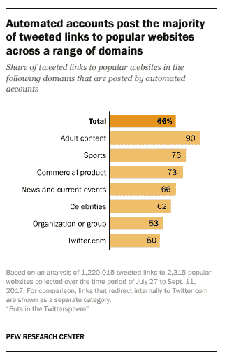

# Twitter 上的机器人分享三分之二的热门网站链接:Pew 

> 原文：<https://web.archive.org/web/https://techcrunch.com/2018/04/09/bots-on-twitter-share-two-thirds-of-links-to-popular-websites-pew/>

这是官方消息:机器人正在 Twitter 上做大量的公关工作——尤其是在推广色情网站的时候。

皮尤研究中心的一项新研究得出了关于自动推特账户是链接共享的结论，这或许并不令人惊讶，该研究旨在量化推特领域基于机器人的活动的一个方面。

具体来说，研究人员想知道有多大比例的热门网站的推文链接是由自动账户而不是人类用户发布的？

他们得出的答案是，大约三分之二的热门网站推文链接是由机器人而不是人类发布的。

研究人员表示，他们有兴趣尝试更多地了解信息是如何在 Twitter 上传播的。尽管在这项研究中，他们没有试图直接深入关于机器人的更棘手(和棘手)的问题——比如这些机器人传播的信息是否实际上是虚假信息。

皮尤的研究人员也没有试图确定自动链接公关活动是否真的导致了人们对相关内容的大量参与。(外部研究人员可能很难确定这一点，因为 Twitter 没有提供关于它如何在其平台上塑造推文可见性的全面信息，也没有关于个人用户如何利用可以影响他们在平台上看到或不看到什么的控制和设置的数据)。

因此，可以肯定地说，许多与 bot 相关的问题仍有待深入调查。

但这里至少有英特尔的另一个花絮，关于面对主要媒体网站的自动账户是什么——尽管像往常一样，这些结果被定性为“可疑的机器人”,因为明确识别一个在线实体是否是人是多么困难。(皮尤使用了印第安纳大学的 [Botometer](https://web.archive.org/web/20230306040230/https://botometer.iuni.iu.edu/#!/) 机器学习工具来识别可疑的机器人；依靠 0.43 或更高的分数来宣布可能的自动化——基于他们自己的一系列验证练习。)

皮尤的首要结论是，可疑的自动账户在 Twitter 生态系统中发布内容链接方面发挥了突出作用——据估计，所有最受欢迎网站的推文链接中有 66%可能是由自动账户发布的，而不是人类用户。

研究人员首先对 120 万条包含链接的英语推文进行了分析(通过 Twitter 的流媒体 API 抽取随机样本推文数据)，从而确定了网站的受欢迎程度，他们将其归结为 2315 个受欢迎的网站，即一旦重复和死亡链接被剔除。

然后，他们将这些内容归类到内容领域，任何指向 Twitter 上任何其他内容的链接(即，而不是外部链接)都被收集到一个单独的 Twitter.com 类别中。

之后，他们能够比较(可疑的)机器人和(可能的)人类如何共享不同类别的内容。

以下是可疑机器人预抓取内容的结果——如上所述，不出所料，这主要是成人内容。尽管机器人被发现对大部分热门网站的链接分享做出了反应。因此，机器人已经做了大量的公关工作…

(看看这个，一个很好的通用经验法则似乎是，如果一个 Twitter 账户分享色情网站的链接，它很可能不是人类。或者，嗯，是一个人类的账户被黑了。)

研究人员还发现，相对较少数量的自动账户负责 Twitter 上流行媒体的大量链接。“在这项研究进行期间，仅 500 个最活跃的可疑 bot 帐户就占了这些新闻和时事网站所有链接的 22%。相比之下，500 个最活跃的人类账户只占这些网站全部链接的 6%。

显然，机器人不会被人类的公共关系弱点所阻碍——比如需要停止工作来吃饭或睡觉。

皮尤表示，其分析还表明，某些类型的新闻和时事网站似乎“特别有可能”由自动账户发布。“其中最突出的是聚合网站，即主要从网上其他地方收集内容的网站。他们写道:“在研究期间，估计 89%的这些聚合网站的链接是由机器人账户发布的。

TL；dr:机器人似乎对推广原创报道不太感兴趣。或者，换句话说，机器人工作经常被用来试图从其他人的内容中榨取廉价的观点。

另一个有趣的观察结果是:“自动账户还提供了比平均比例稍高的链接，这些链接指向缺乏公共联系页面或电子邮件地址的网站，以便联系编辑或其他工作人员。

“在这项研究中，绝大多数(90%)热门新闻和时事网站都有面向公众的非 Twitter 联系页面。少部分缺少这种联系页面的网站被可疑的僵尸程序分享的比率比那些有联系页面的网站要高。在研究期间，大约 75%的此类网站的链接是由可疑的 bot 帐户共享的，相比之下，有联系页面的网站为 60%。”

无需过多解读这一发现，就可以推断出没有任何公开内容页面或电子邮件的网站更有可能发布虚假信息。(皮尤的研究人员没有将这些点准确地连接起来，但他们指出:“这种类型的联系信息可以用来提交读者反馈，这些反馈可以作为更正或补充报告的基础。”)

也就是说，皮尤还发现，与其他类型的新闻和时事内容相比，机器人对政治内容的兴趣相对较低——至少从这张英文推文快照(去年夏天拍摄)来看是这样的。

“某些类型的新闻和时事网站从自动账户获得的 Twitter 链接份额低于平均水平，”研究人员写道。“最值得注意的是，这项分析表明，在该中心分析的新闻和时事内容类型中，以政治内容为特色的流行新闻和时事网站的 bot 帐户链接流量水平最低，其他因素保持不变。在研究期间，在所有以政治或政治内容为显著特征的流行媒体来源的链接中，估计有 57%来自机器人账户。

研究人员还研究了政治倾向——试图确定可疑机器人在分享内容时是向左还是向右倾斜。

(为了确定 Twitter 上链接内容的意识形态倾向，皮尤表示，他们使用了一种被称为对应分析的统计技术——检查出版物 Twitter 受众的媒体链接共享行为，以便在从“非常自由”到“最保守”的意识形态范围内对内容本身进行评分。)

事实上，他们发现自动账户发布了更多来自“意识形态混杂或中间派”网站的内容。至少在“以政治新闻和问题为导向”的流行新闻和时事网站上是如此。

他们写道:“该中心的分析发现，可疑的自主账户发布的链接比例更高，这些链接主要是由接近意识形态光谱中心的人类用户分享的，而不是由更自由或更保守的观众更经常分享的。”“根据分析，自动账户分享了大约 57%至 66%的政治网站链接，这些链接是由意识形态混合或中间派观众分享的。”

皮尤补充道，bot 流量比例的左右差异“并不显著”。

不过，在这一点上，值得强调的是，这部分分析是基于一个非常小的子集，这个子集是已经完全以英语和美国为重点的 Twitter 领域的快照。因此，过度解读这部分分析似乎是不明智的。

皮尤指出:“这一分析是基于流行新闻和时事媒体的一个分组，这些媒体在其标题中突出政治故事或有一个政治部分，主要服务于美国观众。在 2，315 个热门网站的完整样本中，共有 358 个网站符合这些标准。”

实际上，这项研究强调了 Twitter 机器人的一个核心事实:它们经常被用于垃圾邮件/公关目的——试图将流量引向其他网站。他们宣传的内容各不相同，尽管很明显经常是成人内容。

机器人还经常被用来试图廉价地推动点击到廉价的内容聚合器或产品网站，这样外部实体就可以通过提高广告浏览量和收入来廉价地获利。

政治虚假信息运动很可能导致机器人产生的垃圾邮件/公关数量低于色情或内容农场。尽管对民主进程和社会机构的潜在损害可能要严重得多。也很难量化。

嗯，就机器人的影响而言，我们仍然有[比答案更多的问题](https://web.archive.org/web/20230306040230/https://techcrunch.com/2018/01/26/twitter-accused-of-dodging-brexit-botnet-questions-again/)。