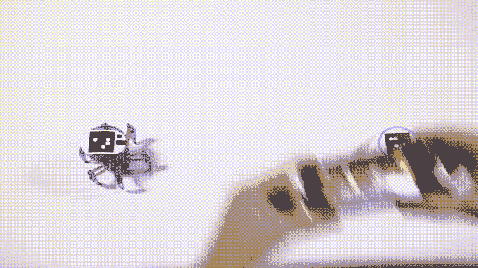
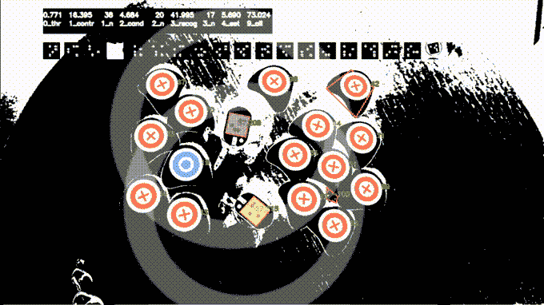

# Bots_alive kit 赋予玩具机器人迷人、逼真的人工智能技术

> 原文：<https://web.archive.org/web/https://techcrunch.com/2017/01/24/bots_alive-kit-imbues-toy-robots-with-charming-lifelike-ai/>

CES 上不缺小工具，下个月的玩具展上也不会缺少机器人和小工具，它们有望实现人工智能，但通常都不尽如人意。但是，一个实际的人工智能研究人员提出了一种更温和的方法，通过对一个受欢迎的现有机器人进行简单而优雅的修改，创造出一种聪明而可行的方式来创造逼真的行为。

[该工具包名为 bots_alive，在 Kickstarter](https://web.archive.org/web/20221224185313/https://www.kickstarter.com/projects/bradknox/bots-alive-robots-that-play-and-find-their-way) 上的售价仅为 15000 美元。我[在 CES](https://web.archive.org/web/20221224185313/https://youtu.be/q478inKFMNo) 上与创作者 Brad Knox 谈论了这项技术，并对设计的简单性感到满意，在这个时候，霸道、会说话、会跳舞的机器人玩具似乎是常态。

它是这样工作的:你从一只 Hexbug 蜘蛛开始，这是一个你可以花 25 美元买到的遥控有腿玩具机器人[。它们通常由一个微型红外控制器控制。smarten one up 需要做的只是在它的头部贴上一个标记，将附带的 IR blaster 插入手机的耳机端口(参见，](https://web.archive.org/web/20221224185313/https://www.hexbug.com/mechanical/spider)[这就是我所说的](https://web.archive.org/web/20221224185313/https://techcrunch.com/2016/09/07/courage/))，然后启动应用程序。

 该应用程序使用计算机视觉系统来跟踪机器人的位置以及套件中包含的积木的位置。它还充当机器人的大脑，告诉它如何移动和去哪里。规则很简单:机器人喜欢蓝色方块，避开红色方块。这是那种简单的片段带来不简单的游戏的事情。你可以做一些小迷宫，让它跟着面包屑走，或者如果你有两个机器人，让它们相遇并战斗。

但是由于诺克斯的团队通过另一个聪明的过程预先装载了许多仿生模式，这些行为和动作看起来更加复杂和自然。是的，它涉及到机器学习。

为了构建机器人人工智能，在麻省理工学院媒体实验室从事这类工作多年的诺克斯决定以真实动物的行为为基础，特别是人类。该团队让计算机视觉系统观看人类驾驶机器人通过各种场景——红色方块后面的蓝色方块、红色方块的迷宫、两个蓝色方块等距等。

 它记录的不仅仅是简单的东西，比如行进的矢量，还有一些小事情，比如错误、犹豫、撞上障碍物等等。然后，他们会用机器学习系统处理所有这些，并产生一个模型，然后让它负责，看看它做得如何，还有什么需要调整或个性化。关于这个过程的更多细节可以在今天 Knox 发表的博客文章[中找到。](https://web.archive.org/web/20221224185313/https://medium.com/@bradknox/building-character-ai-through-machine-learning-7a3159dc4940)

结果是机器人表现不稳定，稍微走错了方向，停下来四处看看，然后原路返回——简而言之，就像一个真正的小动物可能做的那样。本人还挺有魅力的，性格上的小怪癖也不显得照本宣科或者做作。

[https://web.archive.org/web/20221224185313if_/https://www.youtube.com/embed/_OYsXNqm1gM?feature=oembed](https://web.archive.org/web/20221224185313if_/https://www.youtube.com/embed/_OYsXNqm1gM?feature=oembed)

视频

这是一个关于生命幻觉是如何产生的有趣陈述。一个人形机器人做出僵硬的、预先录制的舞蹈动作是令人讨厌的——但是这些像虫子一样的塑料东西通过更微妙的线索、小东西而变得可爱。

进一步的功能正在计划中，如机器人通过强化某些行为来“学习”的能力，未来的发展可能允许对它们的工作方式进行更明确的控制。

bots_alive 工具包以 35 美元的价格出售给 Kickstarter 的支持者，如果你想在盒子中包含一个 Hexbug，价格为 60 美元。一旦众筹结束，你就可以在 bots_alive 网站关注并订购工具包[。](https://web.archive.org/web/20221224185313/https://botsalive.com/)