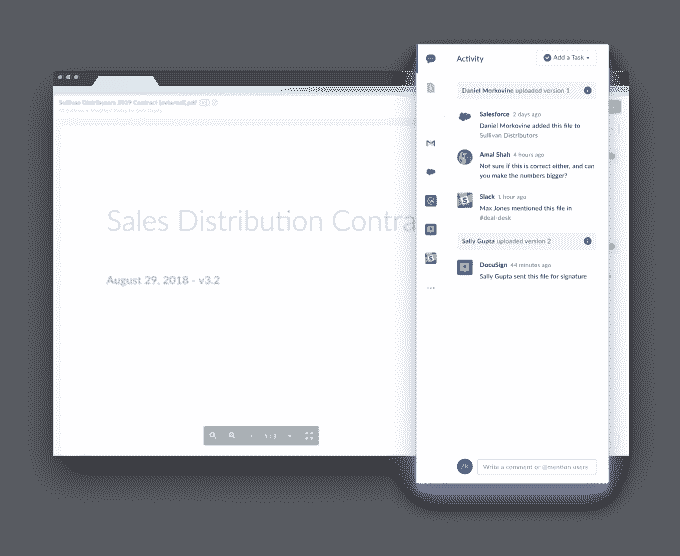

# Box 构建了一个数字中心，帮助解决内容碎片化问题 

> 原文：<https://web.archive.org/web/https://techcrunch.com/2018/08/29/box-builds-a-digital-hub-to-help-end-content-fragmentation/>

云的互联性使我们能够与组织内外的人以及不同的应用程序广泛共享内容，但这种能力也产生了自己的问题，一种数字碎片化。您如何跟踪这些内容在一系列云服务中的使用情况？这是 [Box](https://web.archive.org/web/20221207202343/http://box.com/) 希望通过其最新功能、活动流和推荐应用来解决的问题。

该公司是在本周于三藩市举行的年度客户大会[上宣布这一消息的。](https://web.archive.org/web/20221207202343/https://www.box.com/boxworks/)

Activity Stream 提供了一种在内容通过组织时实时跟踪内容的方法，包括谁接触了它以及它在什么应用程序中使用，起到了一种数字审计跟踪的作用。云时代内容的一个大问题是理解在你创建它之后发生了什么。它在 Salesforce 或 ServiceNow 或 Slack 中使用了吗？你现在可以跟踪你的内容的路径，看看人们是如何分享它的，这可能有助于消除人们在数字世界中的一些隔阂。

正如 Box 的首席产品和首席战略官 Jeetu Patel 指出的那样，一个普通的大公司可能有一千多个应用程序，在跟踪非结构化内容和获得数字轨迹的统一视图方面，没有好的方法来连接这些点。

“我们集成了超过 1400 个应用程序，当我们集成这些应用程序时，我们认为如果我们能够展示这些事件，这对我们的用户会非常有用，”他说。Patel 认为这是一个重要结构的开始，即内容中心的概念，在这里您可以看到与一条内容相关的整个交易记录。

框内的活动流侧栏。照片:盒子

但是 Box 不想仅仅停留在一系列的联系上。它还创建了正在使用的应用程序的深层链接，因此用户可以单击一个链接，打开该应用程序并查看该应用程序上下文中的内容。“看起来 Box 是一个鸟瞰内容如何被使用的逻辑场所，”Patel 说，解释了 Box 创建这一功能的想法。

一个相关的功能是推荐应用列表。[基于盒子图](https://web.archive.org/web/20221207202343/https://techcrunch.com/2017/10/11/box-graph-unleashes-relationships-between-content-and-users/)，以及什么盒子了解用户，他们使用的内容，以及它如何与其他云应用互联，它还在盒子界面上显示推荐应用的列表。这允许用户在其工作环境中访问这些应用程序，例如，他们可以从文档中共享 Slack 中的内容。

盒子里的推荐应用栏。照片:盒子

首先，推荐应用集成包括 G Suite 应用、Slack、Salesforce、DocuSign 和 Netsuite，但是 Patel 说任何通过 API 与 web 应用集成的人都会开始出现在活动流中。

虽然今天宣布了这些产品，但 Box 仍在研究如何解决这些问题。他们预计这些功能将于明年初上市。如果他们能够做到这一点，这将大大有助于解决数字碎片问题，并使 Box 成为组织的资源中心。