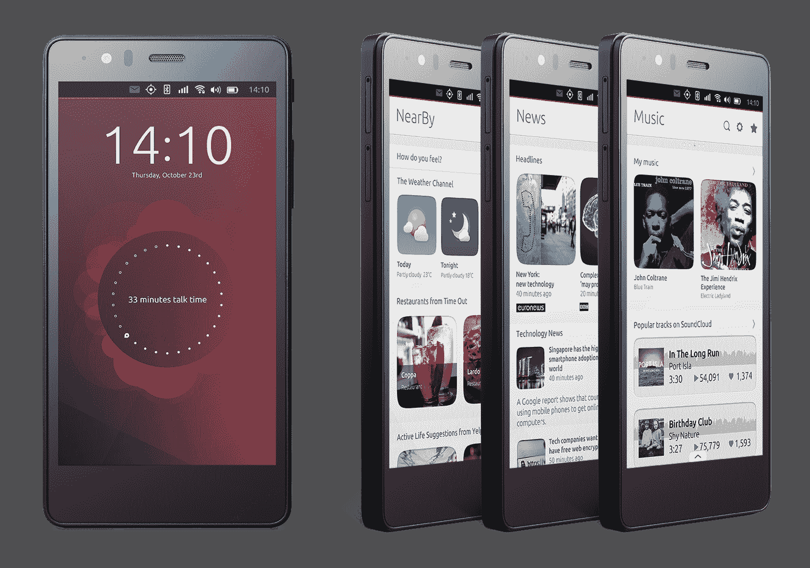

# BQ 和 Canonical 推出第二款 Ubuntu 手机 

> 原文：<https://web.archive.org/web/https://techcrunch.com/2015/06/02/bq-and-canonical-launch-their-second-underwhelming-ubuntu-phone/>

Ubuntu Linux 发行版背后的公司 Canonical 今天宣布与西班牙制造商 BQ 合作推出第二款 Ubuntu 手机。虽然在基本规格方面，它无法与任何最近(甚至更旧)的安卓旗舰手机相媲美，但新的 BQ Aquaris E5 HD 比 BQ 的第一款 Ubuntu 手机更上一层楼。

凭借平庸的 4.5 英寸 540×960 显示屏、1GB 内存和 1.3 联发科技 A7 处理器，第一款 Ubuntu 手机并不令人着迷。新设备仍然使用相同的联发科四核处理器和 1GB 的内存，但其余规格有所改善。

最大亮度为 380 cd/m2 的 720×1280 像素显示器应该可以提供明显的质量提升，尽管它甚至还不是全高清显示器。1300 万像素的后置摄像头(除了 500 万像素的前置摄像头)也比早期设备中的 800 万像素摄像头有所改进。这款手机还具有双闪光灯，可以处理 1080p 的录音。E5 最多支持两个 sim。

目前，这款设备只在欧洲销售，在€的零售价为 199.90 英镑。

和第一款手机一样，E5 也有安卓版本。在那里，测试将其与最近的 Moto G 4G 相提并论，这还不算太糟糕。它的规格与华为 Ascend G740 等价格类似的安卓手机非常一致。

“将新的操作系统推向市场需要愿意挑战移动行业现状的合作伙伴，”Canonical 移动副总裁 Cristian Parrino 今天表示。“BQ 是一个无畏的创新者，他在 Ubuntu 上的风险已经得到了回报——这第二款设备在欧洲的发布标志着两家公司的一个惊人的里程碑。”

鉴于移动市场的竞争如此激烈，推出新的手机操作系统的确需要一个无所畏惧的合作伙伴。也许与 Canonical 的努力最相似的是 Mozilla 的 Firefox OS。对于 Canonical 和 Mozilla 这样的小众玩家来说，Android 实在是太强大了，即使是在低端市场也是如此，很难在他们的产品上取得明显的进步。

按照这种速度，Canonical 的手机可能会在开源爱好者中找到一个小位置，但该公司能否很快将移动 Ubuntu 纳入主流是值得怀疑的(除非明年是手机上的 [Linux 之年](https://web.archive.org/web/20230219130039/http://www.itworld.com/article/2844225/will-2015-finally-be-the-year-of-the-linux-desktop.html))。