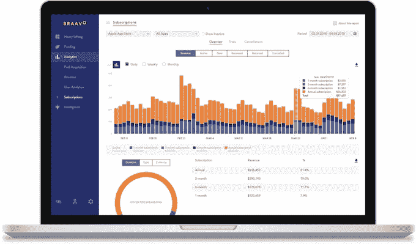

# Braavo 为其应用融资业务筹集了 600 万美元

> 原文：<https://web.archive.org/web/https://techcrunch.com/2018/08/21/braavo-series-a/>

向移动应用开发者提供融资的初创公司 Braavo 宣布，它已经筹集了 600 万美元的首轮融资。

与 Braavo 去年宣布筹集的 7000 万美元相比，这似乎不算什么，但那是债务融资，用于向开发商贷款。新一轮融资是股权融资，用于资助 Braavo 自身的运营和增长。

联合创始人马克·洛朗格告诉我，布拉佛成立于 2015 年，以应对移动应用业务的“新动态”。它与包括 Verv、Fanatee 和 Pixite 在内的开发商合作。

“这些数据是为了创造向公司提供融资的方法，否则这些公司将不得不筹集更多的(风险资金)并稀释自己，”Loranger 说。

对于其第一个融资产品，Braavo 查看了苹果应用商店和谷歌 Play 的数据，特别是一个应用程序已经赚取但尚未支付的金额。然后，它可以提供部分收入的预付款。

洛朗格将布拉佛的新产品描述为“更令人兴奋”和“更数据驱动”它着眼于用户获取、用户参与和收入，预测如果开发商有更多资金用于用户获取，收入将如何增长——然后它可以为这种增长提供债务融资。

la AVO 以“未来收入的固定百分比”获得回报，Loranger 说，因此其激励措施与开发商一致:“只有当他们未来获得更多收入时，我们才能赚回我们的钱。”如果应用收入没有像预期的那样增长，那就意味着 Braavo 收回投资的速度会更慢。

“我们从来没有丢过一分钱，”他说。

该公司还宣布推出一种新的分析产品，允许企业跟踪关键指标，如客户的终身价值。

洛朗格说，这将免费提供给任何拥有“创收移动应用业务”的人。我们的目标不是直接对产品收费，而是“为最终有资格获得资金的移动应用业务创造更多成功。”

新一轮融资使 Braavo 的股权融资总额达到近 800 万美元。它由 e.ventures 牵头，SWS Venture Capital(由绿点首席执行官史蒂夫·斯特雷特创建)和 Shipt 首席执行官比尔·史密斯参与。