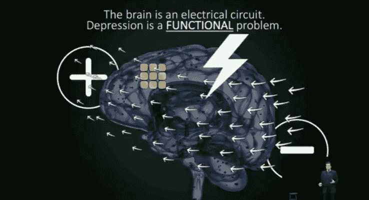

# 脑科学初创公司 NeuroQore 希望其磁铁能治愈抑郁症

> 原文：<https://web.archive.org/web/https://techcrunch.com/2017/02/09/brain-science-startup-neuroqore-hopes-its-magnets-will-cure-depression/>

NeuroQore 公司希望向你的大脑发射磁脉冲，试图治疗焦虑和抑郁等精神疾病。

大多数医生会给患者一些药物来治疗这些疾病，多达三分之二的患者对他们的第一种药物没有反应。另外 10%到 30%的患者将不会对药物治疗产生反应。但是 NeuroQore(不要与贝琪·德沃斯资助的“大脑性能”中心 [Neurocore](https://web.archive.org/web/20221208111103/http://www.thedailybeast.com/articles/2017/02/07/betsy-devos-backed-doctor-an-iranian-refugee-says-tv-can-remedy-attention-deficit-disorder.html) 混淆)希望用这些脉冲取代药物，并认为这可能是初步测试的结果。

“我们对耐药性抑郁症的缓解成功率为 87.5%，”联合创始人 Mehran Talebinjad 告诉 TechCrunch。

这是一种说法——该初创公司目前处于非常早期的阶段，受试者数量非常少——但自 20 世纪 90 年代中期以来，类似的脑电波技术已经出现在治疗精神疾病的领域。

神经反馈在几十年前兴起，用于帮助治疗抑郁、焦虑、多动症、创伤后应激障碍、冲动控制和许多不同类型的成瘾。它主要用于社会工作专业或诊所，在这些地方药物不是主要的治疗方法，它通过刺激大脑的某些部分来发送积极的信号，每当达到理想的情绪时。

当一个令人满意的脑电波模式出现时，神经反馈机器将一个愉快的音调(正反馈)发送到患者的耳朵里，这有望使大脑延长该令人满意的脑电波模式。随着时间的推移，大脑被训练成永久延长健康的脑电波模式。

NeuroQore 在 2017 年 IndieBio 演示日上展示

NeuroQore 基于 rTMS 技术。它的工作方式与其他神经反馈或电刺激疗法略有不同。它不是通过耳朵发送愉快的音调来训练大脑，而是使用磁脉冲将这些音调直接发送到大脑，以自行创建正反馈。

NeuroQore 还使用生物标志物作为物理证据来衡量其结果。与谈话疗法或药物不同，这种疗法不需要猜测大脑是否有所改善，以及在哪些方面有所改善。

根据 NeuroQore 和另一位专家的说法，我们询问了哪些人使用神经反馈，这些类型的治疗也没有副作用。但是不利的一面是，这种疗法可能并不是对每个人都有效。

拥有生物医学工程学位的 Talebinjad 在进行了第一次脑部手术后产生了这个想法。“神经调节非常重要，大脑非常复杂，”他说。“在手术过程中，我意识到没有很多有效的方法。”

NeuroQore 已经在加拿大获得批准，其总部位于安大略省。Talebinjad 和他的团队的下一个挑战是获得 FDA 的批准，尽管他说他确实有一条线。

他希望今年晚些时候在加州建立大脑中心，病人可以去那里接受磁刺激治疗。

NeuroQore 在生物技术加速器 [Indiebio 的演示日](https://web.archive.org/web/20221208111103/http://sf.indiebio.co/)首次展示其技术，今天在旧金山市中心。点击[这里](https://web.archive.org/web/20221208111103/https://beta.techcrunch.com/2017/02/09/watch-indiebio-accelerators-demo-day-today/?ncid=rss&utm_source=feedburner&utm_medium=feed&utm_campaign=sfgplus&sr_share=googleplus&%3Fncid=sfgplus)，你可以在 TechCrunch 上看到这个团队和其他人登上舞台，告诉你他们令人兴奋的新生物技术创业公司。