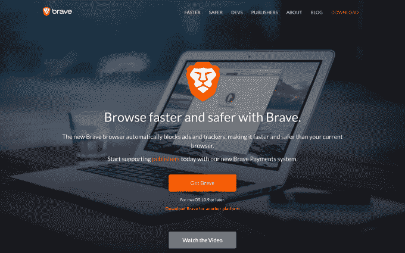

# 前 Mozilla CEO 在不到 30 秒的时间里为他的浏览器创业公司 Brave  筹集了 3500 万美元

> 原文：<https://web.archive.org/web/https://techcrunch.com/2017/06/01/brave-ico-35-million-30-seconds-brendan-eich/>

[关于首次公开募股(ICO)](https://web.archive.org/web/20230329171615/https://techcrunch.com/2017/05/24/how-to-stage-an-ico-and-other-related-questions-you-might-like-answered/) 、[围绕出售加密货币的公司筹资活动](https://web.archive.org/web/20230329171615/https://techcrunch.com/2017/05/23/wtf-is-an-ico/)已经有了很多讨论，但直到昨天还没有多少行动。就在那时，由前 Mozilla 公司首席执行官布伦丹·艾奇创立的网络浏览器制造商 [Brave](https://web.archive.org/web/20230329171615/https://brave.com/) 从其 ICO 中筹集了 3500 万美元——而且也是在不到 30 秒的时间内完成的。

ico 通过向投资者出售加密货币来运营，加密货币可用于以传统股票以外的多种方式存储价值。为了销售，Brave 创造了自己的硬币——基本注意力标志，或蝙蝠——并售出 10 亿枚。这些蝙蝠花费了 156，250 ETH，刚好超过 3，500 万美元。根据 Brave 的说法，另外 5 亿 BAT 存储用于用户增长和“BAT 开发”，该公司没有计划在未来进行另一次象征性销售。

ICO 是迄今为止票房最高的电影，Brave 的业务本身也是利用区块链更有趣的电影之一。艾希创建了 JavaScript，但[于 2014 年在有争议的情况下](https://web.archive.org/web/20230329171615/https://techcrunch.com/2014/04/03/brendan-eich-resigns-as-mozilla-ceo-following-criticism-of-his-support-for-prop-8/)离开了 Mozilla，他已经[从投资者](https://web.archive.org/web/20230329171615/https://techcrunch.com/2016/08/01/brave-the-ad-blocking-browser-from-former-mozilla-ceo-grabs-4-5-million/)那里筹集了 700 万美元，其中包括勇敢创始人基金。他认为当前的互联网广告系统存在固有的缺陷，他雄心勃勃的提议利用区块链来提高各方的效率，包括广告商、出版商和用户。

Kik 是一家深受北美年轻人欢迎的信息服务公司，[最近宣布了开发自己的“金”币](https://web.archive.org/web/20230329171615/https://techcrunch.com/2017/05/25/kik-makes-a-move-into-the-blockchain/)的计划，它将使用这种虚拟货币来支付相关商品和服务，这也是 Brave 采取的相同方法。它计划将英美烟草作为其广告系统的货币，声称这可以减少广告欺诈，提高出版商和广告商的效率。它也在评估未来小额支付和与英美烟草一起购买数字产品的潜力。

Brave 向消费者推销的是更快的加载时间、更严格的隐私控制，甚至是通过阅读内容赚钱的潜力。

更直接的是，它表示将利用这一 ICO 的收益来开发其广告平台。

勇敢 ICO 的一个引人注目的轶事是这个过程是如何被一小撮人所控制的。Coindesk 指出，只有大约 130 人真正购买了英美烟草，其中一名买家拿走了 460 万美元(价值 2 万瑞士法郎)。总的来说，Coindesk 报告说，五个买家获得了总收获量的一半，而 20 个最大的买家购买了三分之二的可用硬币。

这种情况与以太坊中许多人所持的观点背道而驰，即代币销售让任何人都能获得他们使用或关注的公司的所有权。当然，当一家公司销售数千万美元的硬币时，更大、更有组织的投资者——包括冒险的公司或早期的风险投资公司——是一个关键的组成部分，但随着 ico 变得越来越普遍，确保为较小的团体提供空间将是一个日益严峻的挑战。

除了尚未给出具体日期的 Kik 之外，总部位于亚洲的支付公司 [Omise 正准备在本月通过象征性销售](https://web.archive.org/web/20230329171615/https://techcrunch.com/2017/05/30/omise-to-raise-19m-in-first-cryptocurrency-sale-from-a-major-vc-backed-startup/)筹集不到 2000 万美元的资金，因为这一现象开始引起更多老牌(和风险投资支持的)科技公司的兴趣。