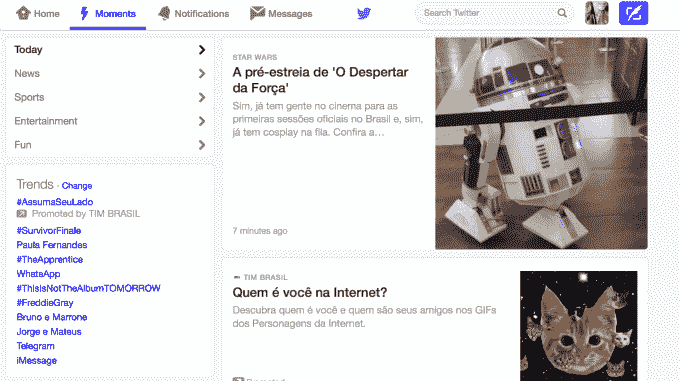

# 更新:巴西法官关闭 WhatsApp，巴西国会希望关闭社交网站 

> 原文：<https://web.archive.org/web/https://techcrunch.com/2015/12/16/brazils-congress-has-shut-down-whatsapp-tonight-and-the-rest-of-the-social-web-could-be-next/>

More posts by this contributor

更新:WhatsApp 恢复在线 [12 小时](https://web.archive.org/web/20221221021650/http://tecnologia.ig.com.br/2015-12-17/doze-horas-sem-whatsapp-suspensao-gera-memes-incriveis-nas-redes-sociais.html)进入法院下令的巴西全境 48 小时停电，原因是拒绝在调查中提交数据，此前第二名法官[裁定](https://web.archive.org/web/20221221021650/http://www.theguardian.com/world/2015/dec/17/brazil-whatsapp-ban-lifted-facebook)“数百万用户受到影响似乎不合理”，并建议用[经济处罚](https://web.archive.org/web/20221221021650/http://www.theguardian.com/world/2015/dec/17/brazil-whatsapp-ban-lifted-facebook)代替。

一夜之间，消息应用 Telegram 获得了 500 万巴西新用户，Twitter 上出现了《荒岛余生》中的场景，人们独自坐在月球上的画面，以及人们普遍看起来情绪低落的画面。

热门标签包括[# eusewhatsapp](https://web.archive.org/web/20221221021650/https://twitter.com/search?q=%23eusemwhatsapp&src=typd)(没有 whatsapp 的我)和 [#nessas48euvou](https://web.archive.org/web/20221221021650/https://twitter.com/search?q=%23Nessas48HorasEuVou&src=tyah) (在这 48 小时里，我打算……)。

如果巴西国会讨论的反隐私立法成为法律，WhatsApp、脸书和谷歌等公司将大幅增加收集、保留和与政府分享敏感用户数据的义务。

圣保罗的一名法官下令 WhatsApp 从今晚晚上9 点开始关闭[48 小时。](https://web.archive.org/web/20221221021650/http://www1.folha.uol.com.br/mercado/2015/12/1719934-justica-determina-bloqueio-do-whatsapp-em-todo-brasil-por-48-horas.shtml)

WhatsApp 是巴西最常用的应用程序，拥有约 9300 万用户，占该国互联网人口的 93%。对于巴西的年轻人和穷人来说，这是一项特别有用的服务，许多人无法支付[这个星球上最昂贵的计划](https://web.archive.org/web/20221221021650/http://exame.abril.com.br/english/brazil-now/brasil-has-most-expensive-cell-phone-rates-on-the-planet.shtml)。

巴西电信公司[已经游说了几个月](https://web.archive.org/web/20221221021650/http://www.zdnet.com/article/mobile-operators-unite-against-whatsapp-in-brazil/)来说服政府 WhatsApp 的语音服务是不受监管和非法的(与出租车行业在优步的态度[并非完全不同)，并且](https://web.archive.org/web/20221221021650/https://techcrunch.com/2015/10/01/the-fight-against-uber-is-getting-violent-in-brazil/)[公开指责](https://web.archive.org/web/20221221021650/http://g1.globo.com/tecnologia/noticia/2015/12/efeito-whatsapp-e-crise-matam-10-milhoes-de-linhas-de-celular-no-brasil.html)导致[数百万巴西人放弃手机线路的“WhatsApp 效应”。](https://web.archive.org/web/20221221021650/http://g1.globo.com/tecnologia/noticia/2015/12/efeito-whatsapp-e-crise-matam-10-milhoes-de-linhas-de-celular-no-brasil.html)

WhatsApp 的关闭相当于让半个国家脱离电网，原因是业界对太阳能即将到来的威胁发生了争吵。

当你想到巴西是宇宙中的社交媒体之都时，这是一个特别令人困惑的举动:巴西人是每个主要全球社交平台的第二或第三大受众，按每个用户计算，巴西人在社交媒体上花费的时间几乎是美国人的两倍。

但 WhatsApp 暂时关闭还不算是巴西互联网目前发生的最疯狂的事情。

如果巴西保守的国会如愿以偿，他们将关闭我们所知的整个社交网络，通过立法机构传阅法案，将发布社交媒体内容定为犯罪，并允许政府监视其公民。

这与去年大相径庭，当时总统迪尔玛·罗塞夫(Dilma Rousseff)批准了开创性的互联网“权利法案”【Marco Civil，作为对斯诺登爆料美国国家安全局(NSA)对巴西进行间谍活动的回应。这一里程碑式的法案是巴西第一部互联网立法，保护网络中立、用户隐私和言论自由。

从那以后，巴西经济陷入危机，很大程度上是由国有石油巨头巴西石油公司的广泛腐败丑闻引发的，该丑闻正在调查巴西最大的建筑公司的负责人、[大约 50 名现任政客](https://web.archive.org/web/20221221021650/http://www1.folha.uol.com.br/poder/2014/11/1548049-entenda-a-operacao-lava-jato-da-policia-federal.shtml)、[甚至前总统卢拉](https://web.archive.org/web/20221221021650/http://www.wsj.com/articles/brazilian-police-seek-to-question-former-president-in-petrobras-probe-1442008371)。

> 如果巴西保守的国会如愿以偿，他们将关闭我们所知的整个社交网络，通过立法机构传阅法案，将发布社交媒体内容定为犯罪，并允许政府监视其公民。

与此同时，迪尔玛的支持率停滞在个位数，许多人呼吁弹劾她，包括巴西相当于众议院议长的爱德华多·库尼亚。库尼亚本人正在接受腐败调查，并被指控在巴西石油公司 Petrobras 的丑闻中洗钱数百万美元。

库尼亚，一位前电信游说者，在该法案提交给迪尔玛并成为法律之前，是 Marco Civil(尤其是其网络中立条款)最大的反对者之一。

但一年后，他控制了一个由福音派极端分子和军事独裁辩护者主导的国会，并正在起草或倡导一系列拟议的法律，这些法律不仅会废除 Marco Civil 关于消费者隐私和言论自由的规定，还会有效地将社交媒体的使用定为刑事犯罪。

反对者戏称为“大间谍”(O Espiã)的 PL 215/15 是一项监控法律，要求巴西人输入他们的[税号、家庭住址和电话号码](https://web.archive.org/web/20221221021650/http://idgnow.com.br/internet/2015/10/06/projeto-de-lei-que-altera-o-marco-civil-e-aprovado-na-ccj/)才能访问互联网上的任何网站或应用程序，并要求脸书和谷歌等公司将这些信息存储长达三年，并向警方提供法院命令。一份早期的草案称，“主管当局”可以在没有法院命令的情况下要求这些数据。

由库尼亚起草的另一部分法律将允许政客们实际上随意审查社交媒体。

这是对欧盟“被遗忘权”立法的扭曲，该立法为普通公民(但不是公众人物)建立了一个程序，要求将他们过去的某些形式的敏感内容从搜索结果中删除(但不从网络上删除)。

库尼亚撰写的版本将允许巴西政客不仅要求他们发现的诽谤性、伤害性或过时的内容被取消索引，而且实际上命令将其从网上删除(通过法院命令，警方可以获得在脸书等地发布该内容的人的家庭地址和纳税 ID)。

国会下议院[在 10 月](https://web.archive.org/web/20221221021650/http://idgnow.com.br/internet/2015/10/06/projeto-de-lei-que-altera-o-marco-civil-e-aprovado-na-ccj/)批准了 PEC 215。现在，它将进入国会投票，然后进入参议院，最终由迪尔玛投票。

WhatsApp 正在巴西的 Twitter 上走红

“这是国会如何看待互联网的一个很好的例子，”马可公民的发起人之一，现任里约热内卢互联网技术协会[主任罗纳尔多·莱默斯说。“所有这些努力和精力都是为了给互联网定罪。巴西的许多政客觉得互联网只是用来说他们的坏话的。他们讨厌互联网。这是一种威胁。”](https://web.archive.org/web/20221221021650/https://www.facebook.com/ITSriodejaneiro/)

莱默斯说，这项立法提案是巴西几十年来对言论自由的最大威胁。

对于那些不熟悉巴西政治的人来说，言论自由只是库尼亚攻击下的公民权利彩虹之一。

仅在今年，他还推动了“同性恋治疗”的立法；一项法律允许 16 岁的青少年在刑事系统中作为成年人接受审判；另一项是禁止事后避孕药，限制强奸受害者堕胎的权利；还有一项名为 PEC 215 的法案——不要与 PL 215 混淆——取消了土著巴西人对其土地的宪法权利。交给国会。

同样值得注意的是，库尼亚不是唯一一个支持反互联网立法的人，前面提到的法案也不是唯一摆在桌面上的法案——甚至不是最糟糕的法案。

> 巴西的许多政客觉得互联网只是用来说他们的坏话的。他们讨厌互联网。这是一种威胁。罗纳尔多·莱默斯，互联网技术学会主任

马可·文去世后一年内提出的其他反互联网法案——全部由国会福音派成员起草——包括 [PL 1676](https://web.archive.org/web/20221221021650/http://www2.camara.leg.br/proposicoesWeb/fichadetramitacao?idProposicao=1295741) ，可能会在本周进行投票。

PL 1676 将规定，任何人未经他人明确授权拍摄、拍摄或捕捉他人声音都是犯罪行为，最高可处以两年监禁(如果照片背景中出现某人，甚至自拍也可能是犯罪行为)。如果这些视频被发布到互联网上，将会被判处最高六年的监禁。

还有:PL 1547 和 PL 1589，[PL 215](https://web.archive.org/web/20221221021650/http://gizmodo.uol.com.br/giz-explica-pl-espiao/)的附录，将增加对网络诽谤、中伤和中伤案件的处罚。

PL 2390 将创建一个巴西互联网用户的中央数据库，作为禁止儿童和青少年访问不当内容的一种手段，但也可以很容易地用来阻止巴西青年——互联网用户中增长最快、最活跃的部分——访问 YouTube 和 Twitter 等主要社交平台。

在这个可能很快成为全球最大的社交媒体市场中，言论自由和隐私权受到了威胁。

虽然巴西的网民数量还不到美国的一半，但在全球各大社交平台上，巴西已经是仅次于美国的第二或第三大玩家了，比如 T2、脸书、谷歌、推特等等。还有另外 1 亿巴西人还没有上网，包括大量的年轻人、穷人和农村人口。就社交媒体消费而言，未来十年巴西完全有可能成为全球最大的互联网受众，千禧一代巴西人也将成为全球社交最活跃的人群。

> 在这个可能很快成为全球最大的社交媒体市场中，言论自由和隐私权受到了威胁。

为了了解互联网在巴西的应用有多么具有破坏性，以及它对现有秩序的威胁有多大，可以考虑千禧一代是当今唯一没有经历过军事独裁的巴西人(巴西在 20 世纪有过两次军事独裁，最后一次结束于 1985 年)。

随着他们上网，他们越来越多地使用社交网络作为表达意见和组织的工具。他们利用脸书事件，在 2013 年巴西世界杯前夕，让数百万人走上街头进行历史性抗议。他们[合作起草了](https://web.archive.org/web/20221221021650/https://techcrunch.com/2014/03/19/brazils-constitution-of-the-internet-puts-net-neutrality-in-the-spotlight/)他们自己的宏观民事立法，在线众包了法案最终文本的 70%。像 [Midia Ninja](https://web.archive.org/web/20221221021650/https://www.facebook.com/midiaNINJA) 和 [Papo 烈斗](https://web.archive.org/web/20221221021650/https://www.facebook.com/ColetivoPapoReto/)这样的独立媒体团体因报道针对贫穷黑人青年的[猖獗的警察暴力](https://web.archive.org/web/20221221021650/http://fusion.net/video/150436/these-citizen-journalists-in-rios-poorest-areas-are-fighting-police-brutality-with-smartphones/)等问题而吸引了全球的关注。

在这种情况下，拟议的反互联网立法是对这种新兴数字授权的直接反应，也是对社交媒体的多管齐下的攻击——限制巴西穷人和青年人口访问互联网，将几乎所有视频、照片和音频内容的发布定为刑事犯罪，以及审查不受现政府欢迎的声音。

行业专家一致认为，至少这些拟议法律的一些组合有可能在国会获得通过。然而，最终这些法案将会停留在迪尔玛总统的办公桌上。

迪尔玛去年力推马尔科 Civil，她的政党在历史上一直施加这种限制——尽管随着即将到来的弹劾战，迪尔玛的日子可能屈指可数。撇开政客不谈，我们可以期待看到巴西的数字一代如何决定团结起来支持开放网络。