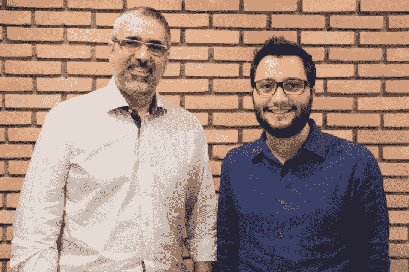
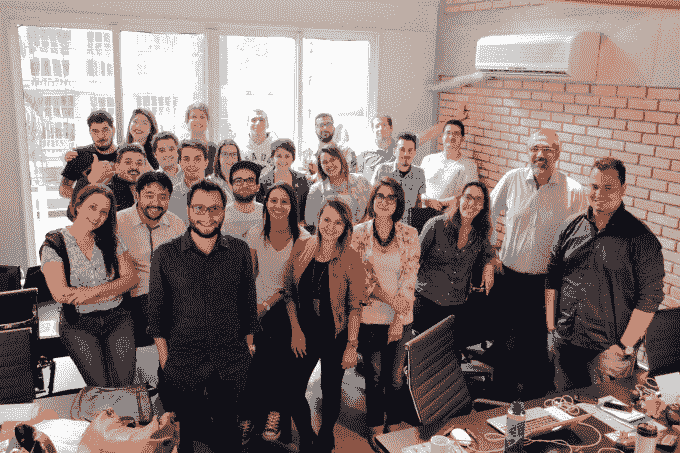

# 巴西桑巴广告公司筹集 300 万雷亚尔，从 YouTube TechCrunch 上拿下优质视频广告

> 原文：<https://web.archive.org/web/https://techcrunch.com/2015/04/23/brazils-samba-ads-raises-r3-million-to-take-premium-video-advertising-off-youtube/>

**编者按:** *朱莉·鲁瓦罗是一名* *自由撰稿人和 RedLightR.io 和RioChromatic.com的编辑。*

总部位于圣保罗的初创公司 Samba Ads 宣布，来自一个国际投资者联盟的 300 万雷亚尔(100 万美元)投资将押注于巴西的在线视频机会。

巴西的 e.bricks，巴西-以色列公司 Initial Capital，以色列公司 Rhodium 和 Dave McClure 的 500 家初创公司在 2013 年筹集了 50 万雷亚尔[种子轮](https://web.archive.org/web/20221204164203/http://thenextweb.com/la/2013/02/20/samba-ads-raises-500k-hopes-to-become-latin-americas-leading-video-ad-network/)并都返回了 A. e.bricks 总经理[佩德罗·梅尔策](https://web.archive.org/web/20221204164203/https://www.crunchbase.com/person/pedro-sirotsky-melzer)将加入桑巴广告联合创始人[罗德里戈·保鲁奇](https://web.archive.org/web/20221204164203/https://www.crunchbase.com/person/rodrigo-paolucci)和[古斯塔沃·卡埃塔诺](https://web.archive.org/web/20221204164203/https://www.crunchbase.com/person/gustavo-caetano)，以及 Initial Capital 的[丹尼尔·卡内罗·达](https://web.archive.org/web/20221204164203/http://www.initial.vc/aboutus)

众所周知，巴西拥有一些世界上最超级社会化的媒体消费者，但该国的在线视频消费几乎同样庞大。根据康姆斯克 2015 年 2 月的数据，每月约有 6500 万巴西人——约占该国互联网人口的 65%——每月观看超过 110 亿个在线视频，即每人每天观看 6 个视频。YouTube 是最大的玩家，拥有 5300 万观众，其次是脸书(4900 万)和 Maker Studios(2100 万)。

真实的数据可能要高得多。康姆斯克只占桌面观看的比例，而巴西人越来越多地用手机上网。

尽管智能手机价格昂贵且带宽落后，但巴西拥有世界第五大智能手机市场，四分之一的巴西人通过手机接入互联网。视频观看条件对广告商来说是最好的。巴西人的视频完成率超过 87%，比全球平均水平高出 [41%。与任何其他移动格式相比，他们更喜欢视频广告。](https://web.archive.org/web/20221204164203/http://www.emarketer.com/Article/Brazil-Stands-Digital-Video-Viewing-Latin-America/1012028)

但根据桑巴广告公司首席执行官罗德·保鲁奇的说法，尽管这些数字很诱人，但只有不到 9%的库存有存货，他认为这意味着一个巨大的机会。(也许甚至是后滚翻单元的复活。)

自拉丁美洲最大的在线视频平台 Samba Tech 成立以来，保鲁奇和联合创始人古斯塔夫·卡埃塔诺(Gustavo Caetano)在过去的十年里一直沉浸在巴西的数字视频中。

但是，虽然 Samba Tech 为大公司、大学和远程学习玩家提供企业流媒体解决方案，但创始人希望探索分布式视频的广告机会，并在 2013 年作为一家独立公司推出了 Samba Ads，由上述投资者和 Groupon Brazil 的创始人兼前首席执行官 Florian Otto 提供种子资金。

"我们最大的问题是，YouTube 之外还有生命吗？"保鲁奇在圣保罗通过 Skype 电话说道。“广告商会购买 YouTube 以外的媒体吗？他们觉得有价值吗？”

Samba Ads 将市场的三方聚集在一起，看看是否有超越 YouTube 的货币化:优质内容创作者、长尾出版商和广告代理商。

> 我们最大的问题是，YouTube 之外还有生命吗？罗德保鲁奇

从汤森路透到名厨[卡拉伯南布哥](https://web.archive.org/web/20221204164203/http://carlota.com.br/carla/)的大约 50 名内容创作者每天向桑巴广告的 2 万个视频库中添加大约那么多品牌友好的视频。超过 500 家长尾出版商，包括相当数量的地方和地区新闻网站，在无需与多个内容合作伙伴签署许可协议的情况下分发视频。

桑巴广告削减广告交易——通常是与代理机构——以维持每月约 3000 万独立观众的库存。内容创作者和 Samba 广告各保留大约 40%的分成，剩下 20%给出版商。

在内容方面，桑巴广告看不到任何竞争。“我们为这些创作者创造了新的观众，”保鲁奇说。“我们让他们继续在自己的财产和 YouTube 上做他们的工作，但我们在巴西各地的网站上分发。”

但他们与 YouTube 和 2014 年在巴西推出的 Fullscreen 竞争数字广告美元，这是巴西一个[12 亿美元](https://web.archive.org/web/20221204164203/http://adage.com/article/digital/brazil-s-big-social-media-land-grab-heats/240061/)的市场。保鲁奇说，圣保罗、里约和巴西利亚的七人销售团队 90%的工作都是与代理商合作，而不是直接与品牌合作，包括奥美、麦肯、JWT 和 DDB 的巴西前哨，以及巴西球员 [Loducca](https://web.archive.org/web/20221204164203/https://www.facebook.com/AgenciaLoducca/app_312426148809670) 、 [Riot](https://web.archive.org/web/20221204164203/http://www.riot.com.br/) 、 [Ampfy](https://web.archive.org/web/20221204164203/http://ampfy.com/) 和 [Africa](https://web.archive.org/web/20221204164203/http://africa.com.br/) ，AdAge 的 2014 年年度国际代理商，代表着从红牛和百事到微软和欧莱雅的客户。

> 我不在乎他们是否观看实际的视频，我在乎他们是否参与广告内容。罗德保鲁奇

“当我们第一次与这些机构合作时，我们面临着一个挑战，那就是展示我们可以做一份有趣的工作，展示视频可以成为一个很好的投资点，”保鲁奇说。“我们最初的想法是，让我们向您展示视频的力量，从传统展示或任何地方获得资金，我们可以推动更好的结果。随着时间的推移，市场开始增长，我们需要与最大的玩家 YouTube 区分开来。我们最大的标志是优质内容。在这里你不会发现猫弹琴或者用户生成的内容。”

Samba Ads 提供标准的 IAB 单元[,如前置广告](https://web.archive.org/web/20221204164203/http://odia.ig.com.br/noticia/mundoeciencia/2015-04-01/no-dia-da-mentira-conheca-os-maiores-mentirosos-do-mundo.html),但也推出了互动实验，包括一个[超级前置广告](https://web.archive.org/web/20221204164203/http://www.sambaads.com.br/galeria-superpreroll#sitesambasuperpreroll),你可以将鼠标放在广告上并与之互动。

保鲁奇说:“对于广告公司来说，这是一种权衡，既要考虑对他们来说安全的东西，又要考虑可能会占用他们更多时间，但会带来一些很好的结果，他们可以向客户展示，并说，‘嘿，这是巨大的新东西，这是未来。’。“这就是无聊和新奇之间的权衡。大多数定价都是标准的 CPM，但我们也提供每次项目的成本。我不关心他们是否观看实际的视频，我关心他们是否参与广告内容。”

