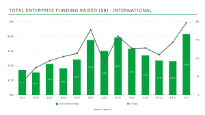
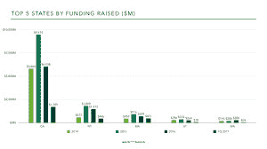

# 打破记录，2017 Q1 2017 TechCrunch 企业融资增长近 80%

> 原文：<https://web.archive.org/web/https://techcrunch.com/2017/04/17/breaking-records-enterprise-fundings-are-up-nearly-80-in-q1-2017/>

米基·格拉汉姆撰稿人

米奇·格雷厄姆在企业技术投资公司工作

[Work-Bench](https://web.archive.org/web/20221006130634/https://www.work-bench.com/)

在经历了企业技术风险投资低迷的一年后，2017 年以企业技术创业公司创纪录的季度开始。

在连续 4 个季度投资减少后，仅在 2017 年第一季度，投资者就向企业科技创业公司投入了创纪录的 50 亿美元，比上一季度增长了近 80%，交易数量达到创纪录的 237 笔。

这些创业公司——为世界上最大的公司解决数据和分析、云原生基础设施、网络安全以及面向未来工作场所的人工智能商业应用的问题——正在通过抓住全球 1000 强和财富 500 强每年在软件和技术上花费的近[3.5 万亿](https://web.archive.org/web/20221006130634/http://www.gartner.com/newsroom/id/3482917)美元来建立业务。

他们正在享受这一刻。今年早些时候，思科在 AppDynamics 公开募股前以 37 亿美元收购了该公司，两周前，MuleSoft 在上市首日股价上涨 45%，紧随其后，企业显然很受欢迎。

随着 Alteryx 上周的 IPO，仍有一系列强大的企业退出，包括 Presido、Okta 和 Yext，它们都提交了 S-1 准备 IPO，还有包括 Cloudera、DocuSign、Domo 和 Tenable Network Security 在内的更多公司的猜测。

作为一家专注于企业技术的风险投资基金，我们在[工作台](https://web.archive.org/web/20221006130634/http://www.work-bench.com/)一直在密切关注这些数字。我们每周都会跟踪并记录所有公开宣布的企业技术融资回合，利用我们公开的[企业初创企业融资数据库](https://web.archive.org/web/20221006130634/http://www.work-bench.com/blog/2014/10/29/enterprise-technology-startups-funding-database/)中的数据，我们查看了 2017 年在 Q1 完成的破纪录的 237 笔交易。

从地理数据和各州筹集的资金来看，加州明显领先。自 2014 年以来，纽约凭借其与财富 500 强客户和金融服务、制药、媒体、保险和电信巨头等各种行业买家的无与伦比的接近，已经成为美国企业技术的第二大中心。不过，马萨诸塞州确实有一个强大的 Q1，以 4.71 亿美元的融资额险胜纽约州，位居第二，而纽约州的融资额为 4.46 亿美元。马萨诸塞州的增长受到了大型后期交易的推动，包括 Fuze 1 . 04 亿美元的 E 系列、Kamina Rio 7500 万美元的 F 系列、data robot 5400 万美元的 C 系列和 ken sho 5000 万美元的 b 系列。

与此同时，纽约从 ie 的 D 轮和 Collibra 的 C 轮获得了两轮 5000 万美元的融资，但大部分融资来自种子到 B 轮创业公司，这预示着这座城市在早期生态系统中的持续势头。鉴于 2017 年可能也会融资的成熟公司数量，纽约可能会在未来一两个季度重新控制马萨诸塞州，今年年底排名第二，仅次于加利福尼亚州。

其他值得注意的交易包括新加坡数据中心公司 AirTrunk 从高盛获得的 4 亿美元风险投资，自动化应用测试公司 Tricentis 的 1.65 亿美元 B 轮投资，connect smart machines 平台 ClouldMinds 的 1 亿美元 A 轮投资，以及实时数据流 Confluent 的 5000 万美元 c 轮投资。祝贺所有这些伟大的公司在企业技术方面创下破纪录的季度。