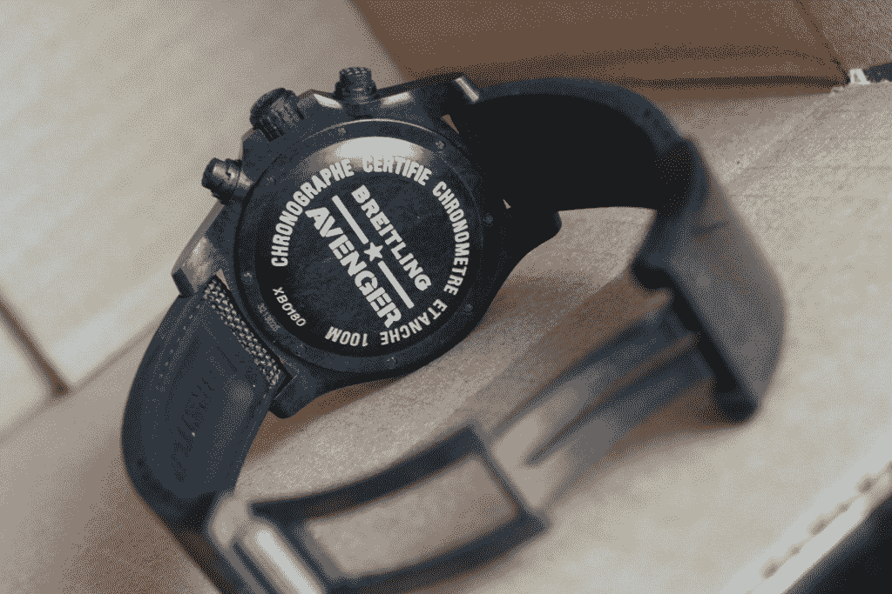
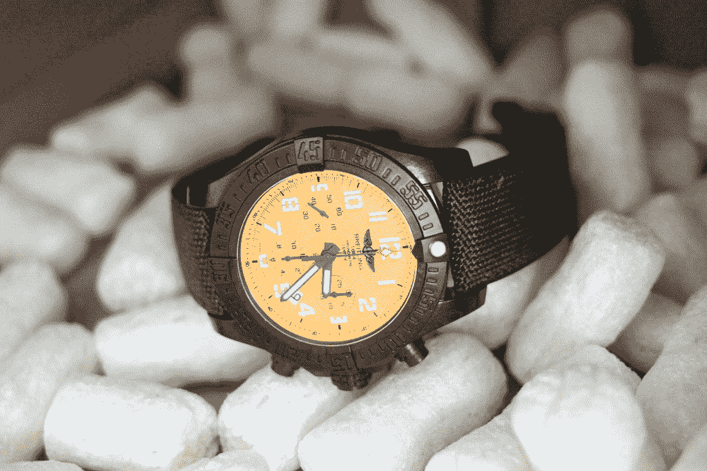

# 百年灵复仇者飓风 45 腕表采用高密度复合材料保持轻盈 

> 原文：<https://web.archive.org/web/https://techcrunch.com/2017/06/13/breitlings-avenger-hurricane-45-watch-uses-dense-composites-to-stay-light/>

# 百年灵的复仇者飓风 45 腕表采用高密度复合材料保持轻盈

根据钟表界的传说，第一款由钢制成的奢华腕表——爱彼皇家橡树()在 1972 年推出时引起了巨大的恐慌。在那之前，有计时器 Timex 和 Seiko 等小型廉价手表——以及劳力士和百达翡丽等品牌在退休时赠送的昂贵手表。用钢制造豪华手表是一种暴行，但最终钢超越了贵金属制成的手表。

等着瞧吧，那些钢铁般的反对者会听说一种塑料制成的豪华手表。

超轻复仇者飓风 45 计时腕表是使用百年灵百年灵百年灵聚合物的最新腕表，这种聚合物本质上是一种防刮擦的汞合金，比钛更轻，比钢更坚固。手表本身包含一个制造(阅读“定制”)计时机芯，并带有橡胶帆布表带。所有这些意味着这是你戴过的最坚固、最轻的手表之一。

45 毫米的腕表几乎让人感觉转瞬即逝，尤其是与同样尺寸的精钢计时表相比。虽然我没有用卡车碾过这个东西，但聚合物耐刮擦，非常舒适，因为它是由塑料制成的，所以对皮肤上的金属过敏的人来说很好。这是一种舒适的穿着——一点也不沉重——45 毫米的面部穿着舒适，看起来比实际尺寸小。

你为什么想要一块塑料手表？百年灵煞费苦心地解释说，这不仅仅是一大块塑料挤到一个模具里，充满了运动。这是一种特殊材料，由百年灵定制，产量非常小。还有两种型号使用这种材料，一种是 24 小时计时码表，另一种是三指针型号 [Colt Skyracer](https://web.archive.org/web/20221208141611/http://www.ablogtowatch.com/breitling-colt-skyracer-watch-price/) 。考虑到手表上一次重大的材料变化是在香奈儿和其他人开始使用陶瓷的时候，塑料并不是一个很大的挑战。

拥有一块独一无二的塑料手表的乐趣有多大？试试 8390 美元，这个价格反映了制造机芯、计时码表认证(每一款百年灵都经过官方精度认证，在智能手表的世界里这是一件毫无意义的事情，但在机械方面仍然很重要)，以及超轻表壳。它只是告诉你，奢侈品的定义每隔几年或几十年都会发生变化，今天的计时器就是明天的奢侈品。

复仇者飓风 45 号现已发货。