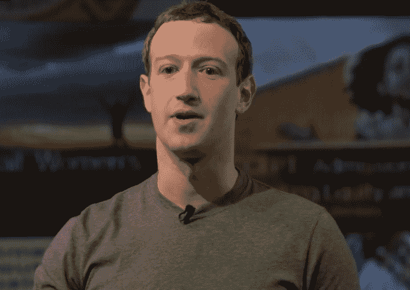
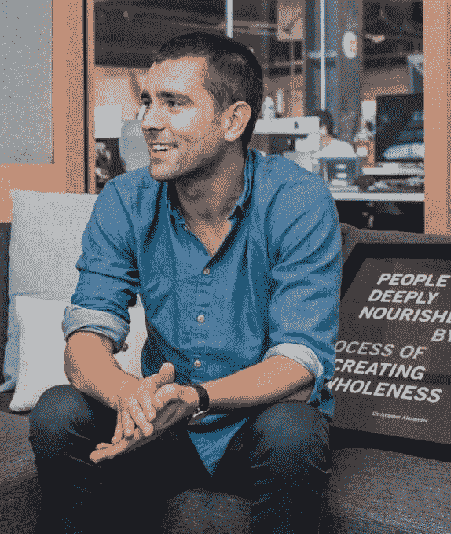

# 脸书改变使命宣言，以“让世界更紧密地联系在一起”

> 原文：<https://web.archive.org/web/https://techcrunch.com/2017/06/22/bring-the-world-closer-together/>

“让世界更加开放和互联”有一个根本性的缺陷:它没有推动更多联系带来任何具体的积极结果。从技术上来说，它可能包括通过新闻馈送进行的数字偷窥，用面对面的友谊换取在线认识，或者过滤泡沫和回声球，这些都进一步使美国两极分化。

因此，今天，当脸书的月用户接近 20 亿时，其首席执行官马克·扎克伯格[透露了](https://web.archive.org/web/20230404054507/https://www.facebook.com/zuck/posts/10154944663901634)一项新的使命声明，即“给予人们建立社区的力量，让世界更加紧密。”

> 我们有责任做得更多。脸书首席执行官马克·扎克伯格

今天，扎克伯格在针对顶级群组管理员的[脸书社区峰会](https://web.archive.org/web/20230404054507/https://techcrunch.com/2017/04/11/facebook-communities-summit/)上宣布了这一变化，会上[宣布了](https://web.archive.org/web/20230404054507/https://techcrunch.com/2017/06/22/facebook-group-admin-tools/)新的群组管理工具。“在过去十年左右的时间里，我们一直专注于让世界变得更加开放和互联。但我过去认为，如果我们只是给人们一个声音，并帮助一些人联系起来，这将使世界本身变得更加美好，”扎克伯格承认。“环顾四周，我们的社会仍然如此分裂。我们有责任做得更多，不仅仅是连接世界，而是让世界更加紧密。”

扎克伯格说，脸书正在把这个新使命变成一个目标，而不是让它仅仅成为一种理念。“我们希望帮助 10 亿人加入有意义的社区。如果我们能够做到这一点，这不仅将扭转我们在世界各地看到的社区成员整体下降的趋势…而且还将加强我们的社会结构，使世界更加紧密。”现在，脸书认为只有 1 亿有意义的群体成员。

脸书使命宣言的演变是其转型的一个里程碑。在围绕美国总统选举的假新闻丑闻的催化下，扎克伯格首先以他的[6000 字社区信](https://web.archive.org/web/20230404054507/https://techcrunch.com/2017/02/16/building-the-world-we-all-want/)为[“建设社区”](https://web.archive.org/web/20230404054507/https://www.facebook.com/notes/mark-zuckerberg/building-global-community/10154544292806634)做了铺垫，重点是脸书可以提供什么帮助。他指出，“当我们开始时，这个想法没有争议。世界每年都变得更加紧密，这被视为一种积极的趋势。然而现在，在世界各地，有些人被全球化抛在后面，有些人正在退出全球联系。”

然后在他的哈佛毕业典礼演讲中，他概述了个人如何帮助“创造一个每个人都有目标感的世界。”现在扎克伯格已经把这些意图写进了脸书的宪章。

脸书首席产品官 Chris Cox

脸书首席产品官克里斯·考克斯(Chris Cox)在脸书庞大的开放式总部的一间玻璃墙会议室里接受采访时告诉我，“我们正在达到一个值得认真审视的规模，看看我们能做些什么来让社交媒体成为尽可能积极的力量。”。他认为新的使命是一种“细化”，亲密关系是一种更具体的联系形式。

考克斯说:“使命有一种方式成为我们谈论我们正在做的事情并相互证明事情的方式。”。“亲密感确实引起了共鸣，它既是一种技术——现在我们可以以前所未有的方式联系在一起——但也是一种深深的人性。”证明人性已经成为一个中心主题，无论是对脸书来说，还是对扎克伯格来说，前者在过去几年里更加重视隐私，后者正在进行他的 T2 全国倾听之旅。

考克斯同意，没完没了地、不健康地浏览脸书并把自己与他人进行比较会让人感到孤立的“联系”与建立更深层次的友谊和公民关系的“亲密”是有区别的。他还说，脸书不断从用户那里寻求定性反馈，了解在他们的体验中什么是有意义的，什么是没有意义的。考克斯没有回答脸书是否专门调查网络成瘾，并驳斥了脸书太多会让人抑郁的说法，但坚持认为“公司的每个部门都有强烈的责任感”

真正的考验将是后续行动，以及脸书愿意将使命置于业务之上的情况。这可能意味着疏远一些更不宽容的用户，做出改变以减少人们看到的广告数量，或者改善隐私和用户控制，以减少公司收到的可赚钱的数据流。

脸书也许会通过接受更多的脸书并不总是解决问题的方法来完成它的新使命。理想情况下，脸书的通信工具和内容算法会变得如此之好，以至于它们似乎会消失，让人们在没有它的情况下变得更亲密。

*你可以在这里阅读[扎克伯格的完整演讲](https://web.archive.org/web/20230404054507/https://www.facebook.com/zuck/posts/10154944663901634)并观看他在以下社区峰会上的主题演讲:*