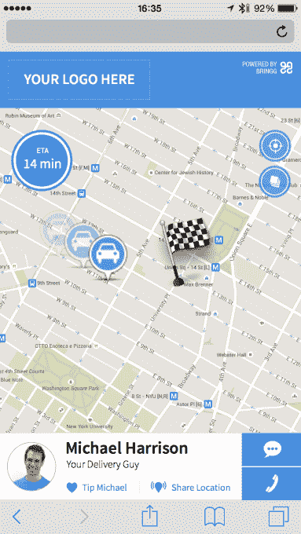

# Bringg 筹集了 500 万美元，因此任何企业都可以提供优步式的体验 

> 原文：<https://web.archive.org/web/https://techcrunch.com/2015/12/16/bringg-raises-5-million-so-any-business-can-offer-an-uber-like-experience/>

如果按需交付是交付的未来，一家名为 [Bringg](https://web.archive.org/web/20221206183400/http://bringg.com/) 的初创公司旨在帮助现有企业更好地与亚马逊和优步等公司竞争。该公司现已筹集了 500 万美元的首轮融资，以进一步开发其网络和移动平台，通过提供实时司机跟踪、调度、警报、移动消息、ETAs 等功能，企业将进入按需时代。

除了首轮融资，Bringg 迄今为止已经筹集了 750 万美元的外部投资。

自今年早些时候推出以来，总部位于特拉维夫和纽约的 Bringg 将其业务扩展到 50 多个国家的数百个客户，包括美国以外的许多市场，包括欧洲、亚洲甚至非洲的部分地区。

2013 年由 MobileMax 前创始人兼首席执行官 Raanan Cohen(首席执行官)创立；曾任 GetTaxi 和 Clarizen.com 首席技术官的 Lior Sion(首席技术官)表示，这家初创公司的想法是通过提供企业所需的技术，为任何交付操作带来优步般的可见性，以添加当今消费者想要的功能，如司机在路上时得到通知、获得基于文本的警报、跟踪他们的交付进度等。

在业务方面，Bringg 提供与现有系统的集成、web 和移动调度、交付跟踪，以及用于与客户通信、签名收集和其他任务的驱动程序应用程序。

最初，这家初创公司与一些较小的公司签约，比如食品配送服务公司 Lish 和 T2 Zuppler T3。但它发现，企业市场——即员工中已有 1000 名以上司机的企业——拥有更大的潜力。这包括希望与亚马逊、服务提供商和其他送货上门业务竞争的大型零售商。

Sion 说，“这些公司通常不是软件企业，它们是零售商，或者是送货公司。”他解释说，这些企业擅长运营和营销，但不一定擅长技术和产品。这就是 Bringg 提供的。

这位联合创始人表示，该公司的目标受众现在是那些已经拥有交付力量、但希望更快行动以保持相关性的大型企业。

“我们从更大的公司和企业那里获得了更多的关注，这有点令人惊讶，”Sion 承认道。“所有像亚马逊和优步这样的初创公司和大公司都在彻底改变这个行业；他表示:“大企业受到了这场革命和颠覆的威胁，但却没有办法做出反应。

“我们帮助他们缩短上市时间。他们不是自己开发[按需基础设施]，而是利用我们，”Sion 补充道。

[gallery ids="1252482，1252479，1252480，1252481"]

如今，Bringg 拥有近 24 家大型企业客户，正是这些客户促成了首轮投资。回到这一轮的是种子投资者 ITURAN，这是一家车队管理公司，现在又加入了一家新的美国战略投资者 Bringg，该投资者拒绝透露信息，还有几名未透露姓名的个人。(Sion 指出，新的战略投资者也是 Bringg 的客户。)

这笔资金将用于扩大 Bringg 目前在美国和以色列的 18 人团队，扩大开发工作，包括添加新功能，如与移动按需订购系统集成，以及扩大公司的营销和销售队伍，以更好地瞄准大型组织。

消费者可能永远也不会认识到 Bringg 的品牌名称——这是一个企业为自己定制和品牌的白标解决方案。但这意味着，我们可能很快就会看到更多公司开始提供实时送货跟踪、查看包裹在地图上的位置、短信提醒、与司机沟通的工具等服务。