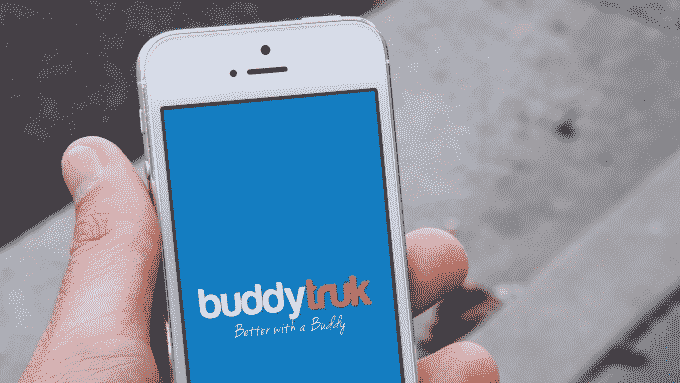

# Buddytruk 是一个共享服务，类似于 Lyft，用于移动 

> 原文：<https://web.archive.org/web/http://techcrunch.com/2014/08/14/buddytruk-is-a-sharing-service-like-lyft-for-moving/>

# Buddytruk 是类似 Lyft 的搬家共享服务

随着像优步和 Lyft 这样的共享服务变得越来越受欢迎，看到这些想法扩展到不同的服务，如搬家，也就不足为奇了。

Buddytruk 是一个点对点的按需搬运平台，让拥有卡车或小型货车的人申请成为搬运工。

iOS [应用](https://web.archive.org/web/20221028221930/https://itunes.apple.com/us/app/buddytruk/id826283020?mt=8)让用户拍下他们想要移动的家具，然后图像被发送给该地区所有雇佣的司机。接受的司机将到达用户的位置来包装物品并将其移动到期望的位置。

Buddytruk 只允许你移动一两件物品，目前正在洛杉矶运营，但首席执行官兼创始人 [Brian Foley](https://web.archive.org/web/20221028221930/http://www.crunchbase.com/person/brian-foley-2) 表示，该公司希望很快扩展到纽约市。

该应用程序有一个内置的算法，可以跟踪时间和里程。当驱动器开始和结束时，用户会收到推送通知，以便他们可以确保数字是正确的。一小时平均约为 40 美元，价格会随着时间的推移而下降。

80%的利润归司机，公司拿 20%。这项服务也没有时间限制，所以如果你的行程只有 15 分钟，你就要为此付费。

司机可以通过应用程序或网站申请，接受犯罪背景调查和车管所检查。当公司会见司机时，他们的车辆也要接受检查。

Buddytruk 还允许司机和用户对乘车进行评级。Foley 说，如果司机不得不处理试图移动超过最小数量物品的用户，或者如果用户不在取货地点，这有助于获得反馈。

尽管按需搬家服务并不新鲜。田纳西州的旅馆侍者已经存在两年了，今天，优步宣布在纳什维尔与旅馆侍者合作 [UberMover](https://web.archive.org/web/20221028221930/http://blog.uber.com/ubermovernash) 。周末有搬家服务。酒店服务员提供类似于 Buddytruk 的服务，用户可以在几个小时内订购搬运工。这项服务最初是为大学生提供的，但该公司在 42 个州的 121 个城市开展业务，约有 8000 名员工。

Buddytruk 由一个九人团队领导，迄今为止已经筹集了大约 15 万美元，可能还有很多事情要做，但如果你现在住在洛杉矶，需要搬家，这似乎是一个很好的选择。