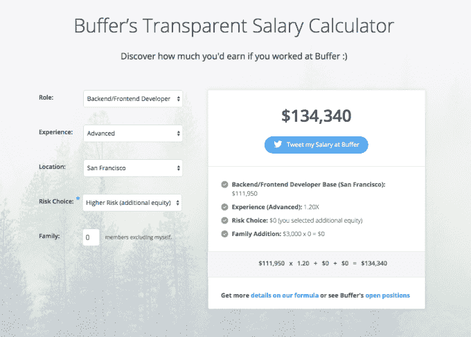

# Buffer 重新调整其公开的薪资公式 

> 原文：<https://web.archive.org/web/https://techcrunch.com/2015/11/24/buffer-rejiggers-its-open-salary-formula/>

# Buffer 重新设置了它的公开工资公式

Buffer，一家以彻底透明而闻名的公司，已经改革了它用来计算员工工资的工资算法。

距离 Buffer first [公布薪资清单](https://web.archive.org/web/20221210051621/https://open.buffer.com/introducing-open-salaries-at-buffer-including-our-transparent-formula-and-all-individual-salaries/)已经过去好几年了。该公司还有一个任何人都可以阅读的[股权图](https://web.archive.org/web/20221210051621/https://open.buffer.com/buffer-open-equity-formula/)，以及一个可以用来跟踪其业绩的[收入仪表板](https://web.archive.org/web/20221210051621/https://buffer.baremetrics.com/stats/mrr?end_date=2014-10-26&start_date=2014-09-27)。事实上，该公司与我们在技术领域看到的其他公司有着天壤之别，TechCrunch 已经两次邀请缓冲儿童接受采访，最近一次是关于看涨:

[https://web.archive.org/web/20221210051621if_/https://www.youtube.com/embed/ExLKYa13s7M?feature=oembed](https://web.archive.org/web/20221210051621if_/https://www.youtube.com/embed/ExLKYa13s7M?feature=oembed)

视频

Buffer 的薪酬表有什么新内容？我在电话上与联合创始人首席运营官·利奥·维德里奇谈论了这一情况，他提出了因规模而改变方法的选择——据该高管称，Buffer 现在有 60 多名员工。

对一些工人来说，他们的工资将会上涨。Widrich 特别指出，其在昂贵市场的工程师将获得加薪。

在改变后的薪酬格式中，最有趣的是 Buffer 所谓的“美好生活曲线”，即员工收入最多增加 8000 美元，这有助于公司校正全球各地不同的生活成本。引用该公司自己的话，“我们之前的公式考虑了城市的生活成本，但没有考虑市场价格。[……]新的公式现在包括一个弹性部分，根据生活成本和不同角色的工资的市场影响进行调整。”

当然，该公司在其网站上有一份新的工资清单，因此其数据一如既往地对任何人开放。

事实上，该公司对其计算薪酬的新方法非常满意，它制作了一个小型计算器让你自己试一试。这就是我如何得知，如果我是 Buffer 的前端开发人员，有中级经验，住在旧金山，风险承受能力较低，没有孩子，我的工资会是 134，340 美元:

我想那应该包括早午餐。

这里有一个问题:Buffer 通过开放做得非常好。但一家公司不是趋势。看看这种特殊的硅谷文化能否传播开来，将是一件有趣的事情。