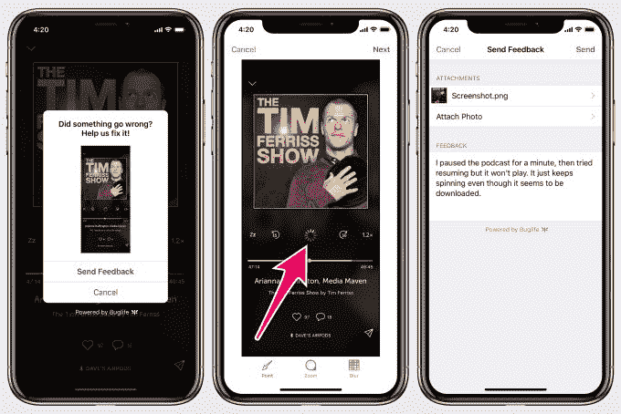

# Buglife 希望将报告手机软件 bug 的权力交到用户手中 

> 原文：<https://web.archive.org/web/https://techcrunch.com/2018/02/05/buglife-wants-to-put-the-power-to-report-mobile-software-bugs-in-users-hands/>

每天我们都会遇到手机应用的 bug。它们可能会锁定或以我们意想不到的方式执行，但是如果您可以向开发人员报告错误，因为它发生了，并且提供了他们修复问题所需的所有上下文信息，那会怎么样呢？这就是 2018 年冬季 Y Combinator 班的一名成员正在尝试做的事情。

创始人 Dan DeCovnick 和 Dave Schukin 在 2011 年提出了这个想法的早期版本，当时他们都在亚马逊为 iPhone 开发音乐播放器。他们发现，在测试软件时，人们会遇到一些问题，比如在某些情况下音乐不流畅，他们会给他们发电子邮件。但是他们不知道问题发生时手机上发生了什么。

他们需要了解更多信息来解决问题，例如手机类型、操作系统版本和底层日志数据。他们在亚马逊建立了一些基本的工具来帮助捕获这些数据，但在 Yammer 和 Twitter 的后续工作中出现了同样的问题，他说他一直看到相同的报告漏洞。

他们在 2016 年推出了 Buglife，将他们的 bug 报告工具想法产品化。他们上个月加入了 Y Combinator。该服务的工作方式是开发者将 Buglife SDK 嵌入他们的 iOS 或 Android 应用程序中。当用户遇到 bug 时，他们可以简单地摇动手机，或者开发人员可以选择不同的方式进入 Buglife 工作流。然后他们可以截屏，画一个指向 bug 的箭头，并输入关于它的注释。Buglife 捕获所有相关信息，如捕获日志、网络信息，并将其发送到吉拉或 Slack，以便在开发人员习惯使用的报告工具中为他们提供丰富的 bug 报告。

照片:Buglife

Shukin 表示，在发布之前，他们在内部测试应用程序时，最初将该工具视为报告错误的一种方式，但他们发现，当他们将它发布到世界上时，开发人员也在应用程序商店的实时应用程序上使用他们的工具。

他说，他的公司的产品与 Crashlytics 或 Bugsnag(我们最近写的关于 T3 的一家公司[)的产品之间的最大区别在于，它们更多的是尝试自动化 QA 过程。Schukin 说 Buglife 更多的是关于用户反馈/众包难以自动化的 bug 类型。](https://web.archive.org/web/20221207043803/https://beta.techcrunch.com/2018/01/10/bugsnag-snares-9-million-series-b-now-gives-you-a-software-stability-score/)

如果你担心截图并发送给开发者会影响隐私，Shukin 说他们已经设置好了，这样在截图时，电话号码和信用卡号码等敏感数据就会被模糊掉。

该公司报告称，大约 300 个应用嵌入了他们的错误报告 SDK，取得了一些良好的早期进展。他们对每个应用每月收费，对独立和开源开发者免费。他们有一个企业定价级别来帮助公司进行更复杂的集成。

两位创始人是目前仅有的员工，他们认为加入 Y Combinator 是显而易见的。作为一对工程师夫妇，他们可以在经营企业的复杂问题上得到指导。“首先，与许多创始人保持联系，从他们那里获得建议，听听他们建立类似公司的经验，这很有帮助，”舒金说。

“我有很多朋友问我编程方面的问题，但没人问我如何谈判合同或处理招聘事宜。能够接触到这些资源已经很了不起了，”他说。

至于未来，该公司希望成为开发者收集全球移动应用程序 bug 信息的解决方案。“我们希望成为一个焦点，团队可以轻松地收集所有可能的数据和用户感到沮丧或遇到问题的背景，并智能地为开发人员提供所有这些数据，而不必在客户支持下经历重重困难。”