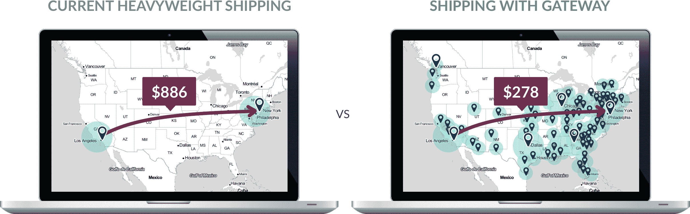

# BuildDirect 开放货运平台

> 原文：<https://web.archive.org/web/https://techcrunch.com/2017/02/21/builddirect-opens-up-its-platform-for-heavyweight-shipping/>

# BuildDirect 开放其货运平台

在过去的几年里， [BuildDirect](https://web.archive.org/web/20230328114313/https://www.builddirect.com/) 为自己发展了一个名字，作为一个家庭装修产品的网上商店(想想地板和屋顶材料，浴缸等等)。).在线销售这些产品的一个问题是，你还必须建立一个物流后端，让你可以将这些沉重的物品运送给客户。BuildDirect 在它的[一岁的市场](https://web.archive.org/web/20230328114313/https://techcrunch.com/2016/02/10/builddirect-wants-to-become-the-amazon-of-the-home-improvement-industry-launches-marketplace/)上为它的卖家网络做了这样的事情，今天它向任何需要在北美运输重型货物的人开放这个运输网络。

[这项新服务被称为 BuildDirect Gateway](https://web.archive.org/web/20230328114313/https://gatewaysupplychain.com/) ，它建立在该公司与卖家合作的经验基础上，将产品送到其 40 个仓库和客户手中。该公司的营销副总裁乔·汤普森告诉我，该公司一直计划在自己的卖家网络之外开放运输服务。不过，它的卖家开始要求该公司提前进入其供应链网络，这比该公司预期的要早，所以在过去的几个月里，该公司专注于测试这项新服务，现在它比原计划提前了近一年开放这项服务。

“我们想创造一个更智能、更简单的家装行业，”他说。“我们一直知道供应链是其中的关键部分。我们知道我们最终想要开放它。”

Gateway 承诺，在全国范围内运输一件重物品，可以节省数百美元的费用。例如，通过利用它的网络，卖家可以以 200 美元的价格将 1500 磅的货物运送到全国各地。该公司承诺，其运输成本将允许供应商节省高达 30%的运输成本。汤普森告诉我，该公司能够做到这一点的方法是，让这些商品有效地搭载在它已经为卖家安排的现有行程上。

BuildDirect 还将为网关用户提供海洋货运服务，包括与海洋服务提供商和港口合作，以确保货物有效地通过海关。

虽然这项服务对所有供应商开放——无论他们是否在 BuildDirect 上出售商品——汤普森预计，许多人都希望利用该公司的潜在买家。因此，虽然 Gateway 不一定会直接惠及 BuildDirect 市场，但客户可能会注意到可用产品的增加，甚至可能会更便宜、更快地交付，这要归功于该公司现在更有效地运营其物流网络的能力。

