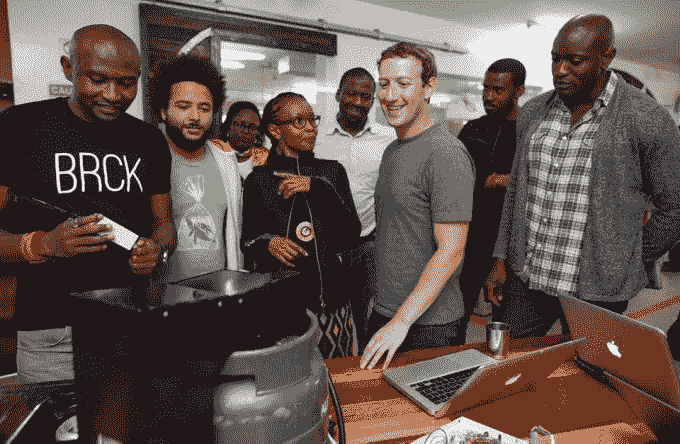
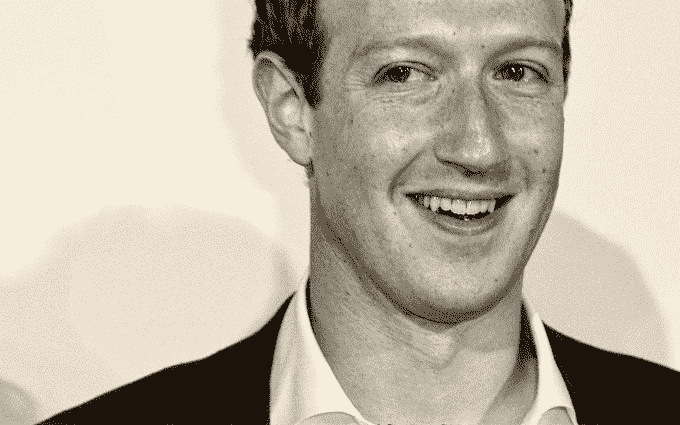

# 马克·扎克伯格的人道主义宣言

> 原文：<https://web.archive.org/web/https://techcrunch.com/2017/02/16/building-the-world-we-all-want/>

“我们正在建设我们都想要的世界吗？”这是一个经常留给总统和宗教领袖的问题，CEO 们很少问这个问题。但是技术已经成为一种力量，与政府和信仰一起将我们团结在一起。因此，为了在人类最动荡的时刻造福人类，行业领袖们也必须奋起接受他们施加影响的机会。

马克·扎克伯格从未把脸书仅仅视为一家企业，因此也从未接受自己仅仅是一名商人的角色。

五年前，扎克伯格在上市前写给脸书投资者的信中写道，“让世界上的每个人都联系起来，让每个人都有发言权，帮助未来的社会转型，这是一个巨大的需求和巨大的机会。”

现在，随着脸书拥有 18.6 亿用户，并开发技术以扩大各地的互联网接入，他的支持者超过了任何国家。他朝着第一步和第二步迈出了巨大的步伐。

今天，扎克伯格提出了一个愿景，并号召朝着第三步努力——“发展社会基础设施，让人们有能力建立一个为我们所有人服务的全球社区。”他刚刚发表了嵌在下面的 5000 字信函，确立了脸书下一阶段使命的核心原则:支持、安全、信息、公民参与和包容。

在脸书总部的中间，在扎克伯格的玻璃墙办公室里，他向 TechCrunch 讲述了他的希望和想法，这增加了他领导的透明度。

## “我能做的最积极的事情是什么？”

当我创办脸书的时候，连接世界的想法并没有引起争议。扎克伯格告诉我:“默认的假设是，世界正朝着那个方向发展，年复一年，世界将变得更加紧密。”。这给了脸书一个从小做起的机会，拉近了朋友和家人的距离。

“现在，我认为这是对全球化和快速变化的一种反应，但我认为世界上有很多人，不仅仅是美国，而是所有不同的国家，都感到被全球化抛在了后面。

唐纳德·特朗普是扎克伯格水族馆中的大象，尽管他从未提到过他的名字。扎克伯格承认，虽然新总统已经对美国的社会结构造成了损害，但他也激起了变革的热情。

“现在有很多人在问，‘好吧，如果我对此感到不安，我能做的最积极的事情是什么？’我的回答是，最有成效的事情不仅仅是对此感到不安，而是实际上去建立长期的基础设施，帮助人们团结起来，”扎克伯格解释道。

“联合起来”不仅仅意味着自由主义者寻求变革或技术。扎克伯格在信中提到的第一个社区是“被全球化遗忘的人”他说，如何教育这些人，让他们随着自动化的发展保持可雇佣性，这是另一天的话题。但扎克伯格强调，人们需要的不仅仅是工作，而是安全感。

他告诉我:“当你调查人们时，会有一种缺乏希望的感觉。”。我认为很多人认为这主要是经济上的，我敢打赌很多都是经济上的……但我敢打赌，比人们想象的更多的是社会上的，是缺乏社区意识，这让我们觉得自己被需要，觉得自己是比自己更大的东西的一部分。”

脸书的无处不在使得它独特地适合于突破这种孤立。

在某种程度上，它将您与朋友的安全网联系起来的能力可以补充传统的支持来源。扎克伯格讲述了在他的旅行中，教会领袖告诉他,“当镇上的一家工厂关闭时，他们知道几周后他们将会看到一些夫妇进行婚姻咨询。”

工人阶级不断演变的困境需要一种不断演变的移情文化，无论是线下的还是线上的。

尽管同样的普遍性会加剧无所作为。脸书可能会分散人们对公民参与和社区的注意力，也可能会成为与他们联系的工具。在网络出现之前，政治和社会愤怒在物质世界之外没有出路。现在，脸书按相关性分类的信息很容易被卷入最新的丑闻中，分散我们的挫败感，或者通过可爱的婴儿照片和无聊的流言蜚语让我们麻木。

脸书可能不想或不能违背我们寻求和消费娱乐的自然倾向。但扎克伯格也计划将脸书磨练成我们更远大抱负的实现者。

## 现代会众

尽管他的信很有哲理性，但它也列出了几个具体的[产品开发项目，脸书正计划](https://web.archive.org/web/20230130101820/https://techcrunch.com/2017/02/16/facebook-nudity-filter/)来提供这个基础设施。

首先，该公司将努力抵制当地社区团体参与度的下降，扎克伯格指出，自 20 世纪 70 年代以来，当地社区团体的参与度已经下降了 25%。用户会看到更多加入当地脸书集团的建议。脸书将给予这些团体的领导人更多的工具来沟通和组织他们的社区，包括创建“子社区”的选择

扎克伯格说，“哦,我们在网上社区，也包括网下社区看到的一件事是，拥有一个敬业而有才华的领导者是打造一个强大社区的关键之一……但是现在我们集团的产品并没有真正为领导者提供便利。”

取而代之的是，它是为像家庭这样的较小群体的临时组织而设计的，“那里没有‘领导者’“扎克伯格没有概述具体的功能，但他说，“ 你可以清楚地看到我们为 Pages 和 Groups 构建的所有东西。”这可能包括分析哪些主题与成员产生共鸣，分配更广泛的管理员或主持人角色的选项，以及引入外部应用程序来扩展功能的方法。

如果掌握得当，这些工具可以利用当今社区的强大能量，让个人感受到力量。脸书不能自上而下实施变革，但它可以提高基层运动的效率。

[https://web.archive.org/web/20230130101820if_/https://www.youtube.com/embed/CFkB5aUoZ8Y?feature=oembed](https://web.archive.org/web/20230130101820if_/https://www.youtube.com/embed/CFkB5aUoZ8Y?feature=oembed)

视频

## 尊重多样性的团结

扎克伯格在他的信中承认，“坐在加州，我们并不适合确定世界各地的文化规范。”然而，到目前为止，脸书一直依靠一套“一刀切”的社区标准来管理什么是可以接受的，什么是不可接受的。虽然它遵守少数几个国家要求它遵守的审查法律，但脸书却认为人们会有相同的道德观，即使他们相隔千里。

脸书要赋予所有社区权力，就必须适应它们，同时不践踏其中个人的独特意见。

“对于一个拥有近 20 亿人口的社区，用一套单一的标准来管理整个社区是不太可行的，所以我们需要向一个更加本地化的管理系统发展，”扎克伯格写道。欧洲人更经常对拍摄裸体图片吹毛求疵，因为一些欧洲文化比中东或亚洲的许多社区更能接受裸体

这就是为什么脸书计划允许用户根据他们在应用中看到的暴力、裸体和亵渎的程度来定制他们的偏好。在扎克伯格所说的“就像公投”中，不响应定期请求来个性化这些控制的用户将被默认为他们所在地区大多数人选择的设置。只有比最宽松的个人设置更极端的内容才会被脸书屏蔽。

秘鲁利马——11 月 19 日:2016 年 11 月 19 日，脸书首席执行官马克·扎克伯格(右二)出席在秘鲁利马举行的亚太经合组织 CEO 峰会，这是更广泛的亚太经合组织(APEC)峰会的一部分。11 月 18 日，秘鲁总统佩德罗·巴勃罗·库琴斯基(Pedro Pablo Kuczynski)宣布亚太领导人峰会开幕，敦促他们大力捍卫自由贸易，反对美国和欧洲的保护主义趋势。(塞巴斯蒂安·卡斯塔涅达/阿纳多卢通讯社/盖蒂图片社拍摄)

为了制定这种更细粒度的不良观点，脸书计划增加人工智能的使用，以标记有问题的帖子。“展望未来，我们保护人们安全的最大机会之一是建立人工智能，以更快更准确地了解我们社区正在发生的事情，”扎克伯格说。人工智能现在触发了脸书 30%的可疑内容报告。

扎克伯格表示，这种新的社区治理方法的目标是“ 社区标准应该反映我们社区的文化规范，每个人应该尽可能少地看到令人反感的内容，每个人应该能够分享他们想要的东西，同时被告知他们不能尽可能少地分享一些东西。”

这实际上让脸书进一步远离了“媒体公司”，因为它将不再拥有单一的编辑政策，而是允许用户自己定义它。

脸书曾试图让用户直接参与其政策。但是这个网站治理系统 [要求 30%的用户投票](https://web.archive.org/web/20230130101820/https://techcrunch.com/2012/12/09/vote-on-facebook-changes/) ，投票率很高，因为他们的多数决定具有约束力。当 61.9 万人投票时，87%的人表示他们想阻止脸书将数据与 Instagram 混合，并取消他们未来影响治理的权利，用户基础达不到 2.994 亿张选票，他们的机构被缩减了。

脸书治理的新方向接受了并非每个人都积极参与公民活动的观点，并给予那些更有控制权的人，同时向其他人提供符合当地文化的环境。

## 用一系列想法去极化政治

这种“我们对他们”的心态与扎克伯格的信念背道而驰。尽管与生活在一个思想相似的孤立小镇相比，互联网可能展示了更广泛的思想，但它也建立了一个意识形态的战场，在那里人们会发生冲突。通过脸书提供的推荐流量和随后的广告收入，它激励了将民众分为对立势力的耸人听闻的行为。

脸书因虚假新闻现象而首当其冲，尽管它正在用外部事实核查和更多功能来反击错误信息。它还因在推动团结和开放的同时，保留特朗普顾问[彼得·泰尔为董事会成员](https://web.archive.org/web/20230130101820/https://techcrunch.com/2016/06/20/peter-thiel-was-not-kicked-off-facebooks-board/)的明显矛盾而受到批评，据报道，它还为中国打造了一个[审查工具的原型。](https://web.archive.org/web/20230130101820/https://techcrunch.com/2016/11/22/chinabook/)

但扎克伯格看到了一个直接攻击两极分化的机会，而不仅仅是症状。“E 即使我们消除了所有的错误信息，人们也会强调不同的事实，以符合他们两极化的观点，”他写道。“这就是为什么我如此担心媒体的轰动效应。”

德国柏林——2 月 25 日:(编者按:这张照片是用数字滤镜处理的)马克·扎克伯格于 2016 年 2 月 25 日抵达德国柏林，出席首届阿克塞尔·斯普林格奖颁奖仪式。(亚当·贝瑞/盖蒂影像公司拍摄)

[红色饲料/蓝色饲料](https://web.archive.org/web/20230130101820/http://graphics.wsj.com/blue-feed-red-feed/)不是答案。“我们的目标必须是帮助人们看到更完整的画面，而不仅仅是不同的视角。我们必须谨慎行事，”扎克伯格写道。“研究表明，一些最显而易见的想法，比如从相反的角度给人们看一篇文章，实际上是通过将其他观点框定为外来观点来加深两极分化。”

注入对方的花言巧语来戳破过滤泡沫，会让我们更加疏远。扎克伯格认为“更有效的方法是展示一系列观点，让人们看到他们的观点在光谱上的位置，并得出他们认为正确的结论。随着时间的推移，我们的社区将确定哪些来源提供了完整的视角范围，因此内容将自然地浮出水面。”

脸书到底会如何揭示光谱还不清楚，但有可能捆绑相关的不同意见的文章以及新闻链接。这可能会让人们看到视角的变化，让他们不那么狂热地认为自己的观点是无可争议的真理。

## 脸书的扩音器，你的声音

总之，这些围绕社区团体、本地化标准和观点多样性的倡议可以开始缩短我们与人类同胞之间的距离。可能需要几年才能看到他们的影响，但这就是为什么扎克伯格现在开始，并温和地鼓励其他人也这样做。

尽管身处脸书的中心，当被问及他是否认为其他科技领袖应该同样大声地呼吁变革时，他谦虚地指出，“我真的不认为我应该说他们应该做什么。”但是，他希望他的同行们能够建立这一愿景，而不仅仅是大声疾呼。我认为这对于其他人来说是一个好主意，无论你是在公司工作还是在经营公司，或者想创办一家公司，都要考虑‘我能建立什么样的社会基础设施？’这将是 10 年后帮助人们走到一起的关键。”

在脸书不成为支持某一政党的公开政治行动者的情况下，能做到这一点吗？扎克伯格认为他的使命横跨左右两派，专注于我们收集和组织的天生本能。

“我非常关心的事情之一是帮助建立社区的一些共同理解，这样人们就可以更好地围绕它进行讨论……我们的目标是在不一定对共同理解应该是什么有意见的情况下做到这一点，”他总结道。“我认为我们有责任在世界上扩大这种影响，建立这种共识。”