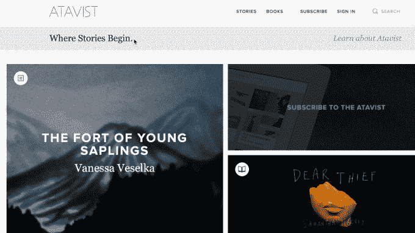

# 建于布鲁克林:Atavist 是在线讲故事的出版商和平台 

> 原文：<https://web.archive.org/web/https://techcrunch.com/2014/12/01/built-in-brooklyn-atavist-is-both-publisher-and-platform-for-online-storytelling/>

# 建于布鲁克林:阿塔维斯特既是出版商又是在线讲故事的平台

我们回到了布鲁克林的 Dumbo 街区，观看《建造在布鲁克林的 T1》的最新一集。这次我们参观了 [Atavist](https://web.archive.org/web/20221006183015/https://atavist.com/) 的办公室，该公司联合创始人兼首席执行官埃文·拉特里夫将其描述为“一家讲故事的公司”——它既是长篇新闻的出版商，也是其他在线出版商使用的平台 [Creatavist](https://web.archive.org/web/20221006183015/https://www.creatavist.com/) 背后的公司。

拉特里夫本人是一名记者，他与杰佛逊·拉布(一名网页设计师和开发人员，他为包括裘帕·拉希莉和村上春树在内的作家创建了网站)和尼古拉斯·汤普森(现为纽约客网站的编辑)一起创立了这家公司。拉特里夫和拉布告诉我们，阿塔维斯特最初是作为一个副业项目开始的，用拉布的话说，就是探索“如果你首先想到数字，那么在数字设备或网络上阅读长篇内容可以做些什么。”

这个平台不仅仅是新闻业的。举个例子，他们在 Blank 上向我介绍了 [Blank 的 David Gerlach 我采访了 Gerlach，了解他的团队如何与 Creatavist partner 合作，将档案采访转化为动画短片。](https://web.archive.org/web/20221006183015/http://blankonblank.org/about-us/)

Ratliff 和 Rabb 还谈到了 Dumbo 社区的变化，Ratliff 将现在的活动与 90 年代末的旧金山进行了比较。

“当我第一次搬到纽约时，那里很荒凉，”拉布说。“这是一个很好的社区，但很荒凉。以前生意很少，现在有点泛滥。”