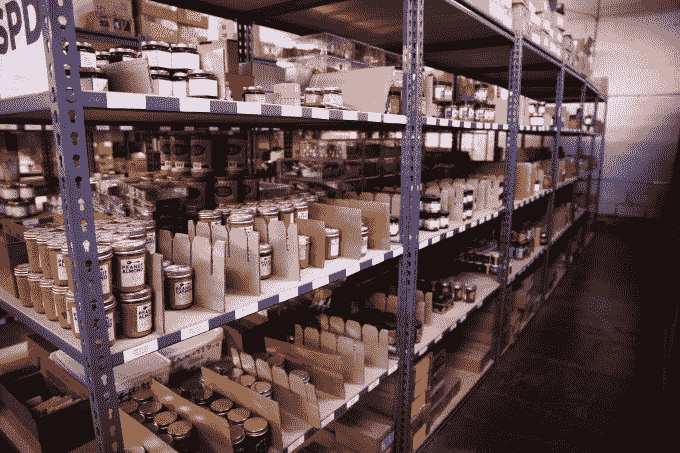

# 建于布鲁克林:Mouth 将独立食品、酒和礼物送到你家 

> 原文：<https://web.archive.org/web/https://techcrunch.com/2014/12/15/built-in-brooklyn-mouth-delivers-indie-food-booze-and-gifts-to-your-home/>

# 建于布鲁克林:Mouth 将独立食品、酒和礼物送到你家

在布鲁克林拍摄的最新一集[中，我们参观了一个我特别喜欢的地方——一家酒类商店。](https://web.archive.org/web/20221209103538/https://beta.techcrunch.com/video/built-in-brooklyn/)

这家商店位于布鲁克林的 Dumbo 社区，由 [Mouth](https://web.archive.org/web/20221209103538/http://www.mouth.com/) 经营，这是一家出售食品、酒和独立生产商提供的“美味礼物”的初创公司。虽然这项业务主要围绕其在线市场，但联合创始人兼首席运营官 Sam Murray 告诉我们，[开设实体商店](https://web.archive.org/web/20221209103538/http://blogs.villagevoice.com/forkintheroad/2014/05/mouth_indie_spirits_and_wine_gallery_opens_dumbo.php)让 Mouth 在社区中有了实体存在，并有了一个直接与客户互动的地方。

与默里一起，我们采访了他的联合创始人克雷格·卡纳里克(首席执行官)和南希·克鲁格·科恩(首席创意官)，了解这个想法的来源，Mouth 实际上是如何包装和向顾客提供食物的，以及更广泛的独立食品运动。

鉴于《Mouth》聚焦于美食家和独立制作人，它似乎特别适合作为这个节目的另一个标题——“潮人创业”但是卡纳里克认为，Mouth 是受到人们对这种食物日益增长的广泛兴趣的启发。

“人们对食物越来越感兴趣——你知道，从农场到餐桌的运动开始有点影响力，绿色市场变得越来越受欢迎，所以人们真的在花他们感兴趣的时间，对吗？”卡纳里克说。"他们的爱好变成了食物，就像过去的音乐或电影一样."

他补充说，“我们很快就清楚了，每个人都对新的独立食品革命，独立食品运动感兴趣，”这就是为什么 Mouth 扩展到纽约以外的食品生产商。

顺便说一下，尽管 Kanarick 现在是一家食品初创公司的首席执行官，并且他接受过一些厨师培训，但他之前是数字营销机构 Razorfish 的联合创始人兼首席战略官。当他谈到布鲁克林是如何发展的时候，你可能会看到一些这样的背景。

“布鲁克林现在是一个品牌，这个品牌的一部分是什么是酷的，什么是时尚的，什么是有趣的，什么是新的，”他说。(我想一些老布鲁克林人对此会翻白眼，但自从我们拍摄这一集以来，我肯定偷过几次这句话——不管高兴不高兴，我总是得到同意的点头。)

