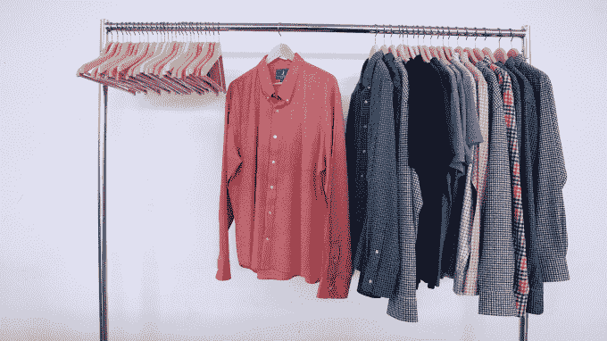

# 建于布鲁克林:Wool&Prince 计划为年轻专业人士打造时尚的羊毛衬衫 

> 原文：<https://web.archive.org/web/https://techcrunch.com/2014/12/08/built-in-brooklyn-woolprince-plans-to-make-wool-shirts-cool-for-young-professionals/>

# 建于布鲁克林:Wool&Prince 公司计划为年轻的专业人士设计更酷的羊毛衬衫

纽扣衬衫和 t 恤听起来可能不是一个特别令人兴奋或性感的市场，但男性时尚 tartup [Wool & Prince](https://web.archive.org/web/20230126061655/http://woolandprince.com/) 似乎显示出不同，两个[Kickstarter](https://web.archive.org/web/20230126061655/https://www.kickstarter.com/projects/1868906/woolandprince-the-better-button-down-guaranteed)活动都没有达到他们的目标。

为了这一集[建在布鲁克林](https://web.archive.org/web/20230126061655/https://techcrunch.com/video/built-in-brooklyn/)，羊毛&王子的工作空间在[布鲁克林时尚&设计加速器](https://web.archive.org/web/20230126061655/http://bkaccelerator.com/)，这是[普拉特学院在今年年初推出的](https://web.archive.org/web/20230126061655/https://www.pratt.edu/news/view/pratt_launches_brooklyn_fashion_and_design_accelerator_to_help_new_creative)。创始人 Mac Bishop 告诉我们，虽然羊毛已经与伐木工人的形象联系在一起(嘿，这是一种回归)，更不用说奶奶织的毛衣，羊毛王子的目标是为年轻的专业人士制作衣服。

为什么是羊毛？毕晓普说，与标准的棉质或聚酯纤维礼服衬衫相比，羊毛更耐用、防臭、抗皱、透气。(第一次 Kickstarter 活动的口号是，“一件连续穿了 100 天的羊毛衬衫。不要洗。没有干洗。没有皱纹。没有异味。”)虽然也有人认为羊毛令人发痒，但毕晓普认为，Wool&Prince 使用的“真正精细的纤维”实际上非常柔软。

显然，他与羊毛有一段历史，因为他的家族在俄勒冈州波特兰市拥有一家毛纺厂，但他的羊毛布道也是基于最近的实验:

> 我当时在联合利华工作，穿着公司的 giddy up——Brooks Brothers 纽扣衬衫，诸如此类。我经常去干洗店，大概每周花 10 到 15 美元在干洗上。我开始穿一些旧的老式羊毛纽扣去上班。人们称赞我，他们看起来有点不同，我一次也没有去干洗店洗那些旧衬衫。但是从正常的、公司的按钮式着装来看，他们看起来有点不正常。

他补充说，Wool&Prince 称之为“更好的按钮”，是他在全国各地的一些朋友测试的结果，包括企业界的朋友。你可以在公司网站上看到最初的产品阵容[。](https://web.archive.org/web/20230126061655/http://woolandprince.com/)

