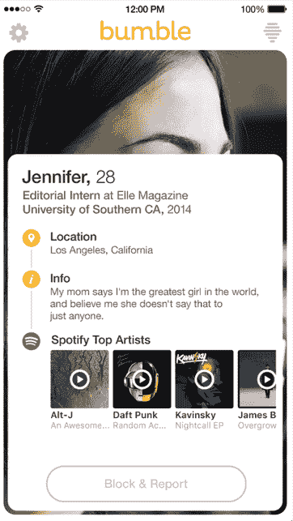

# Bumble 与 Spotify 合作，因此你可以根据某人最喜欢的音乐滑动 

> 原文：<https://web.archive.org/web/https://techcrunch.com/2016/06/15/bumble-is-partnering-with-spotify-so-you-can-swipe-based-on-someones-favorite-music/>

# Bumble 正在与 Spotify 合作，这样你就可以根据某人最喜欢的音乐进行滑动

快速增长的女性主导的约会应用 Bumble 与 T2 Spotify 合作。

Bumble 用户很快就可以选择将他们的约会资料与 Spotify 账户相连接，这样就可以包括他们最常听的顶级艺术家。然后，用户可以点击某人个人资料中的艺术家，这将把他们带到 Spotify 应用程序中的艺术家页面。

虽然有些人可能认为音乐偏好没什么大不了的，但 Bumble 认为它们足以影响你是否决定在某人身上向左或向右滑动。该公司的首席执行官兼创始人惠特尼·沃尔夫解释说:“音乐在很大程度上说明了我们是谁，文化上的联系可以为创建有意义的关系奠定基础。

虽然用户以前可以只在个人资料中输入他们喜欢的音乐，但 Bumble 承认，许多用户可能不会花时间这样做，如果用户想听潜在对手的音乐选择，提供一个指向 Spotify 的直接链接会很有帮助。

目前，顶级艺术家是从 Spotify 上某人的收听活动中自动选择的，但该公司将很快推出一项更新，让用户隐藏某些艺术家。如果你私下里听的令人尴尬的音乐与你在公开场合的形象不符，这可能会有所帮助。

Bumble 表示，这种合作是有机地结合在一起的，这个功能是大约一年前一些 Bumble 员工和他们在 Spotify 工作的朋友之间非正式对话的产物。

但如果这项功能真的开始对用户的刷卡倾向产生影响，它可能会导致其他整合，帮助潜在的约会者更好地了解彼此。

想象一下，链接您的 OpenTable 个人资料以显示您最常去的餐馆，或者链接您的 Gilt 帐户以显示您最喜欢的品牌。在一个基于应用程序的约会世界中，你只有有限的(并不总是准确的)细节来帮助你做出刷卡决定，这些集成可能是一种向决策过程添加验证信息的方式。

并不是说 Bumble 的用户需要更多的激励来使用这个平台。该应用推出 18 个月后，该公司今天表示，平均用户每天花 100 分钟*使用该应用*，他们现在有 550 万用户(其中 110 万人每天使用该应用)。