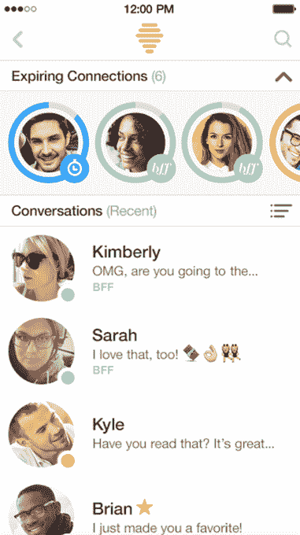

# Bumble 推出 BFF，这是一个寻找新朋友的功能

> 原文：<https://web.archive.org/web/https://techcrunch.com/2016/03/04/bumble-launches-bff-a-feature-to-find-new-friends/>

# Bumble 推出 BFF，这是一个寻找新朋友的功能

Bumble 是一款受欢迎的约会应用，女孩们可以在上面迈出第一步，它发布了一个更新，可能会彻底改变约会应用的世界。

这项名为 BFF 的新功能本质上是让用户使用相同的刷卡和匹配算法来建立友谊，而不是约会。

它是这样工作的:

切换到 BFF 模式后，用户会看到他们的潜在约会对象被 Bumble 认为你会想与之成为朋友的同性所取代。

一旦两个人都向右滑动，双方都有 24 小时来发起对话，类似于今天 Bumble 处理同性约会的方式。

为了区分 BFF 和普通 Bumble，应用程序中的对话将采用颜色编码。

当与新的好朋友交谈时，你的对话将是绿色的，当约会时，你的对话将是黄色的。

而且，虽然最初的推出将迫使用户保持一个用于约会和 BFF 模式的个人资料，但该公司正在努力发布一个双个人资料功能，让用户根据他们是寻求友谊还是浪漫来定制他们个人资料中的图片和描述。

但是为什么 Bumble 认为它的用户想利用这个平台找到最好的朋友呢？该公司解释说，因为用户不仅一直在请求该功能，而且已经为此目的使用了该平台。

具体来说，他们已经看到用户在搬到或刚刚访问一个新城市时，使用 Bumble 作为与新朋友联系的方式。

虽然 Bumble 不会透露普通匹配和 BFF 匹配之间的具体算法差异，但该公司确实表示，他们正在“非常密切地关注兴趣和朋友”，这是他们从用户的脸书个人资料中获得的。

实现 BFF 使 Bumble 成为第一个扩展到约会之外的主要约会应用程序。

这是一个勇敢的举动，对于一个不需要尝试任何新东西的公司来说，至少现在是这样。这家初创公司仅从 1 月份以来就增加了 150 万用户，在过去三个月里交换了 1 亿条消息。

新的更新现已上线，可以从 iOS 应用商店和谷歌 Play 商店下载。