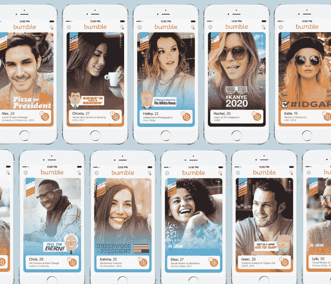

# 从 2016 年总统大选开始，Bumble 为个人资料图片推出上下文过滤器 

> 原文：<https://web.archive.org/web/https://techcrunch.com/2016/03/17/bumble-launches-contextual-filters-for-profile-pictures-starting-with-the-2016-presidential-election/>

# 从 2016 年总统大选开始，Bumble 为个人资料图片推出了上下文过滤器

基于刷卡的约会很难。面对成百上千的潜在追求者，我们大多数人在决定是向左还是向右扫之前，只会花几秒钟浏览一下照片和简历。

因此，为了帮助用户快速做出明智的决定，Bumble 从 Snapchat 的书中吸取了一页，并为用户的个人资料图片推出了过滤器。

但这些过滤器不是为了提供娱乐，而是为了帮助 Bumble 用户向其他用户传达一点关于他们自己的额外信息，这些用户可能只花几秒钟就决定向左或向右滑动。

本周推出的第一个过滤包将以 2016 年选举为主题。用户可以选择所有主要候选人和政党的覆盖图，以及一些有趣的覆盖图，如 [Underwood 2016](https://web.archive.org/web/20221210065307/https://www.fu2016.com/) 和 [Yeezy 2020](https://web.archive.org/web/20221210065307/http://perezhilton.com/2015-10-10-barack-obama-kanye-west-president-of-the-united-states-politician-campaign-advice-2020#.VupJtcdlmvE) 。

由于过滤器是完全可选的，所以看看有多少用户选择与某个政党或候选人结盟会很有趣，尤其是因为政治通常是任何类型的第一次约会都不允许的。

随着 2016 年初选周期特别具有党派性，新功能注定会导致许多用户根据他们的匹配选择显示的任何过滤器来选择是或否。

Bumble 还计划使用过滤器来发布该应用程序的单身男女对哪些政治候选人感兴趣的数据。

选举过滤器将于本周推出，这家初创公司表示，它将基于“进一步表达用户和及时事件”推出未来的过滤器。

