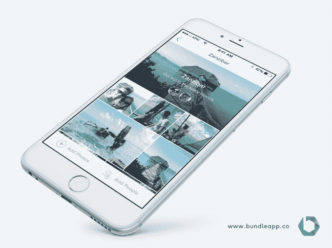

# Bundle 的新应用程序会自动为您整理照片 

> 原文：<https://web.archive.org/web/https://techcrunch.com/2015/05/26/bundles-new-app-automatically-organizes-photos-for-you/>

组织我们庞大的照片库是许多初创公司和大公司仍在努力解决的任务。虽然谷歌本周准备在[谷歌 I/O](https://web.archive.org/web/20221208194628/https://events.google.com/io2015/) 上推出一款新的独立照片应用来应对这一挑战，但总部位于阿姆斯特丹的一家名为 [Bundle](https://web.archive.org/web/20221208194628/http://bundleapp.co/) 的初创公司现在也推出了一款应用，专注于帮助用户自动将照片分组到相册中，然后与朋友分享。

该应用程序的“自动相册”功能使 Bundle 有别于许多照片组织工具，这些工具通常让用户通过挑选照片来手动创建相册。随着我们这些天拍摄大量照片，这可能是一个漫长而乏味的过程。由于所涉及的时间和挫折，我们的许多照片根本没有被分享——它们只是永远埋藏在我们不断扩大的照片库中。

Bundle 的联合创始人 Michel Op 't Landt 解释说，他的应用程序的想法是受这一共同斗争的启发。“[捆绑]源于我个人对我存储在多种设备上的数千张照片的沮丧，这些设备包括几部智能手机、数码相机、外部硬盘上的旧收藏，以及这一切都是一团乱麻，没有任何结构的事实，”他说。

bundle 的“AutoAlbum”功能有助于通过使用机器学习技术将你的照片分组在一起，以确定哪些照片属于同一个“Bundle”(相册)，以及哪些朋友的照片也应该添加到该 Bundle 中。一旦来自同一事件的所有图像被捆绑到一个相册中，该应用程序就会使用计算机视觉技术，通过专注于清除相册中的重复和劣质照片，同时检测人脸和微笑，来推荐最佳照片。随着时间的推移，Bundle 甚至可以学习用户的个人偏好，帮助他们更快地选择最佳照片。

Bundle 还提供无限的照片存储空间，其分辨率最适合在移动设备上查看照片，但允许您连接到 Dropbox、Google Drive 或即将推出的 Amazon Cloud Drive 等存储提供商，以便备份全分辨率照片。(这项备份功能每月收费 1 美元)。未来还将推出一个选项，以提供全分辨率的无限备份，并提供 5 GB 的视频存储，每月 5 美元。

在荷兰苹果应用商店，Bundle 在过去三天里已经看到早期用户添加了 100 万张照片，该应用在照片和视频应用中排名第四，在整体免费应用中排名第 15。

[gallery ids="1161782，1161781，1161780，1161779，1161778，1161777，1161776，1161774"]

在测试中，我发现 Bundle 的 AutoAlbum 功能相当不错——尽管它经常会挑选出一两张不属于某一组的额外照片，但它并不比任何其他不仅仅依赖照片时间戳的应用程序差。为你创作专辑当然很有帮助。

然而，Bundle 的用户界面需要做一些工作。创建“捆绑包”的初始过程在第一次启动时运行，可以从应用程序的“组织”选项卡再次启动，但它有一个不同的用户界面，这可能会令人困惑。停止最初的捆绑包创建过程并转到应用程序的主屏幕也不像应该的那样容易。但是这些事情是可以及时改进的。

与联合创始人 Rene Sijnke、Tjeerd in 't Veen、Pieter-Pleun 一起，该团队迄今已从当地加速器 Startupbootcamp 和荷兰天使投资人那里筹集了 60 万美元的种子资金，其中包括 album print/Albelli 的创始人 Hans Veldhuizen，该公司于 2011 年被 Vistaprint 以 8330 万美元的价格收购。

这款应用可以在 iOS 系统和安卓系统上免费下载。Android 版本的功能尚未与 iOS 完全兼容，因为它不包括连接到 Dropbox 或 Google Drive 或建议捆绑包的功能。不过，它将在几周内更新。