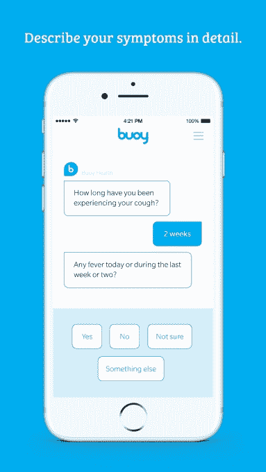

# Buoy 希望通过一款人工智能应用 来对抗虚假在线健康新闻

> 原文：<https://web.archive.org/web/https://techcrunch.com/2017/03/08/buoy-aims-to-fight-fake-online-health-news-with-an-artificially-intelligent-app/>

几乎每次我去 WebMD 的症状检查器，它都会不知何故地告诉我，我可能患有某种可怕的癌症。前往雅虎问答通常没有什么不同。上次我在谷歌上输入“肩痛”时，我得到了一个广告，推荐我购买一个“LightStim”工具，承诺通过我的身体发射“多波 LED 技术”。

因此，当我听说 Buoy(T1)时，一个新的应用程序使用智能算法支持我的医疗数据来猜测你的病痛，我有点好奇。这次它会告诉我我得了什么奇怪的恶心的病？

它告诉我，我可能有粘液囊炎。无聊、陈旧的滑囊炎——这是一种经常发生在中年的疾病，肩部的囊袋因过度使用而发炎。这是有意义的，尽管是反戏剧性的。我经常打字。

Buoy 是怎么得出这个结论的？该应用程序的工作原理是考虑你的年龄、性别、地理位置和其他因素，然后根据你添加的症状将它们与数百万份医疗记录配对。我告诉应用程序我的肩膀疼痛，以及它已经发作了多长时间。Tada，可能是滑囊炎，我的医生在检查了我的肩膀后，也告诉我可能有，然后立即送我去骨科专家那里做进一步的评估。

原来不是粘液囊炎。但这款应用和我的主治医生最初得出的结论是一样的——顺便说一句，WebMD 也将肩膀脱臼、肌腱炎和痛风列为选项。最后一部分很重要，应该用所有远程诊断技术来强调——它仍然不能代替人。

然而，考虑到我的年龄、位置和症状，告诉我可能是粘液囊炎是有道理的。此外，这款应用没有建议用“一个奇怪的技巧”来解决这个问题，而是建议去看医生。Buoy 甚至会建议医生，并提示你预约。

Buoy 创始人、哈佛毕业的医学博士 Andrew Le 告诉 TechCrunch，他已经实施了“一系列测试”，并进行了“一系列研究”来确保 Buoy 的准确性——首先是进行一项质量控制试验，将 500 人的症状与医生的诊断进行比较。结论呢？乐说，Buoy 在 90%的情况下都是正确的。

尽管如此，该应用并非没有竞争，因为似乎医疗保健领域的每个人都突然投身于人工智能 IBM 的 Doc Watson 是该领域最大的鲸鱼。

尽管 Le 认为 Watson 使用自然语言处理来理解基于医学论文的医学，并表示这并不能翻译成患者用来描述其症状的相同语言。Buoy 的与众不同之处在于，它使用的是转化成外行人术语的相同数据，因此我们这些常客可以了解我们身体里可能发生的事情。

Le 的计划是让消费者和医院组织在病人看医生之前迅速处理他们。Buoy 仍在从各种天使投资者那里筹集大约 300 万美元的资金，但该平台今天发布。那些对检查他们的症状感兴趣的人可以在 Buoy 的网络应用程序上这样做，很快就会在 iPhone 或 Android 上这样做。