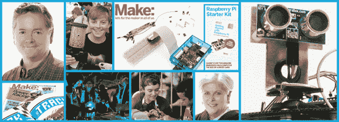
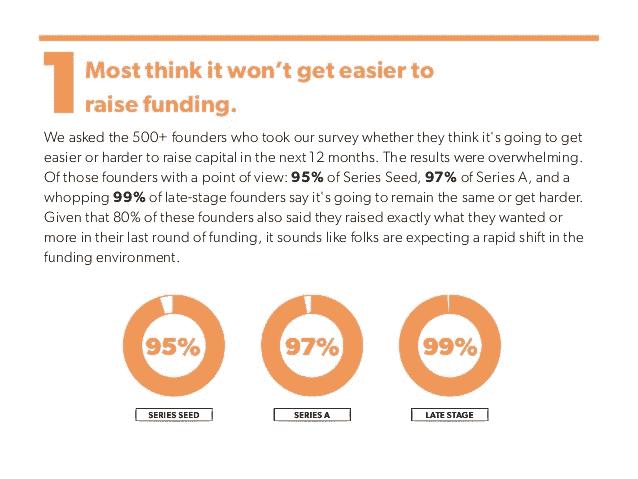
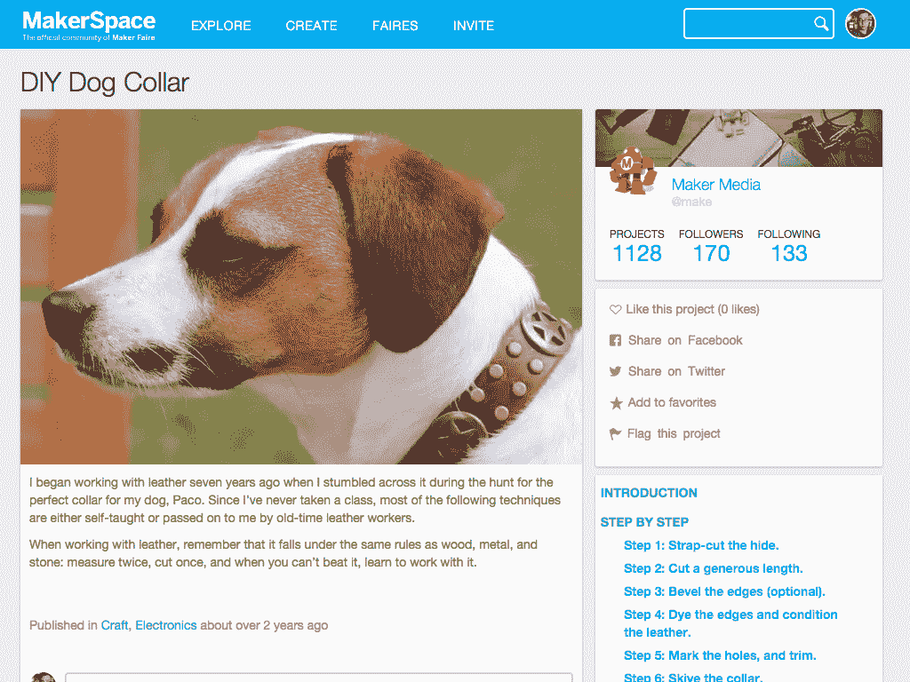

# 随着 Maker Media 裁员，独角兽和小马进入屠宰场

> 原文：<https://web.archive.org/web/https://techcrunch.com/2016/01/08/burn-slower-or-vaporize/>

充满创业公司的马厩正在变成胶水，无论它们是神话中的野兽、戴着派对帽的驴子，还是仅仅是小马。最近一个被迫裁员的是 Maker Media，它是 DIY 运动的冠军。

10 年和 1000 万美元之后，多个消息来源告诉我，Maker Media 今天裁员 20%。经询问，创客传媒向我证实，已有 17 人被放走。

Maker 因其 Maker Faire festival、MakerSpace 社交网络、Make 杂志印刷出版物、MakerShed 在线商店和 MakerCamp 而闻名。这些特性团结了一群在家发明和制作的人。

消息人士称，DIY 爱好者对在线资源的竞争加剧以及管理效率低下减缓了公司的增长。裁员显然集中在 Maker Media 的数字资产上，包括 MakerSpace、MakeZine 和 MakerShed。

## 燃烧缓慢或蒸发

创客并不孤单。科技已经进入了一个季节，许多公司都意识到他们有点太大了。

就在过去的几个月里，我们看到:

此外，在公共巨人和独角兽:

*   推特下跌 8%，约 336
*   据报道，雅虎计划裁员 10%
*   [探戈](https://web.archive.org/web/20230328040840/https://techcrunch.com/2015/11/24/tango-chat-app-unicorn-lays-off-9-of-staff-following-failed-move-into-e-commerce/)裁员 9%，30 名员工
*   [Evernote](https://web.archive.org/web/20230328040840/http://blog.evernote.com/blog/2015/09/29/a-note-from-chris-oneill/) 放过 47 人
*   [LivingSocial](https://web.archive.org/web/20230328040840/https://techcrunch.com/2015/10/14/livingsocial-lays-off-200-20-of-staff-as-it-shifts-from-deals-to-experiences/) 裁员 20%，约 200 人
*   [Groupon](https://web.archive.org/web/20230328040840/https://techcrunch.com/2015/09/22/groupon-is-laying-off-1100-at-a-cost-of-35m-shutters-operations-in-7-countries/) 裁员 1000 多人
*   Rdio 解雇了一半员工，因为它被当作废品出售了
*   Jawbone 损失 15%，即 60 名员工

而这还只是被广泛报道的裁员。

第一轮[的](https://web.archive.org/web/20230328040840/http://stateofstartups.firstround.com/#results)调查显示，大多数创始人认为融资将变得更加困难，许多初创公司正在采取预防措施来降低烧钱率。这意味着裁员，以使资本持续更长时间，希望他们能够达到足够大的里程碑，在寒冷的气候下筹集更多的资金。

## 要么成功要么毁灭

Make 最初是 2005 年的一份印刷杂志，提供有关机器人、电子、计算机、金属加工和木工的技巧和内容。它是由《Make》杂志出版商奥莱利媒体的联合创始人戴尔·多尔蒂于 2013 年创立的。

MakeFaire 于 2006 年在硅谷成立，是 DIY 爱好者和他们制作的奇怪东西的聚会。它慢慢扩展到更多的城市，2015 年有大约 150 场创客活动，在世界各地的主要城市地区有十几个节日，在较小的城市有几十个社区组织的小型创客博览会。

https://www.youtube.com/watch?v=BEXEMgAPfrc

2013 年，O'Reilly AlphaTech Ventures 为 Maker Media 提供了 500 万美元的风险投资。2015 年，随着[创客空间社交网络](https://web.archive.org/web/20230328040840/https://techcrunch.com/2015/05/12/maker-faire-goes-online-with-a-new-social-network-for-makers-called-makerspace/)的推出，创客媒体加强了其在线部分。在这种势头下，几个月后，马克又获得了 500 万美元的 A 轮[。它来自 Ev Williams 的明显风险投资公司 Raine Ventures 和 Azure Capital](https://web.archive.org/web/20230328040840/https://techcrunch.com/2015/05/12/maker-faire-goes-online-with-a-new-social-network-for-makers-called-makerspace/)

但是，面对 AutoDesk 旗下的 Instructables 和 eHow，面对 Pinterest 和脸书集团的分享和 Etsy 的销售，Maker 的在线资产并没有像其杂志和活动那样垄断市场。

Maker Media 的首席执行官格雷格·布罗克韦(Gregg Brockway)向 TechCrunch 发表了以下声明:

> " 周三 ，我们和我们的团队分享了一次战略重组，很遗憾不得不放走 17 个真正伟大的人。作为一家成长中的多元化媒体公司，我们正在精简和适应不断变化的媒体格局。为了更好地服务于蓬勃发展的创客社区，我们正在简化我们的业务，更加专注于我们的增长领域，包括数字、视频、社交和我们的创客集会活动。
> 
> 去年的 Maker Faire 迎来了有史以来规模最大的一年，有超过 120 万人参加。作为这些变化的一部分，我们已经重组并设立了一些新职位，以更好地服务于全球创客社区。"

当风险资本家资助创业公司时，他们不只是希望它们赢得市场。他们希望他们也能入侵和征服其他市场。但是，这可能会将一个适度但可靠的企业推向团队不熟悉和没有准备的领域。Maker Media 的活动很受欢迎，但社交网络完全是另一回事。

随着资本越来越难获得，人才争夺战愈演愈烈，初创公司将不得不做出艰难的决定。那真的是一个你会有优势的邻近市场吗？或者只是一个相关的市场，一个让你跑得筋疲力尽的悬着的胡萝卜？