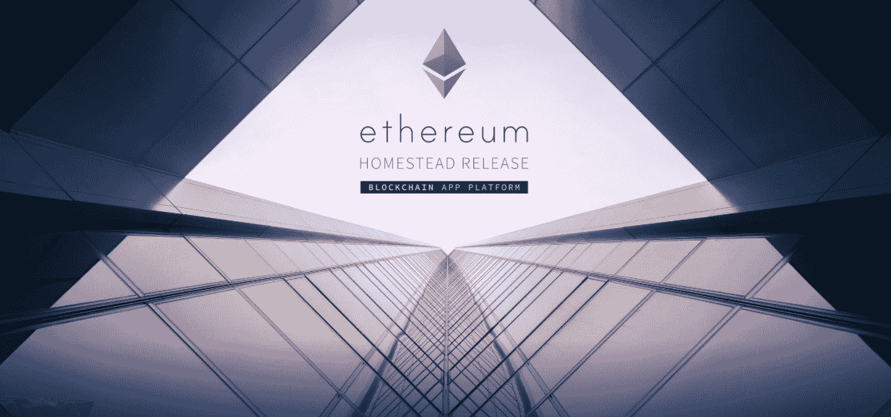

# 以太坊时代的商业

> 原文：<https://web.archive.org/web/https://techcrunch.com/2017/06/04/business-in-the-age-of-ethereum/>

More posts by this contributor

当比特币在 2009 年突然出现时，它挑战了关于交易局限性的先入为主的观念。8 年过去了，另一个平台占据了头条。以太坊以比特币的潜力为基础，正在推动一场金融交易革命。

以太坊是一个开源平台，有利于下一代去中心化应用的开发。Vitalik Buterin 在 2013 年提出了这个概念，当时他正在比特币社区进行研究。自从布特林的最初构想以来，[以太坊](https://web.archive.org/web/20221025222553/https://www.ethereum.org/)的兴趣和规模都在增长；今天，它准备彻底改革开源开发。

比特币开启了共享账本的可能性，现在以太坊正在拓展这一潜力。[根据 Buterin](https://web.archive.org/web/20221025222553/https://coincenter.org/entry/what-is-ethereum) 的说法，“以太坊使用许多相同的系统(如区块链和点对点网络)来生成一个共享世界的计算平台，该平台可以灵活而安全地运行用户想要编码的任何应用程序(包括比特币等共享账本)。”

自从比特币在世界舞台上首次亮相以来，许多开发者都试图将这种意识形态应用到同样由区块链技术支撑的新系统中。然而，这些迭代未能影响技术和金融服务社区，因为它们仅限于少数功能。

以太坊的目的是通过创建一个具有自己的本地编程语言的区块链协议来超越这些限制，这使得任何应用程序都可以在其上编写。这种结构支持所有现有和未来的应用程序，并有助于持续和即时的开发创新环境。

虽然比特币诞生了以太坊，但在过去的一年里，以太坊在未来前景方面已经黯然失色。2017 年 3 月，以太坊的数字货币 Ether[达到了 30 美元](https://web.archive.org/web/20221025222553/http://www.cnbc.com/2017/03/14/ether-ethereum-cryptocurrency-hits-all-time-high-and-2-billion-market-cap-bitcoin.html)的历史新高，推动以太坊的市值达到 25.7 亿美元。

以太坊不同于比特币的另一个方面是以太坊继续从金融和技术社区获得支持。企业已经认识到区块链技术和加密货币在提高安全性和效率方面的巨大力量，它们也加入了这一行列。[微软和摩根大通](https://web.archive.org/web/20221025222553/http://www.influencive.com/1-reason-entrepreneurs-ethereum-eth-bitcoins-competitor/)等机构通过[企业以太坊联盟](https://web.archive.org/web/20221025222553/https://www.nytimes.com/2017/02/27/business/dealbook/ethereum-alliance-business-banking-security.html)的成立，承诺支持以太坊的发展。该联盟的目的是确保以太坊的潜力在各行各业得以实现。

参与该联盟的公司正在努力创建一个标准的开源版本的以太坊，它将成为所有改编的蓝图。摩根大通已经开始实施自己的以太坊系统，以促进全球摩根大通分支机构之间的资金无缝转移。

尽管许多组织投资利用以太坊作为私有化版本的基础，但总体目标是有一天，每个机构的私有网络都将连接到全球以太坊区块链。这将为信息交易建立一个新的普遍基准。

尽管以太坊有巨大的潜力来创造一个更安全、更简化的全球交易系统，但专注于即将到来的事情会忽略以太坊已经开始实施的变革。早期以太坊适配器通过去中心化推动创新。以下是当今尖端企业应用以太坊解决现有问题和创造未来解决方案的一些方式。

***围绕网上消费数据增加保护措施***

身份盗窃是当今全球普遍关注的问题。组织和个人越来越意识到数字安全面临的威胁。

一家名为 [KYC 连锁](https://web.archive.org/web/20221025222553/http://kyc-chain.com/)的公司正在利用以太坊来帮助企业安全地接纳新客户，将简单的身份识别过程和了解客户的规定结合起来。KYC 连锁店的解决方案使客户能够通过只分享必要的信息来管理自己的身份。

KYC 链通过一系列加密协议保护平台上的用户数据。[平台将责任分配给“信任的看门人”](https://web.archive.org/web/20221025222553/http://www.coindesk.com/7-cool-decentralized-apps-built-ethereum/)，他们被授权检索和验证客户文档。

***增强众筹能力和透明度*** <

在过去的十年里，商业发展发生了巨大的变化。企业和企业家不再被迫通过风险投资和私人投资者关系来筹集资金；如今，满怀希望的企业家正通过众筹寻求公众支持。像 Kickstarter 和 GoFundMe 这样的平台已经开启了围绕业务发展的对话和机会。

像 Weifund 这样的组织希望通过区块链的实施来阐述公众对众筹越来越浓厚的兴趣。Weifund 的平台利用以太坊的智能合约功能为贡献者提供可定制的解决方案。

标准的众筹平台，如果项目目标没有达到，一般会发放基本退款；由于以太坊的智能合同，项目组织者可以建立定制协议，或 Weifund 所说的“挂钩”。智能合同扩展了个人为发展做出贡献的方式，同时确保完全透明和严格遵守合同边界。

智能合约是一种在没有中介的情况下传输任何有价值的东西——金钱、股票或数据——的方式，以太坊技术使这成为可能。过去，你必须提出请求才能得到有价值的东西，然后等待中介来促成这个请求。智能合同立竿见影。智能合同的另一个好处是，与合同相关的规则和条例会自动执行。

***让分散的全球劳动力成为现实***

布特林和以太坊支持者信奉完全去中心化；他们设想一个系统，让用户完全控制，并允许他们在任何方向创新。

以太坊还可以帮助初露头角的企业家建立合适的团队。以太坊运营的组织基于民主股东投票，这意味着每个支持者或承包商都可以根据你起草的合同获得你的最新更新和倡议。以太坊消除了管理组织和对股东负责的痛苦，因为所有这些计划都是在合同内自动执行的。

Colony 是一个利用以太坊[驱动分散的全球工作组织](https://web.archive.org/web/20221025222553/https://blog.coinfund.io/five-more-bitcoin-and-ethereum-based-projects-to-watch-in-2016-3820e94852be)的平台。 [Colony](https://web.archive.org/web/20221025222553/https://colony.io/) 剥离组织层级，简化分布式劳动力的管理。基于精英管理的原则，Colony 鼓励人们在全球项目中投入时间、独特的专业知识、反馈和想法。

该系统在以太坊上运行，评估用户及其对平台上群体的贡献。用户根据完成的任务和加权值获得令牌。通过 Stripe 促进了自动加密货币支付，以确保所有贡献者根据价值获得充分补偿。

Colony 设想了一个民主化的工作未来；一个人不受地理位置限制的世界。尽管它仍处于测试阶段，但 Colony 希望其合作网络将推动劳动力管理的未来。

***金融发展***

以太坊经常提到的一个好处是降低运营费用。以太坊[消除了中介](https://web.archive.org/web/20221025222553/https://www.inverse.com/article/13436-meet-ethereum-the-world-computer-that-may-power-the-future)，从而降低了交易费用，提高了交易的速度和效率。每个行业都会从效率的提高和成本的降低中受益，但这种创新对于发展中经济体的组织来说尤其令人兴奋。

发展中经济体的许多人面临复杂的汇款流程、高昂的网上支付费用和高额外汇兑换。金融科技公司 Everex 正在利用以太坊来帮助发展中国家的人们，他们在银行和全球金融系统中的渠道有限。 [Everex 的加密现金解决方案](https://web.archive.org/web/20221025222553/https://medium.com/everex/everex-and-ethereum-bring-financial-inclusion-to-all-ec75904447ce)支持简单的跨境交易。

Everex 的全面解决方案不仅使世界各地的人们能够雇佣更多的代理人来管理个人财务；这也为他们提供了更多的全球投资机会。

以太坊的实现远未完成；然而，这项技术已经成功地启动了一度被认为是不可能的分散解决方案。最近，它被誉为加密货币的未来，但以太坊的潜力甚至超过了这些赞誉。

以太坊的发展得到越来越多的支持，新兴组织也迅速采用以太坊，这正在改变我们对数字安全、众筹、劳动力管理和经济发展的看法。