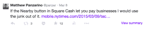
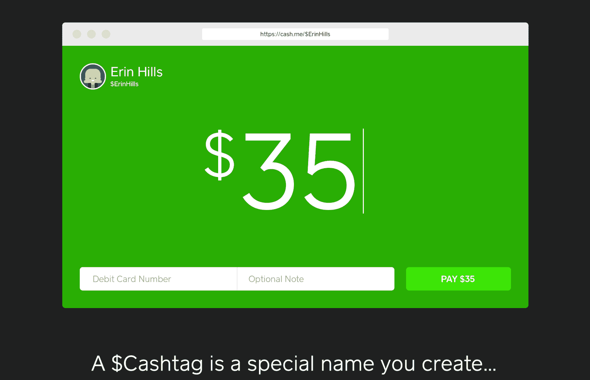
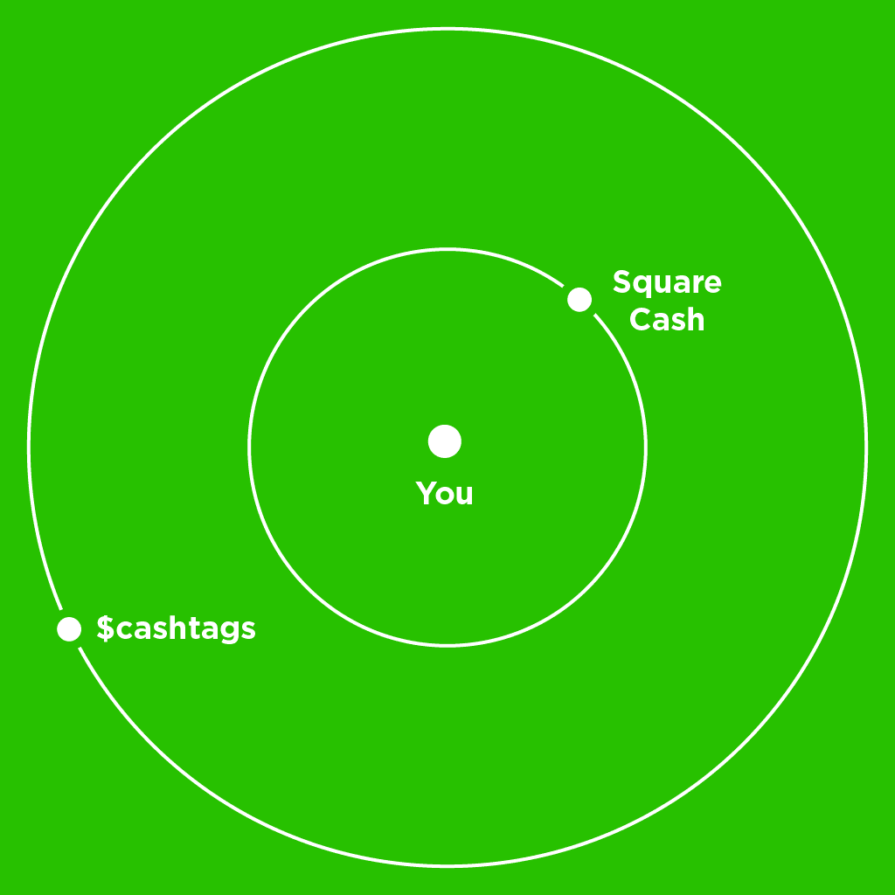

# Square Cash 向企业敞开大门，推出$Cashtags

> 原文：<https://web.archive.org/web/http://techcrunch.com/2015/03/23/businesstime-for-square-cash/>

Square 正在扩大其现金产品，以允许企业接受支付。此外，Square 还宣布了一个名为 [Cashtags](https://web.archive.org/web/20230326061214/http://cash.me/) (技术上称为$Cashtags)的新身份系统，该系统允许人们申请一个唯一的地址，任何人都可以使用该地址直接发送现金。

我一直在[等待现金来扩展](https://web.archive.org/web/20230326061214/https://twitter.com/panzer/status/574789901717086209)付费业务。现金本身是我见过的将钱从一个懒人交换到另一个懒人的最干净、摩擦最小的构造之一——这包括实际的现金。将使用它来支付服务或商品的能力制度化才有意义。

会有很多人带你通过新闻稿来赚钱，并重复党的路线。但是现在是解除禁运的前一天晚上，我正在喝一大杯能量饮料和一些花生。所以让我们像朋友一样分解这些公告。只有你和我，谈论后现代现金。

这是布莱恩。

首先是企业。我与 Square Cash 的负责人 Brian Grassadonia 讨论了现金的新方向以及整个 Cashtag 背后的一些思考过程。这是要点。

企业可以接受任何金额的现金支付，没有每月限额。个人用户仍被限制为每笔交易 250 美元，每周 2500 美元。格拉萨多尼亚解释说，这主要是因为现金的低摩擦特性。他们要求个人用户提供更多信息，然后才允许他们发送更多信息——企业必须立即提供这些信息，包括姓名、出生日期和社会保险号的最后四位数字。

企业也最先因使用现金的特权而被收费——从每笔交易中抽取 1.5%的固定费用。个人用户仍然不收费。

此时，我直截了当地问格拉萨多尼亚，Square 是否能从这些商业交易中赚到足够多的钱，使现金收入超过账面价值。“我们正在围绕 square cash 构建一个极具竞争力的成本结构。这对我们和我们的卖家都有意义，”格拉萨多尼亚说，我认为这是一个很好的答案，如果不是特别详细的话。

顺便说一句，这些企业*不是*打算成为标准的实体零售商，尽管它们有可能注册并使用 Square Cash。例如，没有关于序列号项目或复杂的 SKU 库存的详细来回规定。

相反，这种最初的热潮是针对非营利组织、艺术家、Twitter 用户、在线媒体人士和企业家的。 [Wikipedia](https://web.archive.org/web/20230326061214/http://cash.me/%24wikipedia) 、 [KhanAcademy](https://web.archive.org/web/20230326061214/http://cash.me/%24khanacademy) 、 [USO](https://web.archive.org/web/20230326061214/http://cash.me/%24uso) 和 [RED](https://web.archive.org/web/20230326061214/http://cash.me/%24RED) 都有在发布时分配的现金标签。在视频中添加现金标签图片的 YouTuber 立即带来了广告之外的额外收入。像 [Patreon](https://web.archive.org/web/20230326061214/https://www.patreon.com/) ，但是零摩擦。

对 Square Cash 的这一阶段有意义的业务类型是什么？服务。举例来说，摄影师将会在这次展示的广场宣传材料中被引用,(作为一名前摄影师)我认为这很有意义。没有复杂的库存，交易量(相对而言)很低，而且价格远远高于任何信用卡处理选项，包括 Square。

Square 现金支付一如既往地直接从银行账户中存入和借记，这让任何开设现金账户的企业都可以立即避开有时与刷卡相关的高昂费用。再加上 Square Cash 令人难以置信的低摩擦登机程序，你会发现一些有趣的东西。

这就把我们带到了…咳咳…$现金标签。

### $Thisisathing

这些是唯一的 id，任何人都可以在 Square Cash 的新网站 [Cash.me](https://web.archive.org/web/20230326061214/http://cash.me/) 申请。乍一看，这似乎是一个虚荣的网址，它是。例如，Cash.me/$Panzer 是一个个人资料页面，让人们看到我并直接付款。但这不仅仅是一件虚荣的事情——当你看到它的时候…

Square Cash 是关于“取代纸质现金和支票”的，这将是你会听到的口号(搜索一下今天的新闻，我敢打赌)。这是一个边栏业务注册，资本，读者，等等。我明白了，这是一个令人信服的报价，它不是不准确的。但对我来说，在 Square Cash 上添加 Cashtags 完成了两件事。

1.  它拓宽了广场现金的轨道。
2.  它切断了交易与任何个人信息的联系——除了一个名字。

第一点很容易理解。以前，Square Cash 表面上仅限于你认识的人，或者至少想分享一些个人信息的人。如果你愿意，如果这意味着你不得不分享你的电话号码，你会随便找一个街头艺人吗？大概不会。如果他们有一个印有$Radicalbiketricks 的标志，而你知道他们看到的只会是你自己的现金标签，你会这么做吗？更有可能。

顺便提一下，这就是为什么我真的看不出脸书的新信使支付与 Square Cash 的平价。我相信很多人会用它，这很酷。哪个系统更受欢迎不是我的问题，那是马克和杰克的事。但是如果你谈论的是你不认识的*人的更广泛的圈子*——目前只有 Square Cash 以一种让你舒服的方式来做这件事。

这就引出了第二点。

将金融和个人信息从交易中分离出来几乎是不可能的，除非你拥有支付栈或者拥有巨大的影响力——足以扭曲消费者金融的大梁。

在所有的支付系统中，只有两个被证明愿意这样做。Square 用第一种方式，苹果用第二种方式。

当然，现金标签是一种简单、公开和可分配的现金转移方式。但它们也起到了防火墙的作用，将资金从一方转移到另一方的行为与实际的金融基础隔离开来。你把钱寄给 Square，Square 对这些钱进行数字清洗，去除你个人信息的臭味，然后以新的数字钞票的形式交给收款方，钞票上有潦草的 ball-point $Cashtag。

### 金钱球

为什么这很重要:乱动人们的钱就像触摸他们的眼球。

人们会为了一个免费的 3 美元纸杯蛋糕或摇头娃娃或其他东西排队几个小时，他们只会在 Twitter 或 Meerkat 上抱怨。将他们暴露在*任何数量*的风险中，一些怪人可能会在他们不知道的情况下从你的账户中偷走 3 美元，他们会签署集体诉讼，速度之快会让你头晕目眩。

至少，如果他们意识到，只要将一张写有账户和路由号码的支票交给任何一个提出要求的人，他们就会面临多大的风险。或者把一个多年不变的信用卡号码交给一个大零售商的一个蹩脚的保护不足的安全系统，让其他国家的信用卡号码农场去抓取。

https://www.youtube.com/watch?v=16Y4pDr8iZY&feature=youtu.be

除了传统信用卡欺诈漏洞之外，通过 Apple Pay 使用一次性代币支付无疑比使用信用卡更安全。如果你在商店使用现金标签和现金支付，情况也是如此。

当然，所有这些有趣的东西并不意味着 Square Cash 将为 Square 带来巨大的利润。他们无疑希望它能充当品牌大使，吸引更多人加入 Square 的生态系统，建立品牌认同和信任。祝你好运。自私地说，我希望它能起作用，因为我和我的朋友们不断地为这个和那个互相寄钱。它让我们所有人保持诚实，并防止任何关于谁欠谁的抱怨。

但在更大的范围内，现金标签可能会对我们思考支付和身份的方式产生巨大影响，原因有几个。

现金标签很容易理解和识别。你可以在非营利捐赠广告的底部看到它们，或者把它们潦草地写在交换会议桌旁的纸板上。

使现金标签立即可操作，将任何一张纸片变成一个安全的现金入口。这也让你感到安全，这是在公共场合掏出钱包数钞票几乎永远做不到的。

这些因素结合在一起，使得这一声明没有美元符号取代英镑符号那么愚蠢。