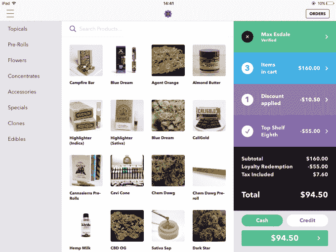
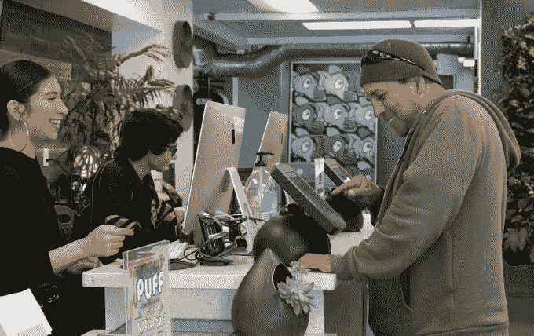

# Meadow 是杂草的亚马逊 

> 原文：<https://web.archive.org/web/https://techcrunch.com/2017/08/02/buy-weed-online/>

大麻合法化正在席卷全国，绿色热潮正在向我们袭来。随着大麻销售商争相遵守复杂的法规，一家初创公司已经建立了他们所需的全套专业商务软件。Meadow 提供一切，从引人注目的逗弄美味植物的数字店面，到自动化的病人记录管理，如果你搞砸了，你就要去坐牢。

这就是为什么[草地](https://web.archive.org/web/20230207192756/https://getmeadow.com/dispensary-software)正在成为杂草的亚马逊。但是你不仅仅可以在[网站上从当地各种顶级商店买到最好的啤酒](https://web.archive.org/web/20230207192756/https://techcrunch.com/2016/04/05/from-farm-to-joint/)。是 AWS 推动了 THC 交易的后端。

Meadow 已经提供:

*   在线和移动订购
*   交付物流
*   店内销售点
*   存货管理
*   退货和折扣
*   病人接收和登记
*   分析学
*   安全性

今天，Meadow 发布了其大麻药房软件套件的最后一部分:忠诚。它让 ganja 买家在同一地点购物获得积分，他们可以用积分兑换现金、折扣、免费产品和奖品。顾客可以在店内或网上获得并应用积分，并跟踪他们在 Meadow 的所有供应商那里累积了多少积分。这对于那些想在大麻变坏或有新货来之前脱手的卖家来说尤其有帮助，同时又不影响他们的公开定价。

Meadow 联合创始人 David Hua 表示:“积分的能力为药房提供了一种与客户建立更深关系的工具。“我们已经看到许多药房在管理忠诚度计划方面失败了。创建一个很容易，用库存跟踪它，并且你的报告对操作者来说经常是非常繁重的。”

Meadow 联合创始人、首席执行官和吸烟者 David Hua

毫无疑问，华是个瘾君子。但 Meadow 的首席执行官也是一位精明的商人，他赢得了 TechCrunch 的 2015 年最佳自举创业公司奖，通过 Y Combinator 领导了[，去年](https://web.archive.org/web/20230207192756/https://techcrunch.com/2015/02/04/cannabismd/)[筹集了 210 万美元的种子资金](https://web.archive.org/web/20230207192756/https://techcrunch.com/2016/04/05/from-farm-to-joint/)。在旧金山教会区的一个仓库里，刺鼻的烟雾经常从 Meadow 总部的院子里飘出来。它愿意充当社区枢纽和活动空间，这使 Meadow 成为连接新兴合法大麻业务参与者的商业层。

Meadow 经常被拿来与杂草软件初创公司 Eaze 相比较。虽然两者都经营着一个虚拟的医生办公室，你可以通过视频聊天获得处方大麻，并且都提供一个聚合的在线店面和送货物流服务，但相似之处也仅此而已。

Eaze 已经积极筹集了超过 2400 万美元用于营销，试图成为大麻的优步，在没有正式雇佣快递员的情况下组织送货。但华认为这是大麻商业拼图中更为普通的一块，可以商品化。这是一个核心的后端办公软件，用于导航更难复制的严格监管，但对于运营一个良好的大麻业务至关重要。

Meadow 的销售点软件让大麻药房提供忠诚度计划

Meadow 的愿景是，如果一家药房在所有事情上都依赖于它，从扫描商店里大麻罐上的条形码到安全地存储病人的医疗数据，他们会为了方便起见而加入它的在线店面和送货物流。

那项计划正在进行中。尽管在 2016 年 4 月只筹集了 210 万美元，华说“我们还有很多跑道。我们在资金方面做得很好。”事实上，现在这家 10 人创业公司可以为 70%允许医用大麻的加州县提供服务，华告诉我 Meadow“接近盈利”

随着大麻在 2018 年初在加州对所有成年人合法，大麻市场将变得更加令人兴奋。“看看科罗拉多州、华盛顿州和内华达州(在那里，大麻最近成为娱乐性合法)，这些市场一夜之间增长了三倍、四倍、五倍。我们希望有一个不错的乘数。”虽然目前只专注于加州，但随着更多州的合法化，Meadow 拥有巨大的增长潜力。

一位顾客使用 Meadow 基于平板电脑的销售点软件结账

合法化也带来了挑战，虽然，随着法规的变化，竞争加剧，更多的老牌企业试图在杂草贸易中占有一席之地。这就是为什么华一直在努力引进大麻世界以外的最佳实践，观察 Square、Belly、FiveStars 和其他商业平台如何处理销售点和忠诚度。

随着禁令的结束，新企业将迎来大量机会。一些人自己开始持有和出售大麻。像 Eaze 这样的其他公司已经争先恐后地处理它如何到达你的门口。但是, [Meadow](https://web.archive.org/web/20230207192756/https://getmeadow.com/) 已经走上了建立严肃的商业软件的不归路。随着 weed 在 2018 年最终成为一项严肃的业务，所有这些时间编码可能会发展成为一项非常粘性的服务。