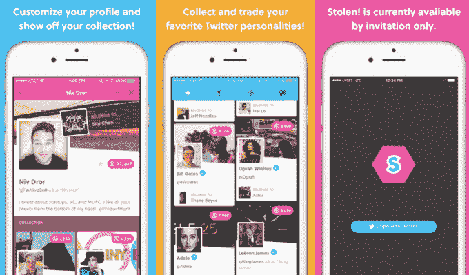

# 时髦的社交应用被盗在用户的“担忧”中关闭

> 原文：<https://web.archive.org/web/https://techcrunch.com/2016/01/14/buzzy-social-app-stolen-shuts-down-amidst-concerns-from-users/>

# 时髦的社交应用被盗在用户的“担忧”中关闭

在对一款名为[失窃](https://web.archive.org/web/20230321223638/https://www.producthunt.com/tech/stolen)的流行应用的游戏机制的担忧中，它的创造者[嘿公司](https://web.archive.org/web/20230321223638/http://www.hey.co/about/)已经决定关闭。他们今天在推特上发布了这条消息。基本上，这款应用允许你“拥有”拥有 Twitter 账户的同伴，不管他们是否注册了这项服务。这本来是一个有趣的游戏，但却惹恼了许多人。

在[采访了 Gadgette](https://web.archive.org/web/20230321223638/http://www.gadgette.com/2016/01/13/stolen-app/) 之后，该团队创建了一个退出页面，如果人们不想参与，可以删除他们的个人资料。奇怪的是，它要求你登录 Twitter 并授权应用程序。然后，团队确保它只要求读取权限，以防人们担心。

这显然不足以安抚那些对整件事感到不安的人。

相关方包括美国众议员凯瑟琳·克拉克(Katherine Clark)，她给 Twitter 和苹果(特别是杰克·多西和蒂姆·库克)写了一封信，内容是关于被盗以及它如何允许滥用者骚扰人们:

Hey Inc .的团队以前也做过类似的东西，但不是为脸书设计的。它失败了。

有些人真的很喜欢这款应用，《财富》杂志称它“令人上瘾”。

许多 Twitter 员工也参与了这个游戏，Twitter 的首席运营官·亚当·贝恩一度“拥有”了我的一些同事。当然，这一切都是为了让开心。然而，我决定删除我自己的帐户。只是感觉不舒服。应用内购买让你有更多的钱在应用中消费，如果你有足够多的假现金，你可以“偷走”用户。

我用它玩了一会儿，但它很浪费时间:

该公司正引导人们去 iTunes 寻求退款: