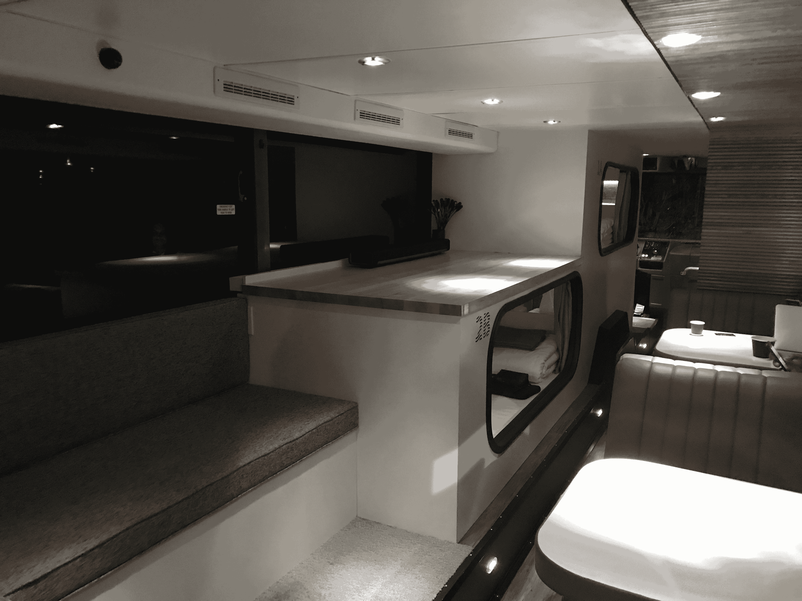
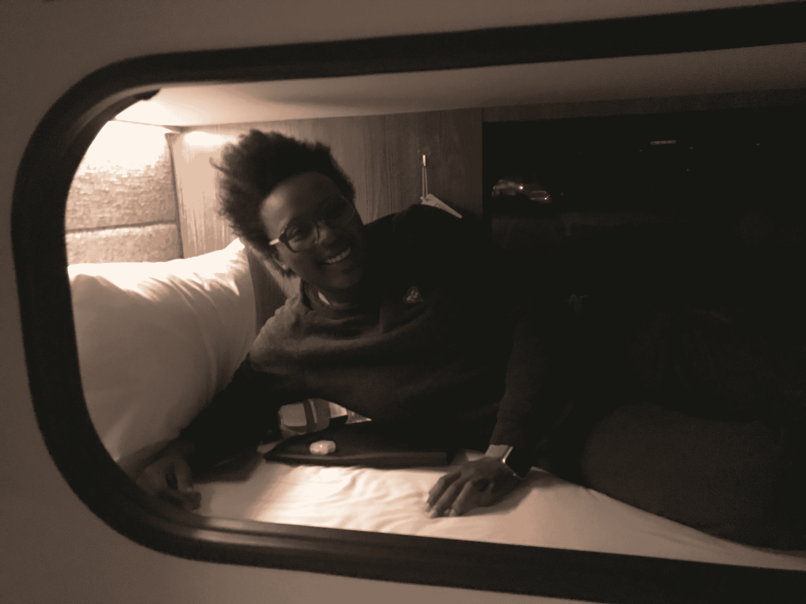
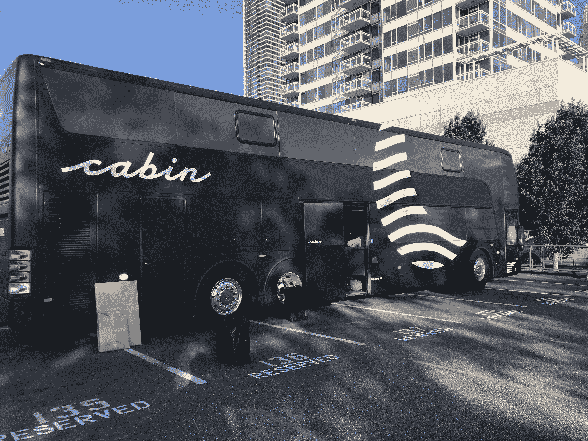

# 在小屋的睡眠舱巴士上过夜是什么感觉 

> 原文：<https://web.archive.org/web/https://techcrunch.com/2017/07/22/cabin-sleep-pod-bus-review/>

配备睡眠舱的包租巴士，想要像丽思卡尔顿酒店一样，但是要有轮子。

上周末，我从旧金山到洛杉矶来回旅行

[Cabin](https://web.archive.org/web/20221208105903/https://www.ridecabin.com/)

。当我到达旧金山的巴士接送点时，一位笑容满面的服务员向我打招呼。然后，她开始为我办理登机手续，并收起我的包。一上车，我就看到了社交休息室，如果人们不想马上睡觉，可以在那里聊天和闲逛。

我绕过那个区域，直接上楼去挑选我的豆荚。我去了一个有紧急出口的上铺，因为出口排的豆荚有最大的空间。每个吊舱都配备了一些夜间必需品，如耳塞、水和褪黑激素补充剂。在挑选出我的吊舱后不久，一位旅伴问我是否想要一张我在吊舱中的照片。很明显，我答应了。

我的睡舱伙伴拍了一张我放松的照片。

我们周五晚上 11 点离开旧金山，所以我不用错过任何工作，我们早上 7 点到达圣莫尼卡，这意味着我在洛杉矶有一个完整的周六。巴士于周日晚上 11 点离开洛杉矶，早上 7 点抵达旧金山。

从洛杉矶到旧金山的往返舱价是 230 美元。Cabin 为您提供睡眠舱、床上用品、免费 Wi-Fi、免费水、夜间茶、咖啡、耳塞和褪黑激素补充剂。您可以在巴士下存放最多两件行李，并携带一件可以放在您的吊舱中的小件物品。

在旧金山和洛杉矶之间旅行，客舱绝不是最便宜的方式。有 Bolt 和 MegaBus，它们都提供相当便宜的往返票，大约 50 美元。当然，还有乘飞机，这是最快的，而且取决于你提前多长时间买票，也不太贵。

“我们真的很坦率地说，这不是去洛杉矶最便宜的方式，”Cabin 的联合创始人兼总裁 Gaetano Crupi 告诉我，他参加了首航。

但是船舱是目前最舒适的方式。这话出自一个在这两个城市间跋涉了 50 多次的人之口。虽然睡眠舱本身很舒服，但路上的颠簸却不舒服。在去洛杉矶的路上，我过了一会儿才睡着，但我不确定这是因为我那天早些时候睡了一会儿，还是因为道路崎岖不平。我有过这样的经历:早上“醒来”时，我甚至不确定自己是否睡着了。

回来的路对我来说要好得多。我很快就睡着了，一觉睡到天亮。我甚至在卧铺巴士上做了一个梦，梦见自己在卧铺巴士上。所以 meta。一觉醒来，我下楼来到社交休息室，机舱服务员向我打招呼，并给了我一些浓咖啡。喝完一杯，我就上路了。

[gallery ids="1517303，1517293，1517292，1517294，1517301，1517299，1517302，1517297，1517306，1517298"]

## 从卧车到小屋

Cabin 的前身是 SleepBus，提供洛杉矶和旧金山之间的往返旅行。Crupi 说，整个试播节目都卖光了，超过 4000 人试图预订。筹集到一些资金后，Crupi 和联合创始人 Tom Currier 开始思考他们触动了什么神经。

“这不是人们想在公交车上睡觉那么简单，”克鲁皮笑着说。“不是这样的。那不是产品。”

因此，他们与一些客户进行了交谈，并得出结论，这一切都取决于时间。但是他们不想简单地提供一辆你可以在上面睡觉的巴士——一种感觉像招待所的东西。

“那是真正的洞察力出现的时候，”克鲁皮说。“每个人都在致力于自主。它将被商品化。一旦你开始在车里待上两个小时，你就不必关心驾驶部分和方向盘了，那为什么它会被设计成这样？”

Crupi 说，Cabin 希望成为一个“感觉像丽思卡尔顿”的品牌。他接着谈到美国的地区交通如何不理想。确切地说，他说它“真的很糟糕”对于自动驾驶汽车，Crupi 设想在高速公路上进行大量的区域运输。

“我们认为，未来是高速铁路，”克鲁皮说。“一旦你开始思考，‘我有一个客户要待 7 个小时’，那么这就是设计和服务的问题。”

这就是对服务员、私人空间和便利设施等细节的强调。最终，Cabin 希望增加机上订购咖啡、茶和其他东西的功能。

“今天你将体验到自主的体验，”克鲁皮说。

自驾车，自动驾驶汽车从一开始就在 Crupi 和 Currier 的脑海中。有一天，客舱将不仅仅提供自主的体验，而是真正的自主旅行。

克鲁皮说:“我们对自动驾驶将给人们的生活带来什么充满热情。”“我们认为，一旦人们不再那么担心他们的通勤问题，社区就可以进一步分离，孩子们可以在大自然中成长，各种各样的好事都会发生，就城市是如何建设的以及人们如何考虑进入他们工作和生活的地方而言。”

尽管离自主还有一段路要走，但 Crupi 和 Currier 希望现在就给人们带来自主体验。克鲁皮说，这是因为他们“对在你的车里睡着，然后你的车带你去某个地方的想法感到兴奋”。

## 经营一家汽车旅馆

到目前为止，为了提供夜间服务，Cabin 已经建造了三辆公共汽车——每个方向一辆公共汽车，还有一辆备用汽车。从现在起到 9 月 1 日，Cabin 将慢慢增加其提供的旅行次数。

正如我提到的，我的旅行是 Cabin 的第一次旅行。本周末，小屋将进行第二次往返航行。小屋正在慢慢进行，以便制定出操作方案，比如每天处理衣物、垃圾和浴室的最佳方式。

Crupi 说:“你必须建立合作关系，因为它是完全移动的。”。“洗好的衣服会被取来放去。燃料到达车辆。这是这种区域交通解决方案的主要优势之一，我不需要机场。”

当小屋不工作时，它停在很多地方。当它接人时，客舱利用旅游巴士接人区。小屋在旧金山和圣莫尼卡都是完全合法的。

“很多初创公司都喜欢‘以后再和监管机构打交道’，”克鲁皮说。“我们就像我们有一个可以被警察局扣押的资产，所以我们的路线得到了圣莫尼卡市政工程师的批准。一切完全认可。”

Crupi 说，下个季度，Cabin 将专注于体验中的好客元素。它还将继续考虑一些事情，比如船舱是否足够大，或者它们看起来是否略有不同。

关于额外的航线，Cabin 正在考虑波特兰和拉斯维加斯。但克鲁皮真正感兴趣的一件事是美国中部，他说那里“是一个巨大的机会。”

“我真的很兴奋，如果你使用高速公路系统，不需要轨道，我们可以在美国用非常有限的基础设施建立这种优质的，几乎是欧洲的旅行体验，”他说。

Cabin [最近为其搬家酒店业务](https://web.archive.org/web/20221208105903/https://beta.techcrunch.com/2017/06/30/cabin-secures-3-3m-for-its-moving-hotel/)融资 330 万美元。这将允许创业公司扩大其区域性服务。Crupi 认识到，Cabin 不是那种马上就会获得数亿美元资金的创业公司，但目前，Crupi 说，“我们有一个盈利的商业模式，我们可以向客户学习。”

## 常见问题

*   **你睡得着吗？**
    在去那里的路上，我想是的。在回来的路上，是的。
*   **pod 是否锁定？没有，但我感到安全。**
*   人们愤怒了吗？谢天谢地，没有。我感到惊讶的是，每个人都很快就去了，而且没有任何噪音。但是如果人们不准备马上睡觉，他们可以呆在社交休息室
*   **浴室很恶心吗？
    不对！对公共厕所来说很好。他们甚至有卫生棉条！！**
*   **坐飞机不是更便宜吗？**
    看你什么时候买你的航班了，但是是的，坐飞机肯定可以便宜一点。
*   你会再做一次吗？
    一般来说，当我旅行时，我会经历相当多的焦虑。坐飞机意味着我必须至少提前一个小时到达机场，并处理安全线和由于天气或其他一些废话造成的潜在延误(想想 SFO 的跑道建设)。开车意味着我必须在车里醒着几个小时，即使我是乘客，我也不能完全伸展我的腿。有了 Cabin，我可以在巴士出发前 10 分钟登车，然后在一张真正的、尽管很小的床上睡着。