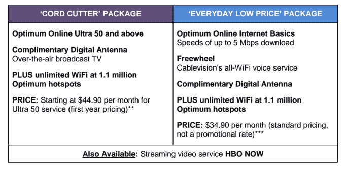

# Cablevision 推出结合宽带、免费天线和可选 HBO NOW TechCrunch 的“脐带切割器”套餐

> 原文：<https://web.archive.org/web/https://techcrunch.com/2015/04/23/cablevision-debuts-cord-cutter-packages-combining-broadband-free-antennas-and-optional-hbo-now/>

Cablevision 作为第一家向其宽带客户提供 HBO 新的独立服务 HBO NOW 的付费电视提供商而成为头条新闻，今天，有线电视公司再次将目标锁定在脐带切割者身上，他们将互联网、免费数字天线和捆绑 HBO NOW 的选项结合在一起。一个捆绑包的官方名称是“cord cutter package ”,是该公司今天宣布的两个新产品之一，另一个结合了较慢的互联网选项、天线和 Wi-Fi 语音服务。

Cablevision 首席执行官 Kristin Dolan 在宣布新捆绑包的声明中解释道:“作为一家连接公司，Cablevision 正在重新想象其与客户的关系。”

多兰补充说，这些包装旨在提供“适合新的消费者生活方式的真正选择”

具体来说，该公司指出，它正在追逐“断线族”——那些放弃昂贵的有线电视订阅的人，以及所谓的“cord never”——即那些从一开始就没有注册有线电视的年轻消费者。

与传统的有线电视套餐相比，这两种套餐最初听起来价格相对较低，因为大部分定价都涵盖了宽带服务(或宽带+电话服务)。)

在 cord cutter 产品包中，客户拥有 Cablevision 的“Optimum Online Ultra 50”互联网服务(下行 50 Mbps 上行 25 Mbps)和一个“补充”数字天线(可靠的 Mohu Leaf 50)，允许他们在没有有线电视盒或付费电视订阅的情况下观看无线广播。

我们应该注意到，这是 Cablevision 第一次向客户分发这样的数字天线。当然，Cablevision 的客户之前可以通过选择纯宽带套餐并购买自己的天线来为自己配置这种设置，但很明显，这里的目标是简化那些希望切断电源线的人的过程，并以免费天线的承诺吸引新客户。

这里的吸引人之处似乎在细则中——“脐带切割”服务是每月 44.90 美元，但只是第一年。(我们已经要求 Cablevision 提供明年定价的细节，但没有立即透露，我们将根据他们的回应进行更新。)此外，Cablevsion 还增加了每月 4.95 美元的调制解调器租赁费。

第二个套餐被称为“日常低价”套餐，每月 34.90 美元(不是促销价格)，价格较低。这包括最佳的在线互联网基础设施(最高 5 Mbps)、Wi-Fi 语音服务和相同的免费天线。这两个套餐还包括访问 Cablevision 的 110 万个热点和调制解调器费用。然而，Wi-Fi 电话服务还需要一次性支付 99.95 美元购买一部摩托罗拉 G 智能手机，才能使用 Cablevision 的无限数据、通话和短信服务，而传统的蜂窝计划则不提供这些服务。

这两个套餐还允许客户捆绑接入 HBO NOW，作为一种选择，每月另付 15 美元。

Cablevision 并不是第一家瞄准断线钳的付费电视提供商——本月早些时候，[威瑞森也推出了新的电视套餐，允许客户选择点播节目](https://web.archive.org/web/20221209202741/http://www.wsj.com/articles/verizon-breaks-pay-tv-bundle-as-competition-mounts-1429240054)。在这里，客户最初会收到一个很小的电视频道包，包括主要的网络和一些更受欢迎的有线电视频道(如 CNN、AMC、Food Network 等。)然后添加他们选择的尽可能多的其他频道“包”，这些频道被分为体育、儿童、流行文化和生活方式等类型。

威瑞森表示，其最便宜的计划是每月 55 美元，包括两个频道包。额外套餐每月 10 美元。顾客可以在使用 30 天后随意更换包装，这是前所未有的灵活选择。

然而，尽管威瑞森的交易巧妙地瞄准了消费者对灵活性的需求，但在削减开支时，它似乎未能解决消费者的财务利益。[一位评审员甚至努力构建一个](https://web.archive.org/web/20221209202741/http://www.usatoday.com/story/tech/2015/04/19/verizon-new-plan-not-as-cheap-as-advertised/26050061/)捆绑包，这个捆绑包比他在新选项之前已经支付的要少得多。

除了威瑞森，Dish Networks 还通过 [Sling TV](https://web.archive.org/web/20221209202741/https://www.sling.com/) 追求脐带切割者，这是一种流媒体服务，每月 20 美元起，让你以每个 5 美元的价格添加可选的主题频道包，[以及每月 15 美元的 HBO](https://web.archive.org/web/20221209202741/https://beta.techcrunch.com/2015/04/01/sling-tvs-service-for-cord-cutters-will-offer-hbo-starting-this-month/)。但是 Sling 已经经历了一些成长的烦恼，可能还没有准备好迎接黄金时代。

这些举措出台之际，传统付费电视行业正不得不与消费者对有线或卫星电视订阅付费价值的看法转变展开竞争。

但有趣的是，至少在目前，削减开支的趋势可能是空谈多于行动。最近的一些研究表明，事实上，消费者做的更多的是“剪线”(让他们的付费电视更便宜)而不是“剪线”。

就在本周，尼尔森表示，拥有视频点播订阅服务的有线电视用户比有线电视用户更有可能放弃这项服务。该公司表示，93%的家庭都更有可能放弃宽带或他们的订阅视频服务，而不是他们的有线电视。