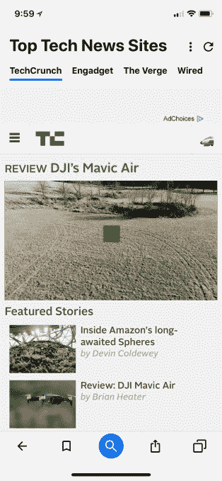
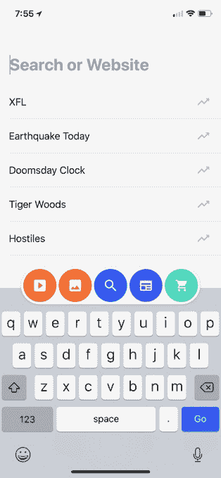

# Cake 为一款可移动浏览器筹集了 500 万美元

> 原文：<https://web.archive.org/web/https://techcrunch.com/2018/01/30/cake-raises-5-million-for-a-swipeable-mobile-browser/>

一家名为 [Cake](https://web.archive.org/web/20230306013933/https://cakebrowser.com/) 的初创公司有一个雄心勃勃的计划，要挑战 Chrome 和 Safari 等现有公司，为移动设备开发更好的浏览器。该公司今天早上宣布，它已经从 Peak Ventures，Pelion Ventures 和 Kickstart Seed Fund 筹集了 500 万美元。

Cake 于 2016 年底由 Jase Bosarge 在犹他州的 Provo 创立，他最初开发了一些技术，并由此产生了一个[专利](https://web.archive.org/web/20230306013933/http://www.internetnews.com/bus-news/article.php/3356391/A+Tale+of+Two+Patents.htm)组合，后来被授权给谷歌用于 Gmail。去年 7 月，该公司从 Ancestry.com 请来工作了 14 年的产品主管 Kendall Hulet 担任首席执行官。

浏览器背后的想法是重新思考消费者希望如何从移动设备上搜索网络——也就是说，提供一套标准的链接供点击不再有意义。

“今天的浏览器仍然和 15 年前非常相似，”Hulet 解释道。“它们不是为移动而重新设计的——它们基本上是塞进手机的桌面体验，”他说。

此外，该公司声称，在手机上返回链接列表要比在桌面上多花 87%的时间才能到达第一个有机列表。

Cake 的想法是在很大程度上消除索引页面，支持各种垂直领域的搜索结果，如网络搜索、图像搜索、视频、新闻和购物。页面是为了更快的结果而预加载的，但 Cake 告诉我们，它不提供基于 Google AMP 的页面(Google 的加速移动页面)。

浏览器不会返回一个链接列表，而是加载最佳结果，然后允许你在其他相关页面中水平滑动。这使得在搜索结果中移动更快，甚至有助于向您展示您可能没有点击过的结果。

[gallery ids="1592388，1592389，1592390，1592391，1592392，1592393，1592395，1592396，1592426"]

*上图:蛋糕浏览器和设置屏幕。Cake 可以让你选择搜索引擎，这要归功于它与各种搜索伙伴的关系。(披露:雅虎搜索由 TechCrunch 的母公司 Oath 运营。)*

在搜索特定新闻的情况下，这可能意味着你会发现自己在浏览新闻来源的故事，否则你可能会跳过——比如 CNN 或福克斯新闻频道，这取决于你如何学习。

你可以选择哪个搜索引擎为你提供新闻——谷歌、雅虎或必应——但你不能为了给自己建立一个新闻泡泡而定制来源，在这个泡泡里，你只能看到那些内容符合你信仰体系的网站。

Cake 还可以提供围绕新闻的分组，如“顶级科技新闻”，这可以作为一种简单的方式来了解正在发生的事情，而不需要特定的查询。

在其他垂直市场，定制选项有所不同。

例如，在图像搜索中，除了搜索引擎之外，您还可以打开或关闭像 Imgur、Flickr、Picsearch 等资源。在视频中，你可以打开或关闭 YouTube 或 Vimeo，或者谷歌、必应、雅虎或 Yandex 搜索结果。

蛋糕显示搜索趋势

该浏览器尚未产生收入，但该公司有办法在返回的页面中间插入一个实际上是广告的搜索结果。例如，如果你正在购买一件特定的商品——比如一件黑色的鸡尾酒礼服——一家零售商可以在你的购物搜索结果中，在有机搜索结果旁边，宣传他们产品的登陆页面。

“我们有机会真正重新想象广告在移动搜索上的运作方式，”Hulet 说。“我们专注于为移动浏览器提供最佳体验，包括广告。”

然而，广告还没有出现在蛋糕中。

在今天的公开发布之前，我们有机会测试了 Cake 的浏览器。

虽然这绝对是一种不同的体验——更像是一款年轻、色彩鲜艳的卡片风格设计的消费社交应用——但它并不总是像宣传的那样工作。(我们被告知，这可能是一些 A/B 测试的结果。)

例如，搜索“埃尔顿·约翰巡演日期”——我们测试的当天的新闻——奇怪的是，首先返回的是谷歌自己的搜索结果。然后你可以浏览其他新闻网站和埃尔顿·约翰的主页以获取更多信息。(主页上有更多的细节，而谷歌搜索结果没有关于歌手的大知识图表、歌曲列表、维基百科的链接等有用)。

小事情也比它们应该的更麻烦，比如开始一个新的搜索。

搜索“特朗普”会带你浏览当天的新闻

当你执行完一个搜索查询后，点击屏幕底部的任何圆形垂直搜索图标，应用程序会假设你现在想在新的垂直搜索中搜索你的原始搜索词，而不是让你输入新的查询。您必须轻敲鼠标重新定位光标，然后删除现有文本并输入新的查询。(或者完全启动一个新标签。)

此外，在这样做之后(在你输入你的查询之前)，如果你意识到你的意思是图像垂直而不是网络搜索垂直，点击底部的按钮在它们之间切换不起作用。也就是说，你必须先输入你的关键字*然后才能选择你想要的垂直搜索按钮。这并不是什么大问题，但是按钮突然不做任何事情感觉很奇怪。*

值得注意的是，该浏览器没有语音搜索按钮，而这正是移动搜索和帮助的发展方向。

其中许多都是测试版中的小问题，可以及时改进，但它们扰乱了整体体验。

话虽如此，今天很少看到有人试图在移动浏览器中创新，因此值得跟踪 Cake 的努力，看看它是否能进一步改进。

然而，如果网络搜索不成功，该公司表示愿意将其技术授权给其他应用。

“我们相信我们正在申请专利的技术可以有多种应用。我们相信网络浏览器是一个很好的应用，”Hulet 说。当被问及如何处理与许可有关的问题时，他补充道，“我们愿意探索任何对话。”。

对于 Cake 的知识产权来说，这可能比试图用新浏览器重新发明移动搜索更有意义——有很多其他应用程序的搜索已经过时，或者可能需要一点创新。

蛋糕适用于 [iOS](https://web.archive.org/web/20230306013933/https://cakebrowser.com/desktop-signup/?_branch_match_id=393385769376814269) 和 [Android](https://web.archive.org/web/20230306013933/https://play.google.com/store/apps/details?id=com.cake.browser&_branch_match_id=393385769376814269) 。