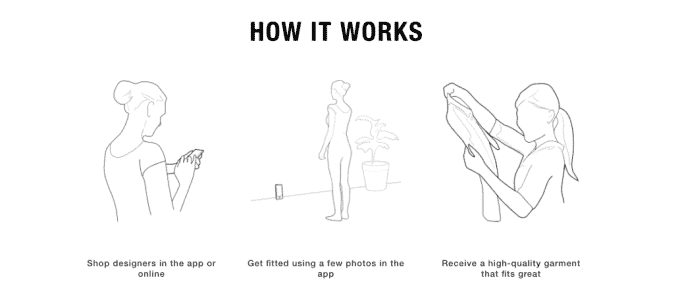
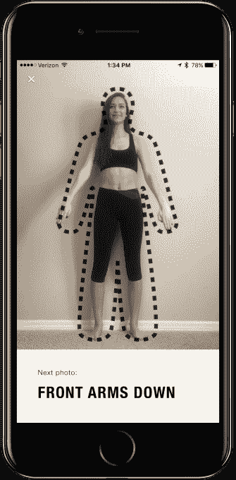

# CALA 的应用程序使用 iPhone photos TechCrunch 让设计师设计的服装贴合你的身体

> 原文：<https://web.archive.org/web/https://techcrunch.com/2017/03/23/calas-app-fits-designer-clothing-to-your-body-using-iphone-photos/>

一家名为 [CALA](https://web.archive.org/web/20221024050558/https://ca.la/) 的初创公司旨在通过提供电子商务运营所需的一切——从生产到交付——让新设计师更容易进入时尚行业。此外， [CALA 销售这款服装的新手机应用](https://web.archive.org/web/20221024050558/https://anthonycucculelli.ca.la/)颠覆了通过 3D 人体扫描技术制作和试穿服装尺寸的传统方式。结果是定制服装与购物者自己的身体尺寸高度匹配。

CALA 于去年由 Shyp 前运营主管安德鲁·怀亚特(Andrew Wyatt)和 Shyp 的第三位工程师迪伦·派尔(Dylan Pyle)创建。在给一家时装公司做顾问后，怀亚特意识到这个领域需要运营技术。

正如他所描述的，CALA 是设计师外包所有“不性感的东西”的一种方式，这样他们就可以专注于他们的最佳点:他们的实际设计。

[CALA](https://web.archive.org/web/20221024050558/https://ca.la/) 面向独立设计师，以及希望推出自己品牌的在线影响者、艺术家或音乐家，处理草图绘制过程后发生的一切，包括在网络和移动设备上托管面向消费者的在线商店，帮助客户找到合适的尺寸，以及制造和交付服装。

在网上和本周刚刚在苹果应用商店推出的 CALA 移动应用程序中，现在有三个时装系列——两个来自设计师—[彼得·伍](https://web.archive.org/web/20221024050558/https://vu.ca.la/)和[安东尼·库库勒利](https://web.archive.org/web/20221024050558/https://anthonycucculelli.ca.la/)——还有一个 CALA 自己的系列，它可以在那里试验自己的新想法。

怀亚特说，服装本身都是在洛杉矶制造的。

“基本上，我们借鉴了 Zara 的经验，在洛杉矶建立了一个 15 至 30 人的小型缝纫店网络。Zara 在西班牙也做同样的事情，”Wyatt 解释道。他表示，这种模式的优势在于，它加快了设计师开始销售的时间。

“我们能够真正做出响应。作为一名设计师，你可以给我们第一份草图和面料选择，40 天后，你就可以出售你的第一件衣服了……通常，在时尚界，这大约需要 12 到 16 个月，”他补充道。

应用程序中销售的产品系列也可以保持较小，因为设计师不会被迫增加更多产品来满足海外的最低制造要求——而亚洲的工厂会有这样的要求。然而，这也意味着你不会在 CALA 上找到 8 美元的背心，而是更像是 1500 美元的夹克和 300 美元的衬衫。

也就是说，通过 CALA 应用程序提供的风格类型可能会有所不同，这取决于 CALA 当时与哪些设计师合作。它可以展示从街头服饰到高级时装的任何东西。

尽管为电子商务时尚品牌提供一个运营平台足以让一家新的创业公司起步，但 CALA 通过使用 3D 人体扫描技术更进了一步。

该公司首先在洛杉矶、纽约和旧金山举办的活动上创建了一个包含 1000 个人体 3D 扫描的数据库，他们邀请人们来见设计师。这些扫描是使用 3D 传感器公司 PrimeSense 的传感器技术制作的(是的，就是被苹果收购了 T2 的那家)，精确到毫米。

现在，有了新的 CALA 移动应用程序，购物者会被提示使用智能手机拍摄自己身体的照片，然后与 CALA 已经存储的扫描照片进行匹配。

客户不是将设备放在某个角度或让朋友拍照，而是将设备支撑在墙边，然后按照应用程序内教程的指导拍摄照片。

“这种身体匹配让我们达到了 95%的目标，”怀亚特说。“我们设计尺码的方式不是基于传统的‘2、4、6、8…’，而是基于我们在平台上已经有的人群。”

这些被称为“智能尺码”的尺码可以根据一个人的实际尺寸进一步调整。

例如，一个顾客可以被映射到一个 3.5 码的位置，但是基于他们的手臂长度，这个模式可以被调整到一个更精确的位置。

像这样的定制服装应该很贵，但怀亚特指出，他们正试图通过使用激光切割过程中使用的数字切割文件来降低成本，这减少了人工切割所需的时间。

CALA 通过预先收取少量费用来支付开发成本，然后从通过其应用销售的商品中抽取一定比例的收入来创收。

然而，该公司看到了其技术在 CALA 应用程序之外的潜力。从长远来看，它希望将其技术授权给其他垂直整合的电子商务企业，这些企业的供应链比传统零售业短。

“你可以看到 StitchFix 和许多这样的公司，他们通过真正理解你的品味来提供价值，”Wyatt 说。

“但我们觉得，服装最私密的部分实际上是你的尺寸——而这从来就不是等式的一部分……我们希望利用机器学习和大数据来帮助推进这一点，不仅制作你想要的款式，还制作人们实际穿的尺寸，”他说。

这家总部位于旧金山的初创公司是一个由三名全职人员和四名兼职人员组成的团队，此外还有其在洛杉矶的合同网络。CALA 即将获得一轮种子资金，将在未来几个月内宣布。