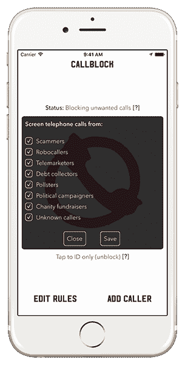
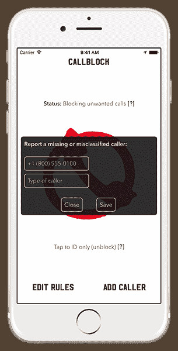
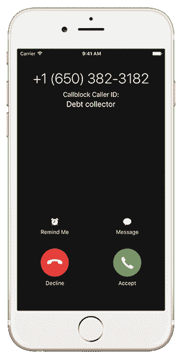

# Callblock 的新 iOS 应用程序将阻止超过 200 万电话销售人员的来电

> 原文：<https://web.archive.org/web/https://techcrunch.com/2016/09/07/callblocks-new-ios-app-will-block-calls-from-over-2-million-telemarketers/>

一个新的应用程序， [Callblock](https://web.archive.org/web/20230327232137/https://callblockapp.com/) ，[即将登陆 iTunes 应用商店](https://web.archive.org/web/20230327232137/https://log.rocketshipapps.com/adblock-for-unwanted-calls-794598f1bc4a#.474wgqk9a)，声称可以按类型拦截超过 200 万个电话销售人员的电话，包括机器人呼叫者、讨债者、政治活动家、骗子等等。该公司解释说，为了确定哪些电话应该被阻止，该应用程序使用了公共和私人记录、正在进行的研究和用户报告的组合。随着新条目添加到数据库中，应用程序将自动更新以包含这些更改。

Callblock 是来自 [Rocketship](https://web.archive.org/web/20230327232137/https://rocketshipapps.com/) 的最新版本，这是一个自举且盈利的应用程序工作室，背后有一个[受欢迎的移动广告拦截器](https://web.archive.org/web/20230327232137/https://techcrunch.com/2016/02/09/google-reverses-its-decision-to-ban-ad-blocking-apps-from-the-google-play-store/)，名为 [Adblock Fast](https://web.archive.org/web/20230327232137/https://adblockfast.com/) ，它今天拥有 75 万用户，在苹果应用商店和谷歌 Play 上被评为 4.5 星和 4 星。新的电话营销阻止应用程序被视为 Adblock Fast 的续集，因为它也专注于管理一个大型数据库，以保护最终用户免受烦恼——在这种情况下，是不想要的电话，而不是令人沮丧的在线广告。

使用 Callblock 很像在 iOS 上使用移动广告拦截器。然而，你没有进入 Safari 的设置，而是进入设置–>电话，然后打开呼叫阻止开关。在应用程序中，您可以通过选中或取消选中它的一系列规则来配置要阻止的呼叫类型。

但是，请注意，启用应用程序或在应用程序中进行更改需要 15 秒到 1 分钟(取决于您的 iPhone 芯片组)才能加载、重新加载或生效。

这款应用利用了今年早些时候在 WWDC 推出的新 CallKit API，它允许第三方应用与本地手机用户界面紧密集成。

在推出时，Callblock 可以筛选来自骗子，讨债人，机器人呼叫者，电话推销员，民意测验专家，政治活动家，慈善筹款人和未知来电者的电话。如果一个本应被屏蔽的电话打通了，你也可以通过点击“添加来电者”在应用程序中报告电话号码(也可以纠正分类错误的数字。)

这并不是第一个帮助用户处理垃圾来电的应用程序——像 Mr. Number 和 Truecaller 这样的应用程序也是这样做的。然而，虽然这些应用程序可以显示谁在打电话，让你报告垃圾邮件并创建个人黑名单，但第三方应用程序直到 iOS 10 才能够直接阻止来电。Callblock 将是首批推出这一新功能的公司之一。

但如果你愿意，这款应用程序允许你拨打来电，而不是默认屏蔽来电。

据消费者团体 Private Citizen 称，电话销售人员每天打 1.48 亿个电话，这就是为什么像 Callblock 这样的东西会受到欢迎。这款新应用目前在全球 174 个国家运行，并将与 iOS 10 一同发布。

与此同时，[用户可以在这里](https://web.archive.org/web/20230327232137/https://callblockapp.com/#signup)请求提前访问移动应用，或者[订阅以便在涉及其他平台时得到通知](https://web.archive.org/web/20230327232137/https://callblockapp.com/#signup)，比如 Android。该应用程序最终将提供订阅服务(每月 0.99 美元或每年 9.99 美元)，但在公开发布时可能会提供一次性促销价格。