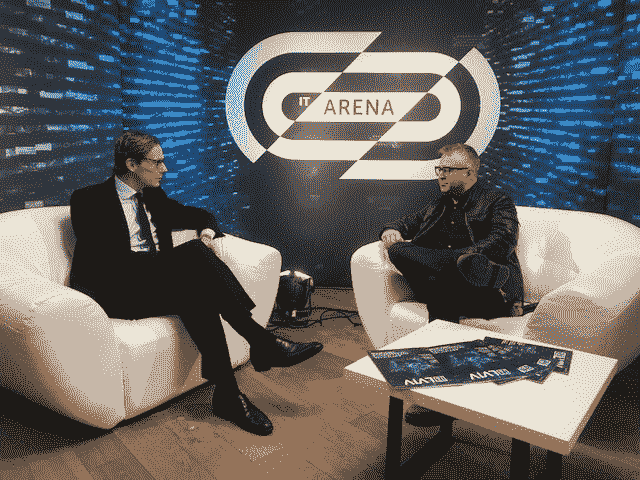
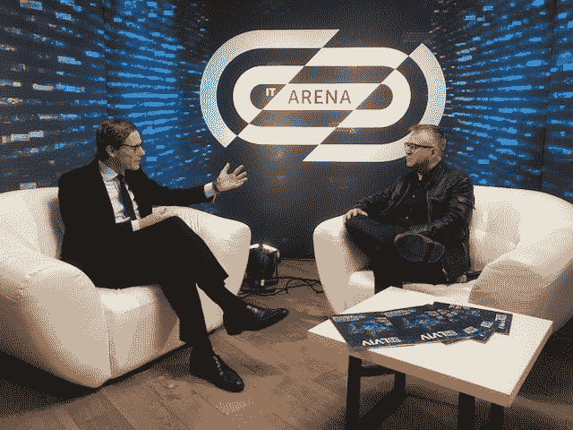

# 剑桥分析公司首席执行官与 TechCrunch 谈论特朗普、希拉里和未来

> 原文：<https://web.archive.org/web/https://techcrunch.com/2017/11/06/cambridge-analytica-ceo-talks-to-techcrunch-about-trump-hilary-and-the-future/>

几周前，我会见并采访了 T2 剑桥分析公司的首席执行官 Alexander Nix。他的公司被认为帮助唐纳德·特朗普赢得了美国总统大选。它还与全球其他许多有争议的政治活动有关，并被一些人指责帮助英国退出欧盟。他详细阐述了所有这些主题([这里是一个简短的总结](https://web.archive.org/web/20230407001713/https://techcrunch.com/2017/11/06/the-ceo-of-cambridge-analytica-plans-a-book-on-its-methods-and-the-us-election/))。

被录制的采访是在乌克兰利沃夫举行的 [IT 竞技场会议](https://web.archive.org/web/20230407001713/https://itarena.ua/)上私下进行的。

这是 50 分钟长的采访记录:

**迈克·布彻(MB):**
你认为数字广告公司已经‘活该’，比如这个世界的 WPPs。你这话是什么意思？

亚历山大·尼克斯(Alexander Nix):
实际上，可能不是数字广告公司，因为他们更进步。我真的在看老派传统创意主导的机构。[例如]在 WPP，显然马丁(索雷尔)已经做出了巨大的努力来改变他的业务。他每天都在付出巨大的努力，每年收购 40 多家公司，差不多就是这样。但是当你看到传统的广告方式时，它基本上是由猜测驱动的，尽管是非常直观和有经验的猜测…我在想的广告…你还记得吉百利的大猩猩打鼓的广告吗？我的意思是，谁会知道这将是一个全国性的成功？我是说，你告诉我他们去调查了 5000 个人的意见，然后决定做一个大猩猩的广告？他们当然没有！他们只是“即兴表演”,而这恰好触动了人们的神经，并取得了巨大的成功。嗯，那种广告将被高度针对性、非常个性化的广告所取代，而这必须是数据驱动的。这不是取代创造力，而是用数据来增强创造力。数据第一，创意第二。它是线性的。

看着你网站上的数据，你说看到你的(美国竞选)广告的人对你的好感度增加了 1.5%。举例来说，并不是每个在看到广告后变得更受欢迎的人都会改变他们的投票。他们中的大多数人已经计划投票给特朗普，否则[广告]不会产生足够的影响来阻止他们投票给希拉里。但这可能会影响一小部分选民。这可能足以动摇密歇根州，但不是整个选举。

多少个州赢得了选举？四个？我的意思是，赢得密歇根，宾夕法尼亚，威斯康星，佛罗里达…差不多就是了。

因为你针对的是选举团？

事情总会归结到这一点。它总是通向 270 的路线图。每天都在变化。你进入选举:“我们在想，好吧，这些是 12-14 个战场州。”六周后你会说:“天啊。那个已经死了。得走了。我们如何实现这一目标？我们如何计算，才能回到我们想要的位置？”你知道，你不需要也负担不起关注 50 个州。你正看着…你知道你会赢得这些，但你永远也不会赢得那些，所以你如何到达你想去的地方？

**MB:**
你说看到剑桥分析公司广告的人……投票给特朗普的可能性增加了 1 个百分点。难道不是公司的说法之一吗？

**Nix:**
谷歌的研究是基于我们数字化运动的影响。它表示，特朗普的支持率上升了 11.3%。投票给特朗普的意向增加了 8.3%。这些都是重要的数字。

因此，在 2017 年，你可以声称你拥有基于 5000 个独立数据集的 2.2 亿美国公民的心理特征？

实际上，它的工作原理与此略有不同。我们走出去，开始展开一个长形式的定量调查，以探索心理学。

所以我们让成千上万的美国人填写了这份调查。完全独立于此，我们收集了 2 . 3 亿美国成年人的成百上千的数据点。

**MB:**
这是公开的数据吗？

**Nix:**这是公开的数据，这是客户端数据，这是聚合的第三方数据。各种数据。事实上，我们总是获得更多。每天我们都有团队在寻找新的数据集。

假设基于人格调查，我们已经为整个美国确定了五种人格类型。比方说，对于每种性格类型，我们都有 10 万 A 型、B 型和 c 型的人。我们先来看看这 10 万个 A 型性格的人，然后再来看看这 10 万人中相应的数据点。我们将看看它们有什么共同的属性，然后我们将在此基础上建立一个模型。所以如果我们发现所有 A 型人格都开着一辆柠檬黄的车，穿着惠灵顿长靴，有一只狗和三个孩子等等，那么我们就可以根据他们的数据对宇宙中其他拥有黄色汽车、狗和惠灵顿长靴的人进行预测，然后说他们很可能也是 A 型人格。

我能给你的建立一个模型的最好的例子是，在英格兰，我们对保守主义者、农村保守主义者有一种刻板印象。他们穿着理发师[夹克]，那种奈杰尔·法拉奇式的。他们有一个理发师，穿着惠灵顿长靴，养了一只拉布拉多犬，他们都上过私立学校，因此他们会投保守党的票。刻板印象但是刻板印象是有根据的。那是四个数据点。其实在英国还是挺准的。想象一下，如果你有 40 个数据点，或者 400 个数据点，你推断他们开路虎，他们喜欢射击，他们都在商业银行工作等等。你开始积累这些数据点，你可以非常准确地说，“嗯，我不知道这个人的政党归属，但我知道他们有一个理发师、一辆路虎和一条狗，他们喜欢射击，在商业银行工作，因此，他们很可能是保守党。

MB:
所以你把这叫做心理图形？

**Nix:**
是的。

**MB:**

不，我们没有。我们对此已经非常非常清楚了。我们在 2014 年的期中考试中使用了心理学。在克鲁兹和卡森的初选中，我们一直使用心理学。但当我们在 2016 年 6 月进入特朗普的竞选活动时，无论何时，都是在距离选举还有五个半月的时候。我们只是没有时间展开那项调查。我的意思是，基督，我们必须建立所有的 IT，所有的基础设施。什么都没有。他的竞选团队有 30 个人。三十。就连沃克也有 160 英镑(这可能是他破产的原因)。他是第一个冲出去的。因此，正如我对你的其他[记者]同事所说的，很明显，我们以前建立的传统模型中已经包含了心理学数据，因为我们没有重新发明轮子。(我们一直)使用基于模型的模型，基于模型的模型，我们已经建立这些模型将近四年了。所有这些模型都包含了心理学。但我们真的出去专门为特朗普的支持者推出了一份长表格定量心理调查吗？不。我们只是没有时间。我们就是做不到。

**MB:**
你说你从 90 年代末就开始构建这些数据。我们知道，2006 年脸书的服务条款与现在大不相同。实际上有相当多的数据——刮擦可能是一个过于生硬的词——但你当时可以从脸书提取的数据现在无法提取。在[脸书]服务条款的大门开始关闭之前，你有关于这些人的大量数据集吗？

**Nix:**
好吧，其实我来纠正你一下。该公司成立于 90 年代初或 80 年代末。我们是一家行为科学公司。我们直到 2012 年才转向数据分析。所以，我们在 2012 年之前收集的所有数据都是由英国公司 SBL 集团完成的，是通过实地的定量和定性研究收集的。我们的工作方式是去和，比如说，10 万人交谈，然后开始用它来建立模型。

**MB:**
怎么跟他们说话？通过呼叫中心调查？

根据国家的不同…我的意思是，在美国，是的，呼叫中心，可能的话，互联网，面对面…但是在像尼日利亚这样的国家，你知道你会有一队又一队的学生去敲门。

MB:
所以你会在尼日利亚做这个？

自从 1994 年第一次选举曼德拉/非国大以来，我们就一直这样做，从那以后，我们每年都进行多次选举。

**MB:**

不，那是两件不同的事情。我们开展了一个“小额”筹款项目。所以我们所做的是利用我们的数据来确定特朗普的核心支持者。这些是特朗普的铁杆支持者，我们估计美国约有 3700 万至 3800 万人。然后，我们针对他们开展了募捐或小额募捐活动，请他们捐款。我们建立了所有的数据和机制来做到这一点。我们在开始工作的第一个月就筹集了 2700 万美元。总之，很明显，这个项目筹集了数亿美元。

**MB:**
你认为这对他们的宣传活动至关重要吗？

嗯，我认为这非常关键，因为当特朗普赢得提名时，他的钱非常非常少。尽管他说他会给自己投资一些钱，而且他确实投资了一些钱，一些是现金，大部分是贷款，但我的理解是，你知道，你是在和机器竞争，而她却从各个地方得到了美元。

此外，在美国有一个巨大的“永不特朗普”派系。大多数共和党人不支持他，甚至那些最终为他工作的人也不支持他。所以 RNC，共和党全国委员会，不支持他。最终他们转向了。许多关键的 RNC 成员都是“永不特朗普”派的成员。他们在他背后。他们试图摧毁他。最终他们来了个 180 度大转弯。我们之所以在这次活动中被推上如此重要的位置，部分原因是因为没有一家供应商会支持他。

共和党供应商所处的环境极其恶劣。他们看着这个候选人，说“首先，我们不喜欢他。”一次典型的总统竞选可能会有五到八家不同的公司支持。你会有一个民意调查员，你会有一个数字机构，你会有一个电视机构，你会有一个研究公司。然后，竞选经理和竞选委员会将选择最好的民意调查者和最好的东西或他们最好的朋友，或者他们解决这些问题的方式。

嗯，特朗普赢得了提名，所有的共和党人都说“嗯，他会被希拉里谋杀的。如果我们为他工作，RNC 的当权者会恨我们的。我们再也不会在美国政治中得到一分钱了。所以我们今天会赚快钱，但明天就会毁了我们的职业生涯。”所以很多人会说“我们永远都不想碰这个。”因此，我们没有像希拉里那样让多个供应商为他的竞选服务，而是走进去说“我们会为你做数据分析。”他们说:“没有人在做研究。”[我们说]我们会做你的研究。“不能做数码”我们要做数码。“没有人做电视。”“我们会做你的电视。”我们会帮你捐款。一夜之间，它从最初的数据变成了端到端的数据。

你相信你在竞选中把赌注押在了农场上吗？

看，在我看来，这是一个很容易的赌注。这是双赢。我看不到坏处。我想即使特朗普没有获胜，如果他没有赢得选举。

听着，我们是一家英国公司，试图打入世界上竞争最激烈的政治市场。你知道，我们有一些混合媒体。但真正让我恼火的是，当记者们去采访我们的工作时。有人说“我们与剑桥分析公司合作，他们的工作并没有真正提供任何东西。简直是垃圾。”然后，您可以看看报价来自谁，它来自一个直接竞争对手！

这是记者们还没有弄清楚的。他们交谈的很多人都是我们正在吃午餐的人。我们走进了(美国)市场。我们在和所有的数据团队竞争。我们正在与所有的数字团队、所有的电视团队、所有的研究团队竞争。你看过《纸牌屋》。是这样的。特朗普现在发现，这是候选人层面最恶毒的攻击性政治文化。在活动经理、GC 级别和供应商级别。这是一场大屠杀。刀子…[拿出来了]。在 DC，每个人都在和别人做爱。

你会看到三段引文，它们都来自于那些被你偷走了生意的人。他们说我们碰到了“剑桥分析”。全是蛇油”[而且是来自]我们最大的竞争对手。

**MB:**
你认为有针对性的广告活动或所谓的“定制受众”活动所使用的工具被错误地描述为“黑暗广告”活动吗？

**尼克斯:**
毫无疑问，营销和广告界领先于政治营销和政治传播界。有些事情我肯定会[说]我非常自豪，我们正在做的是创新的。有些东西是最佳实践数字广告，最佳实践沟通，我们从商业世界中得到，并把它们带入政治。

广告公司正在全国范围内使用这些技术。对我们来说，这是非常令人耳目一新的，真正进入了商业和品牌领域…走进一个活动，你基本上是在试图教育市场他们根本不理解的东西。你走进一个成熟的品牌或一家广告公司，你会直接进入(复杂的)对话:“啊，所以你在做一个程序化的活动，你可以用一些线性优化的数据来增强它……他们理解它。”他们知道这是他们的世界，现在它归结为细微差别。“那么，你到底在做什么会更有效一点，并给我们带来 3%或 4%的额外收益。”这是一种享受。你知道，这些是真正了解这个世界的专业人士，这就是我们想要经营的地方。

MB:
你对自己的公司在媒体上的表现感到后悔吗？

如果有什么证据可以证明是什么在驱动媒体，那就看看希拉里·克林顿的新书吧。自由派媒体支持他们的候选人。他们被公平地击败了，他们正在猛烈抨击并试图摧毁每一个人和每一家公司，这是导致失败的原因。希拉里根本无法接受这一点。她是一个拒绝承认的女人。自由派媒体[将《剑桥分析报》定性为“巫术，他们认为这是‘巫术’，现在是俄罗斯的错！他们只是不能接受希拉里是如此不受欢迎，如此分裂的候选人这一事实。她未能调动她的基础，人们也没有从根本上信任她。比起照镜子，他们更喜欢痛打剑桥[Analytica]痛打川普，痛打其他任何人。除了接受他们的候选人不是人们想要投票的事实。

**MB:**
你会用自己的方法改善自己的公众形象吗？为自己打造自己公司更好形象的营销活动？

我们会推出一个全国性的行为微定位项目来推广剑桥分析公司吗？它可能不会真正实现我们正在努力做的事情。我的意思是，实际上，我只是在一本谈论我们的方法和沟通方式的书上“打点一切”,我正在和出版商讨论我们是否应该以此为目标。这是一本书，还没有出版，下个月就要出版了，只是用相当专业的术语谈论交流如何改变，技术如何影响它，数据对广告和政治活动有什么影响，然后用大量的案例研究，用大量艺术作品、目标和心理图形等的真实例子来说明它们。我们在考虑[一场运动]的想法。但是我认为用我们的技术来推广一本书太复杂了。这更像是一次思想练习。这意味着要有多个版本，多个标题，多个扉页。

**MB:**
为一本书进行 A/B 测试？这本书会在新年出版吗？

它首先在德国发行，因为是一家德国出版商联系了我们。它将在下个月左右发行，然后在英国发行

MB:
这将是关于公司或方法论的。还是你的世界观？

英文名还没有确定，但我认为它会像《广告狂人对数学人》一样。这将是(关于)广告行业的演变，数据、心理学和数字化如何改变一个实际上没有太大变化的行业。对于一个价值数十亿美元的行业来说，这种颠覆意味着什么，并举例说明了我们为展示其有效性而开展的不同活动。

英国退出欧盟的头条新闻是“英国退出欧盟大抢劫，我们的民主被劫持了”。你对此有何反应？

嗯，听着，我的意思是你在暗示我们参与了英国退出欧盟的抢劫。我们再一次被所有媒体看得一清二楚，包括卫报，他们从第一天起就毫无根据地传播这个故事。卡罗尔·卡德瓦拉德把再次追踪我们作为她的个人使命，生活在对选举结果的否认中。她不能接受英国人民想要离开欧洲，她把诋毁我们作为自己的使命。我们没有在英国退出欧盟工作。我们没有做一点工作。我们没有做很多工作。我们没有研究英国退出欧盟。我们根本没有参与脱欧或投票脱欧运动。我们对此非常清楚，这就是为什么我们要把他们送上法庭，我们要和解。

**MB:**
你觉得你当时为什么会和它扯上关系？

因为在竞选活动开始之前，我们接触了许多不同的竞选活动，有支持的，也有反对的，讨论我们是否可以在英国退出欧盟扮演一个角色。我们进行了多次讨论。显然，这些讨论进入了公共论坛，但我们每年都会与数百家公司会面，讨论商业机会。这并不意味着你与他们合作，也不意味着你与他们签约，更不意味着你为他们工作。但是《卫报》提供了一两个数据点，然后围绕这些数据创造了一个完全虚构的故事。这件事像病毒一样传播开来，然后其他所有的报纸都蜂拥而至。如果你经常说谎，它就会变成真理。但即使在我们站出来否认之后，他们还是一次又一次地宣传同样的信息。

**MB:**
但是你在从事其他活动。例如，关于肯尼亚和南非就有一些争议。你对此有何反应？

嗯，你说的是贝尔波廷杰公司，它为一些错误的决定付出了代价。

你参与了那些活动吗？

不，我们和演员没有关系。我们与贝尔·波廷杰公司无关，也与古普塔公司无关。事实上，我对此知之甚少。我真的不能对发生的事情发表评论。我只知道我在报纸上读到的。

你参与了肯尼亚的竞选活动？

我们在整个非洲都工作过。

**MB:**肯雅？

嗯，让我们等到选举结束吧，因为一般来说，根据经验，我们从来不谈论活着的选举。但我可以告诉你，2013 年我们在肯尼亚为肯雅塔的最后一次选举工作。这是有据可查的。我可以这么说。听着，肯雅塔以 12 个百分点的优势获胜，从我读到的内容来看，选举监督委员会……批准了一些选举设备的招标，这其中有一些违规行为。反对派利用这些违规行为来挑战选举结果。我想如果这是几年前的“佛罗里达”,当它下降到 0.5%的时候，好吧。但是当你谈论 12%的胜利时，我认为法院举行这次(新)选举的决定是一个可怕的决定。我认为这将导致可怕的流血和暴力。如果肯雅塔因为任何原因没有赢得这次选举，那么他的支持者会觉得被抢劫了。如果奥廷加的人不这么做，他们会觉得他又一次被欺骗了，因为这是奥廷加被置于公共领域的看法。

这个结局我看不好。我认为仅仅为了肯尼亚，为了该地区的和平，我认为这是一个可怕的决定。实际上，我甚至看不到这场选举会在下个月尘埃落定。我认为它会一直拖下去。所以，我认为法院的决定是短视的。

批评者声称你为俄罗斯政府工作，或者第三方演员与他们有联系，你对此有何回应？无论是专门针对特朗普的竞选活动还是其他竞选活动。

我们从来没有被直接问过。据我所知，没有任何权威人士对我们提出任何直接的批评，当然，也没有人暗示或声称我们参与了此事。我们没有被任何人调查。我们正在尽我们所能帮助理解竞选，就像竞选中的其他人一样，但没有对剑桥[Analytica]进行调查。

美国国会不是正在调查你与俄罗斯试图干涉选举的关系吗？

不，不是的。美国国会正在进行…

**MB:**
《大西洋》杂志报道过。

哦，那一定是真的！我不知道…我的意思是这正是我在说的。我的理解是，美国国会正在对俄罗斯干涉选举进行调查，他们已经向各种各样的人寻求帮助。这并不意味着剑桥正在接受调查。你知道我们非常乐意帮忙。我们从未在俄罗斯工作过。我们从未为俄罗斯工作过。我想小心点，但我不认为我们公司有任何俄罗斯员工。我们在俄罗斯没有生意。我们和俄罗斯没有任何瓜葛，从来没有。

与普京政府有关联的第三方呢？

T21:我甚至不知道他们是谁，也不知道从哪里开始。我的意思是，我们直接为竞选工作，也间接为竞选工作，我们为一个支持竞选的超级政治行动委员会工作，这个委员会的非官方名称是“击败邪恶的希拉里”或者“信守承诺”之类的。

MB:
你有一个投资人，罗伯特·默瑟。这给了你什么样的独立性？他知道自己的政治观点。你觉得独立于这样的投资者吗？

好吧，实际上，我不会谈论我们的任何投资者或董事会成员，因为我们不会。但我可以回答你的问题，即“我们的政治意识形态是否受到公司其他人的影响?”？这个问题的答案是……我们每年在世界的某个地方进行 7 到 9 次总理或总统选举。因为他们中的很多人都是中间偏左或者中间偏右。事实上，如果你把它们加起来，我可能会说——这是基于一个猜测——我们左倾比右倾做得更多。现在，很明显在美国…

你能给我举一些左倾运动的例子吗？

你得上我们的网站。我肯定你能找到 25 个，而且你能看到哪些聚会。都会有的。但是在美国，你必须选择一方。你不能翻跟头。你不会被鼓励在一个周期为民主党工作，然后(在下一个周期)转向共和党。共和党对我们有吸引力的原因是，民主党在科技军备竞赛中遥遥领先。在奥巴马的领导下，通过 Civas 和 Blue Labs，他们率先使用了大数据。他们使用非常复杂的数字技术。共和党人被落在了后面。到 2012 年罗姆尼落选时，出现了真空。没有合适的技术人才来竞争。就像拿刀去枪战一样。这就是商业机会。这是因为大部分的技术团体，我将在这里概括一下，但是很多有政治倾向的技术团体倾向于左倾。如果有政治动机，伯克利和麻省理工等地的人们会支持希拉里或奥巴马。然而，那些可能更偏右的人，显然会选择去银行或投资管理行业工作，并具备这些技能。因此，由于人才匮乏，共和党人在科技军备竞赛中被谋杀了。这是商业机会，也是我们寻求解决的问题。对吗？如果是另外一种情况，情况可能会有所不同。

**MB:**
你自己的个人政治观点是什么？你谈论那些吗？
**尼克斯:**
我们把个人的意识形态丢在门外。我们认为“外国”和客观是选举中的一项资产。我认为很多政治竞选活动，在美国，很多竞选工作人员和供应商被他们自己的意识形态蒙蔽了双眼。他们盲目地相信他们的候选人，以至于他们实际上不能客观地看到竞选中发生的事情。他们只能看到他们和他们所有朋友所相信的，因此他们认为这代表了 2 亿选民的意见

**MB:**
【你是说】他们把自己投射到活动中？

是的，很自然。作为一个局外人来到一个外国，用全新的眼光看待一个政治景观，能够不被蒙蔽判断，这是一件美妙的事情。这就是我们带来的。同样，这就像一个好律师代表他或她的客户。你不能带着有罪或无罪的先入之见走进去。你必须进去看看事实。这就是我们努力要做的。

**MB:**你有没有一份黑名单，上面有你不想为之工作的人？

**Nix:**
哦肯定是的。我们只为主流政党工作。保守党，工党，共和党，民主党。我们避开边缘政党或少数群体。我们不是要策划一场革命。我们正努力为政党提供最好的技术…通讯技术。正如我之前所说，选举大约占我们公司收入的 20%。我们在国防和国土安全方面有大约 20/25%的份额。剩下的就是品牌和商业空间了。我们不是一家政治公司。我们是一家科技公司，我们认为自己是一家科技公司。我们有一种吸引学者的科技文化。你知道我们三分之一的员工是博士。我们是极客！从根本上说，我们是一群试图解决问题的极客，我想说，政治可能是公司中最不可取的部门，因为它可能会造成分裂，人们不一定喜欢参与其中。但是，如果你给一个数据科学家一个真正具有挑战性的问题，比如识别一个国家或一个问题的意识形态，一个模型或其他东西，这是关于解决问题的。这并不是试图推广他们自己的个人意识形态或议程或类似的东西。

MB:
你在和帕兰提尔合作？

**Nix:**
不是，Palantir 成立于现在大约 9、10 年前。他们在国防和国土安全领域非常活跃。他们是这一领域的先驱和领导者。彼得·泰尔在运用他的两个平台《哥谭》和《大都会》以及其他稍微不为人知的作品时，确实是革命性的。我是说这些人是真正的先行者。我认为像我们这样的公司已经赶上来了。但是他们值得称赞。他们真的很早就到了现场。

我想你把五角大楼当成客户了，不是吗？

我们在 2005 年成立了一个国防/政府防务部门。在那段时间里，我们为全世界的军队工作。我们在一种叫做心理战的东西中训练很多军队，这是心理战或信息作战，是一种通信战。它试图理解如何说服部队不要打仗或者说服你的部队去打仗。它试图打击敌对行为，或者你如何对抗激进主义或反恐，等等。我们自己也做了很多信息运作项目，我们深入各国，开展研究和活动，改变行为以减少冲突。在英国，我们的客户包括国防部和外交部，在美国，我们的客户包括所有的“通信公司”，如北方通信公司、安全通信公司、国务院、五角大楼和各种“三信机构”等等。

**MB:**你对未来有什么憧憬？你谈到了心理特征分析，关于数据集数量的分析，以及你可以从社交媒体中获取的数据。当然，我们都知道 Alexa 在他们的房子里记录他们说的话。你认为事情会朝哪个方向发展？首先，考虑到现有的大量数据，你觉得你自己的公司会朝哪个方向发展？第二，你认为你最终会在数据收集方面与谷歌和亚马逊竞争吗？

**Nix:**
这里有几个问题。让我们从大局出发。有两项技术让我非常兴奋，每个人都在谈论。显然，IOT 将彻底颠覆数据市场。我认为数据行业注定要失败。这是一个非常非常高的交易量和非常低的利润。随着物联网的发展，随着我们在一切事物上安装传感器:汽车、冰箱、电视，数据将变得无处不在。因此，数据量将会增加，数据价格将会下降。你将无法像今天这样出售数据。我认为人们将开始更多地控制他们的数据。人们与像我自己的公司和其他营销机构这样的公司分享数据的方式将变得更加互惠。但总的来说，数据的增长是让像我们这样的分析公司变得更有价值的一个因素。更多的数据需要更多的分析。然后在另一端——如果你把它看成一个三明治，而我们在中间——你就有了区块链。通过分布式分类帐技术，您将能够拥有透明度，并对数据和数据集的使用和实施方式承担责任，直到永远。因此，没错，IOT 的数据环境变得越来越可怕。但另一方面，它将通过区块链进行更多的自我监管，并将变得更加透明。这两样东西都是面包卷，而分析是三明治中间的象棋。分析将发挥越来越大的作用，破译大量数据，理解这些数据，将其应用到许多不同的领域，然后使用区块链技术将其证券化。

就广告业而言:看，我一直对此直言不讳，但我不认为我是某种“预言家”。我想业内很多人都认识到了这一点…即使他们只是在窃窃私语…我认为广告业就像悬崖边上的旅鼠。他们不能后退和前进看起来很可怕。宏盟、电通、WPP……他们正试图转向。他们正在四处收购公司。但你不能买下一家数据公司，把它和一家广告公司挤在一起，然后希望它能成功。事情不是这样的，那是一种不同的文化。它需要整合。你需要一起种植这些东西。所有的咨询公司都在过去的两三年里看到了商机，并开始收购数据公司。为了进入这个领域，他们正试图收购广告公司。然后紧追大企业集团，从它们那里夺取相当大的市场份额。你让大品牌自己明白他们的数据是如此有价值，他们不再想把这些数据交给广告公司。他们可以将其中一些功能带入内部，并在内部拥有自己的数据分析和营销机构。这是在伤害他们。

还有像我们这样的小型颠覆者，他们只会越来越多。我们正在吃一块馅饼。所以，我认为将会有一个清算，现在正在发生。在过去的一三个月里，WPP 的市场份额急剧下降。但他们不会是唯一的。还会继续下去。我并不是说它们都会破产，而是说这是“适应或者死亡”。这个市场正在发生根本性的转变，也是时候了！这是过期的。广告商做广告的日子已经一去不复返了。只要客户的妻子喜欢，除了观众回忆之外，没有其他指标可以量化它的成功。或者很少。他们也不在乎了。他们可以挤一个柠檬，从广告商那里得到一些钱。我认为广告客户需要更多的责任感，他们需要更多的有效性衡量，他们需要实证数据来证明这些数十亿美元的巨额支出是合理的。

**MB:**
让我们快进说，10-20 年。会有人买得起隐私，然后会有很多人会放弃他们的数据来换取服务，就像他们现在做的那样。我们认为这是一个好的情况吗？你有什么看法？

我认为人们只是点击一个盒子而没有真正考虑清楚的日子已经一去不复返了，他们所有的数据都被抽走了。抓住了。我认为人们正在认识到数据是有价值的，而且他们也在说，“实际上它并没有那么敏感。我真的不太在乎人们是否理解我的购物习惯或我开什么车。这不是健康或财务数据。但它很有价值，我为什么要把它送给别人，让其他公司和广告商从中赚钱呢？”所以我看到更多的是互惠。我看到人们有类似虚拟数据钱包的东西。他们将控制自己的数据。你将能够对他们说“嘿，我可以许可你的数据或使用你的数据用于某种活动或目的吗？”那里会有一场交易。他们会说“是的，你可以，但是你要打九折”或者“我想要这个作为回报。”我认为，随着人们掌握控制权，这个市场正在崛起。我认为这很明智。我认为这给了人们更多的控制权，因此也给了他们更多的保护。我认为广告商在使用数据和收集数据的方式上需要更有针对性，这可能是好的。但实际上，这不会削弱这个行业或它的发展方向。因此，我真的希望像英国信息专员办公室(ICO)这样的人，他们突然试图赶上过去五年的数据。我希望他们明白，监管的存在是为了保护消费者，而不是阻碍一个真正能带来很多好处的行业的发展。不仅仅是在通信领域，而是在所有企业领域。

**MB:**
如果消费者对他们的数据有更多的控制权，这难道不会开始让你的工作变得有点难做吗？

不，我认为不会，因为我认为事情正在发生变化。我认为老一辈，我们的父母甚至更老的人…你知道，这对他们来说是一个可怕的勇敢的新世界。“什么叫有人知道我开什么车？!"“是的，妈妈，他们知道你开什么车”“但那太可怕了！”“为什么可怕？”“因为我不想让他们知道！”“你在乎吗？”“这不是重点。”“嗯，是重点！”其实新一代，下一代，比我们年轻，他们不在乎。他们其实根本不在乎。

**MB:**
他们习惯了这个世界？

**Nix:**
他们习惯了这个世界，他们也意识到了。"我在乎人们是否知道我开什么车，早餐吃什么麦片吗？"他们为什么要这么做呢？他们不在乎是否把自己喝得烂醉的照片放在脸书正在做的事情上。他们不在乎。更别说[有人知道]他们开什么车了。

他们是否在意这可能会影响选举？

**Nix:**
嗯，这个问题问得好。最终，我不认为人们是天真的，尤其是互联网一代，千禧一代。我认为他们明白发生了什么。媒体报道太多了。这不是为了蒙骗别人。记住，四面都一样。特朗普在剑桥使用的秘密武器并不是民主党没有的。希拉里的数据和数字团队多达 200 人左右！巨大！巨大！这是屡试不爽的。那是一台机器！他们什么都做了！但是他们不在聚光灯下的原因有两个。答:希拉里输了。第二:你知道，特朗普在某种程度上被许多人认为是一个两极分化的人物。这就是原因。不是我们做了什么。我的意思是，我想如果我们做了完全一样的工作，没有什么不同，但都是为了希拉里…

你认为结果会一样吗？

**Nix:**
不，我想没有人会在意。《卫报》不会写这些愚蠢的标题，《纽约时报》也不会。他们不会在乎的。这与剑桥无关。这与我们的技术无关。是关于特朗普的。