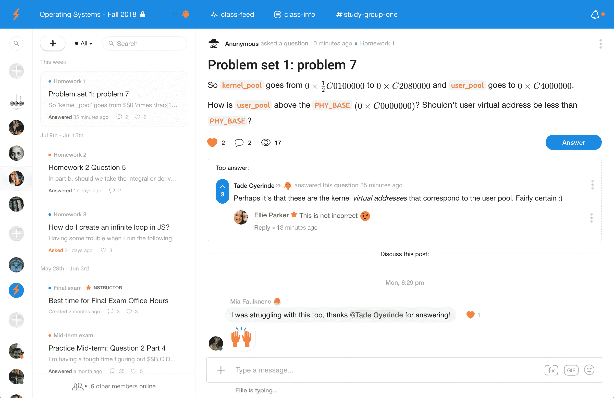

# Campuswire 推出重新设计课堂交流技术

> 原文：<https://web.archive.org/web/https://techcrunch.com/2018/08/02/campuswire-launches-to-redesign-classroom-communications/>

塔德·奥耶林德痴迷于教育机构内部的交流。几年前，在英国利兹大学学习时，他创建了 Gleepost，这是一个面向大学校园的类似 Craigslist 的服务。

这家初创公司失败了，所以 Oyerinde 继续与他的大学室友和双胞胎兄弟 Uniroulette 一起创建了一个聊天轮盘的克隆版，但仅限于有社交障碍的人。edu 电子邮件地址。正是在这里，他获得了产品设计的入门知识，也学会了如何成为一名社交黑客，利用设计选择来推动对话和参与。“对于 uni roulette……我们需要有大约 20 个孩子同时玩才能让它运行起来，”他向我解释道。为了获得这些数字，这家初创公司每天晚上 8 点正式开业，任何试图更早登录的人都会得到一个倒计时器。

为了进一步推动参与，Oyerinde 围绕不同校园的爱情和错过的联系的概念创建了几十个(如果不是几百个)脸书页面，如 Leeds Crushes 或 Bodleian Library Secrets。学生们被吸引住了——同时也收到了精心设计的广告信息，让他们在 Uniroulette 上花更多的时间。他在伦敦从天使那里筹集了 25 万美元，但最终，这家初创公司失去了流量，并最终消失了。

Oyerinde 希望第三次是他的新项目 [Campuswire](https://web.archive.org/web/20221025222334/https://campuswire.com/) 的魅力。该平台今天公开发布，旨在最大限度地提高课堂对话的效率，即使是在从数学到英语的不同学科之间。该产品的灵感当然来自 Slack 和其他当前的校园通信工具，但重点是节省教师和教职员工的时间。

“学生在大学课堂上需要交流的 70%的事情是问问题，”Oyerinde 说。“你需要同步和异步通信的平衡，我们在这方面有很多经验。”

如今，校园面临的挑战是，教职员工和学生沟通的方式有天壤之别。像 Blackboard 这样的现有公司都有论坛功能，但是这个社区经常是死气沉沉的。教授使用电子邮件，这是异步的，但不容易在上课的学生之间共享。与此同时，今天的学生痴迷于短信、Instagram 和 YouTube 作为沟通渠道。Campuswire 的目标是让所有人都妥协。

Campuswire 的平台允许学生提问和投票选择答案，在讲座中创建社区

有几个设计决策使 Campuswire 独一无二。一个是学生可以在课堂上匿名发布问题。“40%的学生永远不会问问题，除非他们可以匿名提问，”Oyerinde 说。他指出，由于课堂讨论不对未注册的学生开放，他们在信任和安全方面的问题有限。

最重要的是，产品的设计是由效率驱动的。对于学生来说，问题很容易浮出水面，有助于教师限制重复回答。效率的另一面是鼓励学生附和自己的答案。我们想“激励前 5%的学生互相帮助，”Oyerinde 解释说。“他们真的会参与进来，所以教授们必须做更少的工作。”这在学生人数可能有数百人甚至数千人的班级中至关重要。

自去年秋天在加州大学洛杉矶分校以来，该平台一直处于测试阶段，在最初的一系列课程中使用量很大。“在加州大学洛杉矶分校的四个班级中，有三个班级的用户每天使用我们的时间超过 5 个小时，而在所有班级中，平均每天超过 3 个小时，”Oyerinde 说。他还说，“我们有超过 75%的 10 周保留率。”团队选择加州大学洛杉矶分校是因为它的季度进度表，“所以这意味着我们有两倍的迭代半衰期。”

正当新学年开始之际，校园网首次亮相。他说，我们将“继续开展学生拓展活动，并在今年秋季扩大班级的覆盖面”。这家初创公司现在在纽约有一个六人团队。