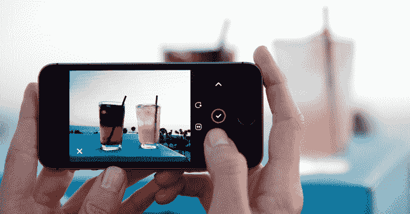
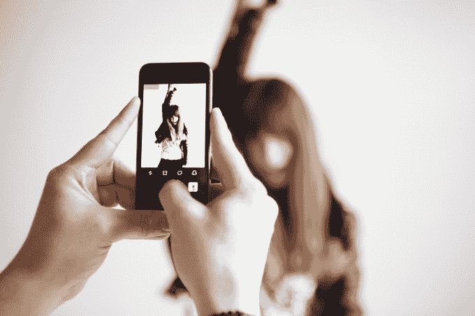

# Camu 是一款漂亮的多功能相机应用、照片编辑器和手机信使 

> 原文：<https://web.archive.org/web/https://techcrunch.com/2014/08/21/camu-is-a-beautiful-all-in-one-camera-app-photo-editor-and-mobile-messager/>

今天发布的一款名为 [Camu](https://web.archive.org/web/20221006191837/http://camuapp.com/) 的新移动应用旨在作为 iPhone 默认相机应用的轻量级替代品，同时还为用户提供事后编辑和分享照片的能力，而不必在其他应用之间切换。这款应用在某种程度上与长期受欢迎的相机应用竞争，如[相机+](https://web.archive.org/web/20221006191837/https://itunes.apple.com/us/app/camera+/id329670577?mt=8) 或[相机真棒，](https://web.archive.org/web/20221006191837/https://itunes.apple.com/us/app/camera-awesome/id420744028?mt=8)，但功能集更简单、更精简。

“市场上的大多数相机应用程序都充满了复杂的设置，”Camu 应用程序背后的 Sumoing 公司的首席执行官 Ilkka Teppo 解释道。

“与此同时，短信解决方案是以文本优先或照片聊天为基础的，”他补充道。“我们希望创造一种真正的移动优先的相机体验——挑战捕捉、编辑和发送照片和视频必须在单独的应用程序中的假设。”

当然，苹果的原生 iPhone 相机应用程序也在其最新版本的 iOS 操作系统 iOS 8 中提供了一些功能，预计将于 9 月份推出。你可以改变相机模式，添加滤镜，然后点击[进入你的照片库，进行各种编辑](https://web.archive.org/web/20221006191837/http://www.macworld.com/article/2359708/icloud-meet-photos-whats-changing-for-your-images-in-ios-8.html)，或者通过 iMessage、电子邮件、iCloud、隔空投送、脸书、Twitter 或 Flickr 分享照片。

因此，Sumoing 相信用户想要的是一套包括抓拍、编辑和分享的综合功能，这是正确的。但由于相似性，它必须通过使用 Camu 的体验以及它的额外功能来竞争。

这些功能包括为图像增加景深的“超级对焦”模式，一套不同的滤镜，为照片添加文本的能力，实时将照片变成拼贴画的能力(在 Instagram 用户中也很受欢迎)，以及当帧中不再有移动时自动拍摄照片的“自拍”模式。

编辑完照片或视频后，你可以在 Camu 上分享你的媒体，与朋友私下聊天，或者在脸书、推特或 Instagram 上公开发布。

该公司由来自芬兰赫尔辛基诺基亚集群的设计师和工程师团队组成，在移动应用方面已经有了不错的记录。Sumoing 的第一款 iOS 应用 Repix 于 2013 年初推出，结合了照片编辑和绘画，目前安装量已超过 1200 万。

Sumoing 有少量的种子资金，现在也通过 Repix 产生收入，这有助于资助 Camu 的创建。然而，Camu 的商业模式还不是一成不变的，但是 Teppo 说他们看到了未来“许多不同的选择”。我们预计这些包括应用内购买，但没有得到证实。

这款应用现在是 App Store 上的编辑选择，可以在这里免费下载。