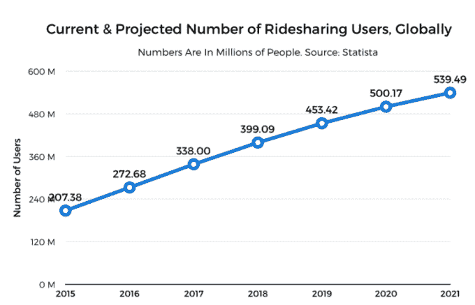
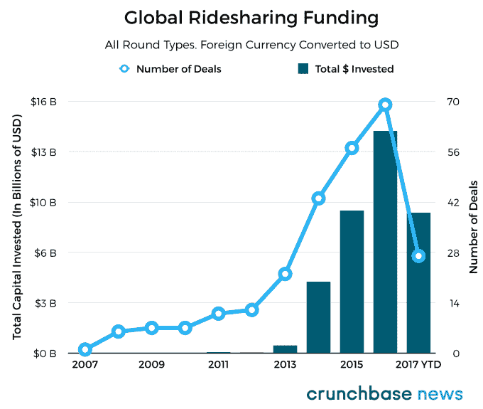
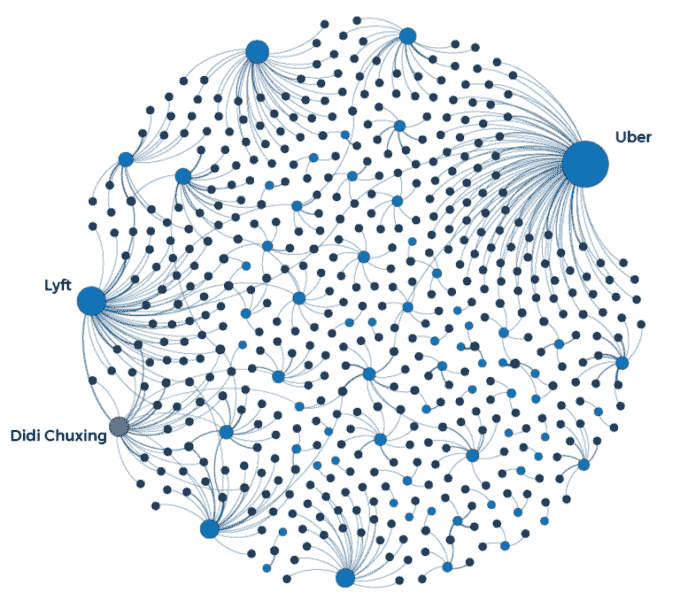
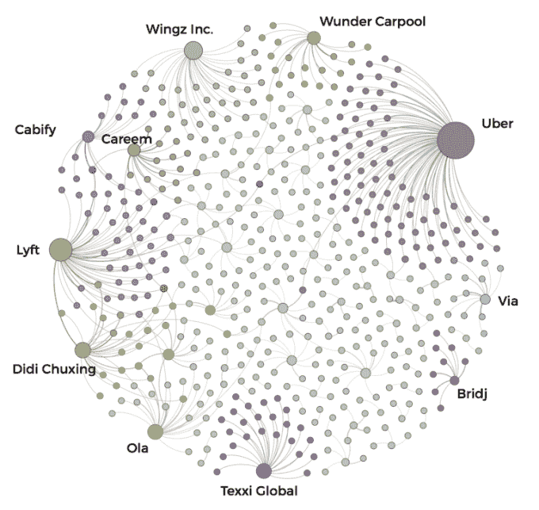
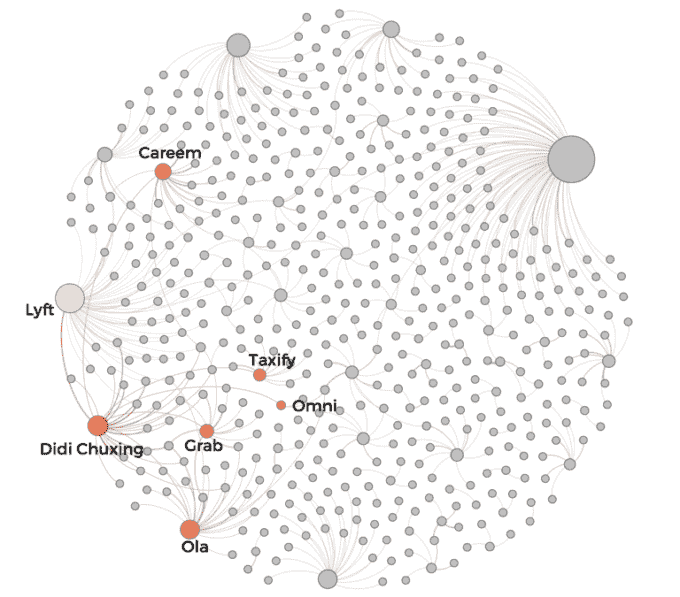

# 滴滴能否超越优步赢得全球拼车市场？

> 原文：<https://web.archive.org/web/https://techcrunch.com/2017/08/17/can-didi-out-network-uber-to-win-the-global-ridesharing-market/>

杰森·罗利是《金融时报》的风险投资和科技记者

[Crunchbase News](https://web.archive.org/web/20230326072848/https://about.crunchbase.com/news/)

.

More posts by this contributor

最近，来自拼车行业的消息似乎有两种。对该行业目前(也许是暂时)的卫冕冠军优步的文化和领导困境有淫秽的报道。与此同时，大约每个月都会有一个关于该领域另一项九位数投资或收购交易的故事，由任何人领导，从拼车或汽车行业的现任者到沙特阿拉伯和阿布扎比等国支持的日本亿万富翁。

在这里，我们将特别关注拼车行业的投资活动及其投资网络结构。这既有助于量化优步目前领先的优势，也有助于识别潜在篡位者不断增长的联盟网络。

## 描绘拼车热潮

拼车是交通市场中增长最快的领域之一。根据 Statista 编制的[数据，拼车服务的用户数量将在 2020 年突破 5 亿大关。](https://web.archive.org/web/20230326072848/https://www.statista.com/outlook/368/100/ride-sharing/worldwide)

Statista 进一步估计，到 2020 年，拼车行业的全球收入将达到约 614 亿美元，来自 Statista 分析所涵盖的各个地区 12%的成年人口。这表明该行业在全球范围内有一个强劲但线性的增长轨迹。然而，持续增长并不便宜。

维持拼车行业的增长——特别是考虑到大多数市场上来自其他拼车服务、出租车公司和公共交通的激烈竞争——是一项非常资本密集型的工作。

使用 Crunchbase 的拼车类别中约 70 家国内外拼车公司的 260 多轮各种类型的融资数据，我们可以在下图中看到过去几年的投资金额。

请注意，在 2013 年之前的几年中，仍有已知金额的交易，但鉴于随后几年的金额规模，这些交易太小，无法正确显示。

全球拼车投资数据所呈现的规模问题表明，该行业的资金出现了大规模、几乎无与伦比的增长，不到 10 年前，这个行业在企业家眼中不过是一闪而过。

## 拼车市场到底有多纠结？

在过去 18 个月左右的时间里，有很多交易，在外人看来，可能会让拼车行业看起来像一堆错综复杂的联盟。

例如，谷歌的母公司 Alphabet 有一家名为 Waymo 的自动驾驶汽车子公司，谷歌旗下的地图应用 Waze 今年开始推出拼车服务。尽管谷歌通过其风险投资部门 [GV](https://web.archive.org/web/20230326072848/https://www.crunchbase.com/organization/google-ventures) ，[在 2013 年 8 月向](https://web.archive.org/web/20230326072848/https://techcrunch.com/2013/08/22/google-ventures-puts-258m-into-uber-its-largest-deal-ever/)[优步的 C 轮](https://web.archive.org/web/20230326072848/https://www.crunchbase.com/funding-round/42c8af05c0bf5f0a05351ca9580250e9)投资了大约 2 . 58 亿美元。

我们不要忘记，苹果公司正在[开发自己的自动驾驶汽车技术](https://web.archive.org/web/20230326072848/http://money.cnn.com/2017/06/13/technology/business/apple-cars-self-driving/index.html)，并于 2016 年 6 月[向中国打车巨头滴滴出行](https://web.archive.org/web/20230326072848/https://www.crunchbase.com/funding-round/3a3f949f78a8735baef7550b42184c9f)投资 45 亿美元。阿里巴巴、腾讯和软银也参与了那一轮，这不是巧合，因为它们在汽车行业都有自己的雄心。两个月后，2016 年 8 月，滴滴完成了对优步中国[70 亿美元的收购](https://web.archive.org/web/20230326072848/https://www.crunchbase.com/acquisition/8824e7820a56956bfed95a754cb37ff8)，在与滴滴争夺中国市场份额长达数年后，该公司投降了。

最后，传统汽车制造商也加入了拼车行业:2016 年 9 月，福特收购了私人城市公共交通公司 Chariot，2015 年 12 月底，通用汽车在 Lyft 的 F 轮融资中领投了 10 亿美元，阿里巴巴和滴滴出行也参与了这笔交易。

这足以让人头晕目眩。考虑到上文提到的一系列相互关联的交易和交易撮合者，拼车投资者网络是现有公司和竞争利益的无可救药的大杂烩这一观点似乎是合理的。

但这是真的吗？不完全是。

使用 Crunchbase 的投资轮数据，我们能够使用开源网络分析和可视化软件包 [Gephi](https://web.archive.org/web/20230326072848/https://gephi.org/) 绘制不同拼车公司的投资者网络。

上面的网络可视化包含三组节点(即圆圈):

*   深蓝色的节点代表投资者。
*   浅蓝色的节点代表公司。
*   而一个蓝灰色的节点代表滴滴出行，既是公司，也是战略投资者。

公司节点的大小是由它们的“度数”决定的，这是一种从有向图[中得到的统计数据，有向图](https://web.archive.org/web/20230326072848/https://en.wikipedia.org/wiki/Directed_graph)计算到该节点的入站连接数。入站连接越多(在这种情况下，投资者越多)，indegree 得分就越大，因此该可视化中的节点也就越大。像优步和 Lyft 这样的公司拥有相对较多的投资者，这就是为什么它们的节点在图上更大。

上面的联系是根据投资者参与公司的轮次来加权的。特别忠诚的投资者(那些在最初投资后进行了多轮跟进的投资者)比那些互动相对较少的投资者更接近他们投资组合公司的节点。

尽管从美学角度来看，上面的图表并没有告诉我们很多关于投资网络的信息。为了做到这一点，我们用品牌颜色突出显示并标记了一些拼车公司，并将突出显示扩散到图表上最近的邻居(通常只是他们的投资者)。在这些颜色开始混合的地方，我们可以看到投资者相互重叠的地方。

我们现在可以看到，全球拼车行业的投资者出人意料地明显分化。大多数投资者的投资组合中只有一家拼车公司，只有少数例外。这些例外的一些重点:

*   Kapor Capital 在 T2 上市，投资于优步和 Via。
*   Coatue Management [向](https://web.archive.org/web/20230326072848/https://www.crunchbase.com/organization/coatue-management/investments)投资了 Grab、滴滴出行、Careem 和 Lyft。
*   加州投资集团 AFSquare 是该数据中唯一一家同时投资优步和 Lyft 的投资者。

## 追踪滴滴出行的触角

在这个圈子的中间，有很多公司拥有小型投资者网络，但在大多数情况下，优步在一边，滴滴、Lyft 等公司在另一边。

这是为什么呢？

正如我们前面提到的，滴滴出行在这个网络中有着某种独特的地位，因为它既是一家接受外部投资的公司，也是一家战略投资者。

这个版本的网络可视化突出了滴滴出行和它投资的一些拼车公司。

除了在中国占据主导地位之外，滴滴还一直在全球对拼车公司进行战略投资。以下是一些精选的交易:

据推测，这种投资策略是为了对抗优步的全球扩张。如果是这种情况，这种策略是一个有趣的练习投资柔术。滴滴没有像优步那样，将大量资源投入到发展全球偏远地区的地面业务中，而是收购了在地区上占主导地位的公司的股份。

这种“购买”而非“建立”的方式来扩大其国际影响力，使滴滴在全球拼车市场处于某种独特的地位。这种方法似乎正在奏效，至少目前如此。

我们最近获悉，滴滴正在争取买下其主要竞争对手更多的股份。*纽约时报*记者 Mike Isaac [发推文](https://web.archive.org/web/20230326072848/https://twitter.com/MikeIsaac/status/897326706691719168)称，滴滴已经加入软银和其他投资者组成的财团，购买更多优步股份，这一进展也被*的信息*所报道。

问题是，哪种策略会占上风？尽管优步有充足的资金继续在其众多国际市场开展业务，但滴滴的资本状况更好，而且与软银(SoftBank)结成了联盟。软银是当今风险投资、私募股权投资和收购领域资金最雄厚的公司。截至目前，滴滴是拼车领域资金最多的公司，筹集的现金比优步多近 40 亿美元，更不用说债务和信贷设施了。对滴滴来说，收购拼车行业的全球霸主地位是一个可行的战略。

随着滴滴在中国之外的广度和深度不断扩张，它可能会成为值得关注的拼车公司——让优步见鬼去吧。